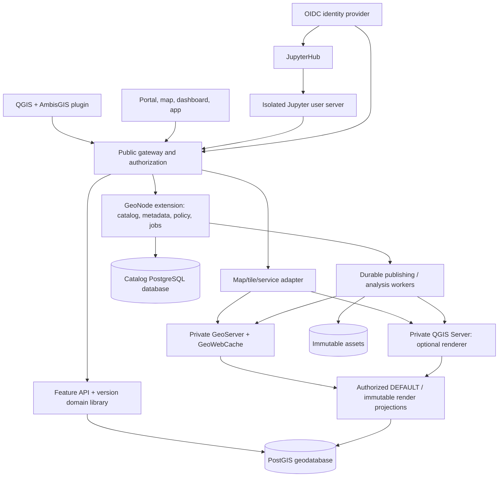

# AmbisGIS — Comprehensive Product Design

**Revision 2.0 · 19 September 2026 · Codex / Visual Studio Code handoff**

An independently maintained GIS product built from forked and consolidated source. Donor projects provide starting code, not continuing architecture, patch or release authority. This revision supersedes the original integration-led plan.

**Status:** design and local planning utilities only. No GitHub repositories, Projects or issues were created or modified during this revision. No GIS product or source-build/repair exercise has been implemented. AmbisGIS is a provisional, not trademark-cleared, name.

**Contents:** 13 component/governance chapters, 66 implementation tasks, 24 requirements, 15 proposed repositories, 65 source references and the original 48-capability comparison.

The editable sources are individual `docs/` specifications and machine-readable manifests. Start execution from `README.md`, `AGENTS.md` and `CODEX_START_PROMPT.md`, not from an old bootstrap.


<a id="revision-2"></a>

## Revision 2 — controlling changes

**19 September 2026. Replaces, rather than merely supplements, the first plan.**

The user clarified that the goal is an independently maintained GIS product made from forked and combined source—not an upstream-led integration distribution. The old plan's thin-fork policy, preference for unchanged externally supplied PostgreSQL/PostGIS, and exclusion of QGIS core from source custody were inconsistent with that goal.

The revised requirements are binding:

1. Own the selected source baselines, builds, patch path, contracts and release authority. Donor releases are optional inputs; upstream acceptance or synchronization is never required.
2. Combine and refactor product responsibilities, not just logos and login. Retain one catalog, metadata authority, policy model, service lifecycle, installer and supported product release. Preserve process boundaries where security, storage or fault isolation justify them.
3. Retain complete relevant dependency/build inputs. Demonstrate an upstream-disconnected rebuild and independent synthetic-defect repair. Pinning alone is not independence, and indefinite insecure freezing is prohibited.
4. Use **AmbisGIS** as the working product name and `ambisgis-` as the repository prefix. This is not a trademark clearance. Brand/configuration choices must be reversible.
5. Use one cross-repository GitHub Project, **AmbisGIS — Product Development**, with issue-backed work, explicit dependencies, review/evidence gates and safe repeatable provisioning.

### Concrete package changes

The repository manifest now has four new projects and eleven forks (fifteen total), including PostgreSQL, PostGIS, QGIS, GeoTools, GeoWebCache, JupyterHub and JupyterLab source custody. The plugin repository is `ambisgis-qgis-plugin`; `ambisgis-qgis` is the actual QGIS fork.

Two detailed chapters cover independent product maintenance and GitHub Projects. Seven new tasks bring the backlog to 66; four additional requirements bring traceability to 24. Existing task IDs and the original five capability goals are retained. The architecture, component documents, roadmap, source-lock template, bootstrap, agent rules and start prompt have been updated rather than leaving contradictory instructions in an addendum.

The new Project seed exporter is a local executable aid. The live Project provisioner is a clearly specified Codex task, not something claimed to exist already. GitHub CLI/GraphQL capabilities and permission requirements are cited in the Project chapter; no live Project/repository writes occurred during this revision.

### First action for Codex

Use this revision's `AGENTS.md` and `CODEX_START_PROMPT.md`. Do not run the old eight-repository bootstrap. Verify actual remote state before writes. The previous plan had not created repositories, but Codex must not assume that remains true when it executes.


---


<a id="chapter-00-architecture"></a>

## 00 — Product architecture and scope

### 1. Executive decision

Build **an independently maintained GIS product from source-owned forks and consolidated product modules**. Existing projects are source donors, not continuing architecture or release authorities. AmbisGIS controls the selected code, build inputs, data models, internal contracts, user experience, security fixes and release cadence. It must be possible to build, modify, test, install and repair a supported release without upstream repositories, package servers, release decisions or maintainer approval. This does not require rewriting mature algorithms or putting all code into one language/process. See `11-independent-product-and-source-ownership.md` for the governing requirements.

A branded collection of unmodified upstream services connected only by configuration, adapters and single sign-on does **not** satisfy the product requirement. Internal integration remains necessary engineering work; independent source stewardship and deliberate removal of redundant product responsibilities are required outcomes.

The working product name is **AmbisGIS**. This is the user-proposed working name, **not a trademark-cleared brand**. Branding is configurable; public binary branding remains subject to clearance. The initial hosting model is a self-hosted deployment for one organization, with users, groups, public resources, and private resources. Strong shared-database SaaS tenancy is not an initial promise.

The main differentiation is operational and semantic cohesion: **one install, one identity, one content model, one authorization model, one publishing workflow, and explicit versioned-edit behavior**. Installation must not require an administrator to independently understand GeoNode, GeoServer, GeoFence, pycsw, an identity provider, and JupyterHub configuration before publishing a layer.

The technical rationale is not a legal finding about Esri's market position. The comparison uses the user's ArcGIS Enterprise experience to define target workflows and acceptance tests rather than assuming every open-source tool is less capable in every dimension.

### 2. Scope contract

**Required for the first complete scoped release:** administer a GIS deployment; register/copy datasets; expose map/query/edit/raster-tile/vector-tile services; edit metadata; create maps, dashboards, and responsive applications; manage users/groups/sharing; create isolated named edit branches; reconcile and post with conflicts; run integrated spatial Python notebooks; publish from QGIS through a single wizard.

**Not required for the first release:** ArcGIS Online multi-tenant SaaS, Hub, Knowledge graphs, Utility Network/Trace Network semantics, Parcel Fabric, full topology-controller parity, ArcGIS Image Server distributed analytics/orthomapping, 3D scene services, full geoprocessing service catalog, offline replica/sync protocol, ArcGIS enterprise geodatabase wire-format compatibility, arbitrary ArcPy execution, complete Arcade emulation, native `.aprx`/`.sd` ingestion, or universal ArcGIS SDK/Pro compatibility. Relevant extension interfaces are reserved; these exclusions must appear in release notes rather than disappear behind a blanket “ArcGIS replacement” claim.

ArcGIS Enterprise 11.5 and Pro 3.5.x are the **reference environment**, not declarations of the latest Esri versions. Contract tests must name exact client builds.

### 3. Selected components

| Product capability | Initial implementation decision | Reason / boundary |
|---|---|---|
| General map/coverage/OGC serving | GeoServer with selected, pinned extensions; embedded GeoWebCache | Reuse rendering/standards. Inherited admin UI is a restricted diagnostic tool during migration; the owned service model is authoritative and no inherited UI may create competing product state. [S01–S05] |
| Desktop cartographic rendering | Optional QGIS Server engine selected per publication | Preserve QGIS project rendering when style conversion is insufficient; same product service/capability model. [S11–S12] |
| Portal and catalog | Extended GeoNode backend | Reuse content, metadata, and permission structures rather than establish a competing item database. [S06–S08] |
| Web user experience | New React/TypeScript shell with MapStore integration | Reuse map/dashboard foundations while delivering modern navigation, workflows, and a constrained app composer. [S09–S10] |
| Spatial storage | PostgreSQL + PostGIS | Fork both engines, preserve tested storage semantics initially, and produce AmbisGIS-controlled builds. Add branch/domain semantics in the owned geodatabase module; core changes are allowed when justified. [S13–S14] |
| Feature and version APIs | New typed Python service, initially FastAPI, sharing an `ambisgis-geodb` domain library | Own service-oriented edit semantics and protocol contracts; do not misuse GeoServer's configuration REST API. |
| Publishing/long jobs | Durable PostgreSQL job records + GeoNode-compatible worker stack | Existing queue infrastructure is reused, but the database is authoritative for job state and retries. |
| Identity | Bundled Keycloak or a supported external OIDC provider | One SSO identity; resource permissions remain in the catalog. [S34] |
| Notebooks | JupyterHub + JupyterLab + pinned custom spatial images | Multi-user execution, quotas, storage, and application integration need more than notebook files. [S18–S19] |
| Files/attachments/raster assets | Content-addressed local blob adapter initially; S3-compatible adapter later | Avoid a mandatory additional storage server for a small installation. |
| Standards metadata | Catalog forms/core metadata + pycsw adapter as needed | No separate GeoNetwork installation for normal layer metadata. GeoNetwork remains an advanced option. [S02, S25–S26] |
| Desktop authoring | QGIS + AmbisGIS publishing/version-edit plugin | Maintain an owned QGIS source fork and tested desktop/server distribution. Implement publishing as a bundled plugin where appropriate; plugin modularity is not dependence on future upstream QGIS releases. |

P0 must validate this composition against G3W-SUITE and Lizmap end-to-end examples. If either eliminates a substantial amount of code while satisfying the catalog/security/versioning boundaries, record an ADR before implementation. Do not silently swap architectural foundations halfway through a milestone. [S39–S40]

### 4. Logical architecture



This is a logical diagram, not a requirement to create one microservice per box. Start with a modular GeoNode extension for the control plane, one feature/gateway application, a worker deployment, and AmbisGIS-owned builds of the inherited engines. The branch library is imported by the feature application; it is not an additional network service by default. The map adapter may be a module in the gateway.

### 5. Authoritative ownership and transaction boundaries

| Information | Authoritative owner | Other copies |
|---|---|---|
| Identity subject and authentication | OIDC provider | Opaque subject references in catalog; never duplicate passwords. |
| Items, metadata, groups, role assignments, sharing rules | GeoNode-backed catalog extension | Search index, GeoServer labels, ACL projections are rebuildable views. |
| Feature schema, domains, relationships, feature states, branch heads, audit | `ambisgis-geodb` database | GeoNode stores references, not competing feature state. |
| Stable service/layer IDs and active publication revision | Catalog service registry | Gateway caches are revisioned and revocable. |
| QGIS projects, styles, attachments, rasters, notebook files | Blob/storage adapters with database manifests | Workers use staged read-only mounts; content hashes detect corruption. |
| Publication job and per-step progress | Catalog job tables | Queue messages are wake-up signals, never sole job state. |
| Tile content and render projections | Derived cache | Disposable; never the source of data or permissions. |
| Notebook kernels and scratch files | Isolated user runtime | Not trusted administrative components. |

Use separate PostgreSQL databases/roles for the control plane and each managed geodatabase even if the first installation uses one physical PostgreSQL instance. A branch-version group spans layers **inside one geodatabase** so edits/post can be atomic. Publishing across catalog, geodatabase, assets, and render engines is explicitly a **saga with private staging and compensating actions**, not a fictitious distributed ACID transaction.

Authorization policy changes must be committed to the catalog and enforced at the gateway immediately for new requests. Async engine ACL synchronization cannot be the only barrier. Strict revocation invalidates cached decisions; private access fails closed when policy cannot be established. An already authorized response cannot be retroactively removed from a client, so revocation guarantees apply to new requests, not historical downloads.

### 6. Public product surface

The initial navigation is **Home, Content, Maps, Apps, Notebooks, Services, Data, Jobs, Administration**. Ordinary publishers see one “Publish” action. Internally exposed terms such as workspaces, coverage stores, Django settings, GeoFence rules, and identity-provider clients are hidden behind templates and diagnostics. Advanced settings remain accessible through a deliberate expert panel, not as prerequisites.

A normal browser session uses the portal origin and API gateway. **Notebook code and arbitrary rendered outputs must not share the portal's security origin.** Provide SSO and coherent navigation while Jupyter user servers use isolated per-user domains, appropriately scoped cookies, and a separate registrable domain where practical. “One product” does not mean “one JavaScript trust boundary.” [S18]

The user can publish a public resource without authentication being required for every subsequent read. Anonymous read is an explicit policy choice; it is not intrinsically a vulnerability. Administrative calls, private reads, write operations, and version management require authorization.

### 7. Data and client compatibility posture

Native APIs are versioned and documented first. OGC endpoints are generated or proxied only through capability-aware, access-controlled adapters. An ArcGIS-shaped facade is a **separately tested compatibility profile**, initially focused on read-only service discovery, query, map export, and selected feature edits later. Similar URL shapes do not establish compatibility.

A native client uses `/api/v1`; OGC clients use `/ogc`; explicitly tested ArcGIS-style operations use `/arcgis/rest/services`. The gateway reports precisely supported capabilities. Do not populate optimistic flags to persuade clients to enable operations that do not work. In particular, native branch support does not justify advertising Esri `isDataBranchVersioned` or `VersionManagementServer` support. [S20–S24]

The first desktop publishing client is QGIS. Standard external clients, including ArcGIS Pro where supported, can consume standard services. Publishing ArcGIS service-definition files is not included.

### 8. Quality and release principles

Prefer correctness and measured interoperability over visual demo breadth. A publishing wizard is not complete until cancellation, retry, overwrite, permissions, and rollback work. A branch implementation is not complete until concurrent post, schema changes, deletions, and backup/restore preserve invariants. A notebook deployment is not complete until one user's arbitrary code cannot read another user's files or obtain an administrator token.

Use Python type checking, schema-generated API clients, database integration tests, Playwright user journeys, OGC/ArcGIS compatibility fixtures, security tests, and a pure reference versioning model. Upstream tests remain required for changed forks. Every release includes reproducible source commits, dependency/image locks, an SBOM, release notes, upgrade/recovery instructions, and a visible support matrix.

### 9. Initial hard decisions and unresolved gates

Accepted planning defaults: use GeoNode rather than write a new catalog; use GeoServer rather than write a rendering engine; maintain a QGIS source fork with a bundled publishing plugin; expose native branch behavior before claiming Esri protocol compatibility; keep one organization per deployment; keep GeoNetwork optional; keep deployment composable but initially single-node.

Evidence gates: verified donor baselines followed by owned component builds and catalog/map contract tests; actual fork/file licensing; identity and GeoFence propagation without bypass; QGIS project parity; branch storage/merge performance; exact native/ArcGIS operation boundaries; safe notebook hosting; upgrade/restore behavior. `DECISIONS.md` tracks them. A failed spike changes an ADR and the backlog, not the definition of success.


---


<a id="chapter-01-landscape-and-parity"></a>

## 01 — Open-source landscape and feature parity

### 1. How to read the comparison

The comparison is functional, not a market-share or legal-monopoly analysis. There is no useful single percentage called “ArcGIS parity”: rendering, edit integrity, administrative UX, desktop publishing, security, and operations are different dimensions. The statuses below mean **available upstream**, **partial/building block**, or **new integration/product work**. They do not mean an integrated AmbisGIS implementation already exists.

A capability can be technically strong and still produce a poor end-to-end experience when identities, metadata, styles, permissions, and installation are fragmented. Conversely, some open-source systems offer valuable database or standards flexibility that should not be discarded merely to imitate a vendor UI.

### 2. Product-to-project comparison

| ArcGIS reference | Principal open-source candidates | What can be reused | Important gap for this project |
|---|---|---|---|
| Enterprise geodatabase | PostgreSQL/PostGIS; Kart; GeoGig; QGIS versioning | Spatial SQL/indexes/types; separate spatial version-control approaches. [S13–S17] | Unified schema semantics, service-only branch editing, conflict review, atomic post, domain/relationship enforcement. |
| GIS Server map services | GeoServer; QGIS Server; MapServer | Server rendering and standard map/feature/coverage interfaces. [S01, S04, S11, S45] | Unified configuration, ArcGIS-shaped service facade, transactional publishing, a simple service manager. |
| GIS Server feature services | GeoServer WFS/OGC Features; pygeoapi; Koop; custom feature API | Standards-based access plus existing GeoServices output foundations. [S05, S24, S41, S44] | Esri query/edit contracts, user-facing edit semantics, attachments/relations, branch integration. |
| Portal | GeoNode + MapStore; G3W-SUITE; Lizmap | Catalog/sharing/metadata and integrated mapping or publishing workflows. [S06–S10, S39–S40] | One polished UX, lifecycle consistency, app-composer requirements, notebook/version APIs. |
| Metadata/catalog | GeoNode; GeoServer metadata extension; pycsw; GeoNetwork | Several existing levels of metadata authoring and standards. [S02, S06, S25–S26] | One authoritative record and simple authoring workflow; avoid mandatory second admin application. |
| Dashboards | MapStore dashboards | Connected maps/charts/tables/counters. [S09] | Product theming, unified service permissions, chosen widget/event contracts, accessible workflows. |
| Experience Builder | MapStore application contexts/extensions; custom composer | Configurable application foundations. [S10] | General responsive composition and a curated widget framework; not Esri widget import compatibility. |
| Notebook Server | JupyterHub/JupyterLab + scientific images | Notebook execution and multi-user runtime building blocks. [S18–S19] | GIS-ready environments, resource/identity integration, safe isolation, publish SDK, scheduled execution. |
| Image Server subset | GeoServer coverage/ImageMosaic; GDAL; TiTiler | Raster coverage/mosaic/COG/tile building blocks. [S04, S27, S43] | Unified raster publishing; full raster analytics, orthomapping, and Esri raster-function chains excluded initially. |
| ArcGIS Pro publishing | QGIS plugin + QGIS Server or GeoServer adapter; Lizmap/G3W | Desktop/project-based publishing patterns and rendering. [S11–S12, S39–S40] | A single supported wizard, stable service IDs, overwrite/dependency checks, packaging diagnostics. |

GeoServer is a strong default, **not an objectively universal “best alternative.”** QGIS Server becomes preferable when preserving QGIS-specific cartography is more important than supporting a broad server-side style dialect. G3W-SUITE and Lizmap merit a working evaluation, not dismissal because the initial mental model named GeoNode.

### 3. Detailed feature matrix

“Implement” below names work in the proposed AmbisGIS distribution. Phase gates, not the presence of an upstream checkbox, establish acceptance.

| ID | Capability | Existing foundation | AmbisGIS decision / implementation needed |
|---|---|---|---|
| CAP-01 | Simple installation | GeoNode integrated installation [S08] | Generate all component settings, credentials, callbacks, storage, health checks; one diagnostic surface. |
| CAP-02 | Modern service manager | GeoServer admin/config REST [S01] | Build service-oriented UI; do not expose upstream setup complexity as normal workflow. |
| CAP-03 | Dynamic map image | GeoServer / QGIS Server [S01, S11] | Gateway adapter, legend/identify consistency, policy enforcement, stable service URLs. |
| CAP-04 | Feature query | WFS/OGC APIs, PostGIS [S05, S13, S24] | Native typed query API with bounded filter grammar; tested ArcGIS subset. |
| CAP-05 | Feature edits | Database transactions; upstream edit protocols | Service-only native edit API with concurrency, validation, audit and permissions. |
| CAP-06 | Multi-layer edit atomicity | PostgreSQL transactions [S14] | Group layers in one managed geodatabase; reject impossible cross-database atomic requests. |
| CAP-07 | Domains / coded values | Database constraints; some import metadata [S27] | Registry, UI forms, subtype-specific domain binding, server validation and export mapping. |
| CAP-08 | Subtypes / field defaults | Generic database and application components | Explicit type registry, immutable IDs, supported default-expression grammar. |
| CAP-09 | Relationships | PostgreSQL foreign keys; import support [S27] | Typed relationship metadata and query/edit APIs; rules enforced per branch state. |
| CAP-10 | Attachments | Database/blob primitives | Immutable content, transactional relationship metadata, limits, policy-aware download. |
| CAP-11 | Global IDs / ObjectIDs | UUIDs / sequences | Stable identity independent of branch, import, layer order, or publication revision. |
| CAP-12 | Editor tracking | Database/service audit primitives | Trusted identity/time, immutable audit, no client spoofing of ownership. |
| CAP-13 | Named edit branches | Kart, GeoGig, versioning plugin [S15–S17] | Evaluate; implement accepted service-first semantics and UI rather than assume interchangeability. |
| CAP-14 | Reconcile/conflicts/post | Separate version-control approaches [S15–S17] | Three-way feature/field comparison; stale-head detection; atomic constraint-checked promotion. |
| CAP-15 | Historical queries | Snapshots / application revision models | Immutable commits, retention, policy checks, time/revision semantics explicitly defined. |
| CAP-16 | Attribute rules | SQL constraints / functions | Declarative validation/calculation subset; no unrestricted SQL/Python/Arcade submitted by users. |
| CAP-17 | Spatial validation | PostGIS operations [S13] | Chosen geometry validity policy, no silent repair; cross-feature rules as separate work. |
| CAP-18 | Full Esri topology/network fabric | Not the selected foundations | Excluded; a geometric validity check is not a topology/Utility Network implementation. |
| CAP-19 | Basic layer metadata | GeoNode / GeoServer metadata [S02, S06] | One editor and schema with projection into service descriptions. |
| CAP-20 | Standards metadata export | pycsw / GeoNetwork / GeoServer [S02, S25–S26] | Supported ISO/CSW mapping chosen and validated; preserve original imported XML. |
| CAP-21 | Metadata review/harvesting | GeoNetwork [S25] | Optional advanced deployment profile; not required for ordinary layer publication. |
| CAP-22 | Raster coverage | GeoServer WCS/mosaic [S04] | Publish/analyze/authorize coverage assets and render presets. |
| CAP-23 | Raster map tiles | GeoWebCache / coverage renderer | Automated gridset, extent, seeding, quota, version invalidation. |
| CAP-24 | Vector tiles | GeoServer vector tiles; Martin [S03, S42] | TileJSON/style/sprite/glyph lifecycle; measured alternative server only if needed. |
| CAP-25 | Cloud-optimized rasters | GDAL/TiTiler building blocks [S27, S43] | Optional COG path with range access controls and explicit data/visualization distinction. |
| CAP-26 | Raster analytics parity | Python/GDAL components | Basic registered notebook/jobs; distributed Image Server workflows not promised. |
| CAP-27 | Portal item catalog | GeoNode [S06] | Extend existing schema; add service, app, notebook, version-workspace item types. |
| CAP-28 | Users/groups/sharing | GeoNode/identity components [S07, S34] | One authoritative policy model and tests across every route/cache/engine. |
| CAP-29 | Web maps | MapStore [S09–S10] | Stable item references and renderer adapters; own versioned map definition. |
| CAP-30 | Dashboards | MapStore connected widgets [S09] | Reuse, theme, integrate resource permissions and accessible keyboard operations. |
| CAP-31 | Responsive app builder | MapStore contexts [S10] | New declarative composition, layouts, draft/publish workflow and widget registry. |
| CAP-32 | Esri app JSON / Arcade import | No accepted compatibility implementation | Unsupported by default; provide manual migration report, not a false automatic conversion. |
| CAP-33 | Notebook editor | JupyterLab [S18–S19] | Integrated catalog lifecycle and safe launch. |
| CAP-34 | Multi-user notebook execution | JupyterHub [S18] | Isolated runtime, per-user origin, quotas, persistence, scoped tokens. |
| CAP-35 | Python spatial environment | Scientific images + spatial libraries | Lock/test interoperable native packages; separate core, raster, optional PyQGIS profiles. |
| CAP-36 | Scheduled notebooks | Notebook execution tools and worker framework | Least-privilege execution, parameter schemas, run provenance, no hidden user token reuse. |
| CAP-37 | Desktop publication | QGIS ecosystem [S11–S12, S39–S40] | AmbisGIS wizard, analyzer, upload/reference, asynchronous progress and rollback. |
| CAP-38 | QGIS styling fidelity | Shared QGIS rendering libraries [S11] | Pin compatible renderer, fonts and assets; compare against desktop fixture render. |
| CAP-39 | Cross-engine styling | QGIS/SLD export path | Define a tested subset and warn on unsupported constructs; choose QGIS renderer when needed. |
| CAP-40 | Stable overwrite | Generic service/catalog primitives | Immutable publication revision, preserved IDs, atomic active-pointer cutover. |
| CAP-41 | ArcGIS-shaped discovery | Public Esri REST contract; Koop GeoServices output [S21, S44] | Evaluate reuse before implementing compatibility tier C1; do not call it full server federation. |
| CAP-42 | Esri branch REST protocol | Public version contract [S20] | Separate deferred compatibility profile; native branch functionality comes first. |
| CAP-43 | Offline replicas / sync | Different ecosystem projects | Explicit later work; no `syncEnabled` claim before protocol and conflict tests. |
| CAP-44 | Backup / restore / upgrades | Database and upstream mechanisms | One manifest-aware backup/restore procedure and supported upgrade path. |
| CAP-45 | Multi-node availability | Component-specific scale mechanisms | Later HA profile; Compose restart policies are not HA. |
| CAP-46 | Accessibility / modernity | Varies by upstream screen | Product design system, WCAG 2.2 AA target, keyboard and screen-reader acceptance tests. |
| CAP-47 | Full Pro analysis toolbox | QGIS/GRASS/Python ecosystem (requires task-level review) | Not a blanket parity claim; curate tested server/notebook tools for the scoped workflows. |
| CAP-48 | Enterprise operational diagnostics | Existing logs/health mechanisms | Unified correlation IDs, jobs, storage, permissions diagnostics and redacted support bundle. |

### 4. Alternative project decisions

**Kart, GeoGig, and the QGIS versioning plugin:** perform a focused spike against branch isolation, multi-layer atomicity, delete/update conflicts, geometry identity, server authorization, and history retention. A Git-like data workflow may be useful, but it cannot be declared a drop-in implementation of Esri's service-managed editing semantics. Reuse algorithms or choose an engine only after correctness and license gates. The new domain API remains the product contract even if storage internals change. [S15–S17, S20]

**G3W-SUITE and Lizmap:** evaluate publishing one real representative QGIS fixture through each. They are particularly relevant to avoiding needless work on project packaging and QGIS Server integration. Selection still must satisfy the product's catalog authority, REST, notebook, and branch requirements; keep a scored evaluation artifact rather than an impressionistic UI ranking. [S39–S40]

**pygeoapi:** evaluate for standards adapters if the selected GeoServer release lacks a required stable implementation. Do not introduce another catalog or expose its configuration as a second user workflow. [S41]

**Martin and TiTiler:** optional specialist serving engines behind existing contracts. They must earn additional deployment complexity through measured throughput, cost, or format capability, not architectural fashion. [S42–S43]

**GeoNetwork:** retain for organizations needing advanced catalog governance. Default metadata authoring stays in the product; requiring a second metadata application would reproduce the user's stated pain. [S25]

**QGIS core and PostgreSQL/PostGIS:** maintain source-owned forks and build the supported product from those sources. Initial algorithms may be unchanged, but source custody, patch capability and release authority are mandatory. A plugin or schema boundary is an implementation choice, not a ban on core changes. Optional compatibility with independently installed upstream QGIS is a separate tested profile, never the only supported publishing path.

**Koop:** a JavaScript toolkit that already exposes GeoServices/FeatureServer-style endpoints through providers and output plugins. Evaluate its `output-geoservices`, `featureserver` and query machinery before implementing the C1 facade from scratch. This is an important reuse candidate, not evidence of branch editing, full write compatibility, or secure integration with this design. The native typed API remains authoritative. Avoid unbounded dataset materialization or a second permission/cache model. Selection requires conformance, query-pushdown, licensing, maintenance and protected-route tests. No extra fork is authorized by default. [S44]

**MapServer:** a separate mature mapping-engine alternative with OGC services and MapCache. Compare it when map rendering, deployment footprint or supported formats justify another engine evaluation. Do not add a third renderer to the default distribution merely for completeness. [S45]

**Mapbender / QGIS2Mapbender:** browser-configured map applications and direct QGIS-project/QGIS Server publication provide an alternative end-to-end workflow to evaluate. They may reduce application/publishing work, but are not assumed to satisfy the unified branch, notebook and catalog requirements. [S46]

**QGIS Web Client / QWC Services:** existing authentication/permission, editing, full-text search and permalink components are useful comparisons for a QGIS-centered product. Evaluate their real setup and security boundaries alongside Lizmap/G3W; do not mistake a Docker example for a complete supported AmbisGIS distribution. [S47]

### 5. Evaluation scorecard and stop rules

For each selected component, produce an evidence sheet with supported release, security posture, license scope, API extension points, representative workflow result, test coverage, upgrade rehearsal, maintainer/patch burden, and replaceability. Score integration correctness and recoverability before cosmetic familiarity.

Stop a component adoption when its license prevents the required use, it exposes an unfixable authorization bypass, it cannot preserve source data faithfully, or its ownable maintenance burden exceeds demonstrated capacity. A large justified refactor or inability to merge an entire upstream release is not by itself disqualifying; AmbisGIS must demonstrate a safe patch or replacement path. Do not treat “we already forked it” as a reason to continue with a failing choice.


---


<a id="chapter-02-server-and-rest"></a>

## 02 — Server product and service APIs

All GeoServer, GeoTools and GeoWebCache references below identify inherited code inside AmbisGIS-owned forks. Adapters are internal modules whose two ends the product controls, not a permanent dependency on externally evolving APIs. Service definitions, metadata and authorization have one authoritative product model. Remove redundant inherited ownership/configuration paths as specified in chapter 11.

### 1. Service manager and metadata UX

The service manager is a new AmbisGIS surface backed by the catalog and publishing API. It is not a cosmetic copy of GeoServer's configuration tree. Users see named services, type/capabilities, owner, sharing, health, source status, extent/CRS, active revision, edit policy, jobs, and metadata. Typical actions are Publish, Preview, Edit metadata, Configure sharing, Update, Stop, Start, Roll back, and Delete.

GeoServer's REST API remains an internal administrative mechanism for workspaces/stores/layers/styles. It does not establish the ArcGIS feature-data contract. [S01] GeoServer also has metadata support and an extension; those should be integrated rather than characterized as absent. [S02]

Metadata editing is available both on the portal item and on the service details screen. Both call the **same authoritative catalog API** with optimistic revision checks. Required fields are title, abstract, owner/contact, tags, rights/license/access constraints, geographic/temporal extent where known, source/lineage, CRS, field descriptions, and update frequency where relevant. Optional fields are progressive disclosure. Imported metadata that cannot be mapped is preserved as an original attachment, not silently discarded.

The product generates standard service metadata, basic feature-field descriptions, thumbnails, and citation/export formats from that record. Engine sync status is visible but users never install GeoNetwork merely to set a title or abstract. Advanced ISO profiles/harvesting are optional adapters. [S02, S25–S26]

### 2. Resource model

A `Service` has immutable UUID, stable URL slug, service kind, owner item ID, published layer IDs, capability profile, active revision ID, renderer, permission policy reference, data-source references, and status. A `ServiceRevision` is immutable and includes layer bindings, style/assets, schema fingerprint, CRS settings, metadata snapshot reference, engine descriptors, smoke-test result, and previous revision.

A `Layer` has an immutable UUID plus a stable numeric service-layer ID. That number is assigned once; reordering layers must not renumber endpoints. The underlying dataset ID and feature UUID namespace survive service overwrite. A layer alias is presentation, not identity. Deleting a layer that is used by a web map or relationship requires an explicit dependency resolution.

Use typed schema descriptors for integers, decimals, text length, date/time, booleans, UUID, coded values, nullability, geometry type/dimensions/SRID, and edit policy. Dates have explicit UTC/time-zone or date-only semantics; never infer all date fields are timestamps. Native JSON preserves large identifiers as strings when necessary; compatibility encoders enforce their documented numeric bounds.

### 3. Native API families

All routes below are **proposed contracts**. Initial JSON schema files are starter contracts, not a complete OpenAPI implementation. Implementation task API-01 creates the authoritative OpenAPI specification before handlers.

| Family | Representative route | Required behavior |
|---|---|---|
| Catalog | `GET /api/v1/items`, `GET/PATCH /api/v1/items/{id}` | Search/filter; conditional update; discoverability separate from data permission. |
| Metadata | `GET/PUT /api/v1/items/{id}/metadata` | One canonical record, validation, revision check, export links. |
| Service directory | `GET /api/v1/services`, `GET /api/v1/services/{id}` | Human and machine discovery; only visible resources. |
| Layer schema | `GET /api/v1/layers/{id}` | Accurate capabilities and field/domain/relationship schema. |
| Feature query | `POST /api/v1/layers/{id}/query` | Typed filter, geometry filter, CRS, field selection, sorting, keyset cursor, version/revision. |
| Feature read | `GET /api/v1/layers/{id}/features/{uuid}` | Branch-aware state, revision token, authorization. |
| Edits | `POST /api/v1/version-groups/{id}/apply-edits` | Atomic supported multi-layer edits; idempotency, expected head, per-feature revision. |
| Attachments | `POST /api/v1/uploads`, then edit attachment references | Staged immutable content; download authorization; atomic logical attachment changes. |
| Versions | `POST/GET /api/v1/version-groups/{id}/versions` | Owner/privacy, consistent base snapshot, bounded lifecycle. |
| Reconcile | `POST /api/v1/versions/{id}/reconcile` | Immutable three-way plan with captured source/target heads. |
| Resolve/accept | `PUT /api/v1/reconciles/{id}/resolutions`, `POST /api/v1/reconciles/{id}/accept` | Revision checks; no unresolved conflicts; accept candidate into branch only. |
| Post | `POST /api/v1/versions/{id}/post` | Accepted reconcile and expected heads; atomic target promotion after revalidation. |
| Maps | `POST /api/v1/services/{id}/export-map` | Authorized layers, renderer policy, bounded dimensions/DPI/time. |
| Tiles | `GET /api/v1/services/{id}/tiles/{z}/{x}/{y}` | Revision/policy-aware cache; correct tile scheme/content type. |
| Publications | `POST /api/v1/publications`, `GET .../{id}`, `POST .../{id}/cancel` | Durable job and state machine; private staging; safe cancellation. |
| Jobs | `GET /api/v1/jobs/{id}`, event stream/poll | Coarse status plus actionable diagnostics and support correlation ID. |
| Applications | `POST /api/v1/apps/{id}/publish` | Immutable app revision and dependencies checked at publish. |
| Notebooks | `POST /api/v1/notebooks/{id}/launch`, run/schedule APIs | Scoped execution and catalog integration; no privileged browser token. |

### 4. Query correctness

Use a typed filter AST with allow-listed operators and schema-validated fields. Compile to parameterized SQL. Never concatenate client `where`, sort, table, layer, or CRS strings into SQL. The compatibility parser accepts only its documented expression subset and returns a useful unsupported-expression error rather than stripping unsupported clauses.

Define null semantics, escaped strings, date handling, spatial predicate and input CRS explicitly. Apply server-side authorization filters **before** counts, statistics, pagination, exports, and aggregation. Feature counts and existence/extent can leak private information too. Pagination must preserve a consistent requested revision; opaque cursors contain signed query/revision context, not trusting client-supplied offsets as a security boundary.

Bounding-box candidates use spatial indexes followed by precise predicates where necessary. Define output field order, aliases, geometry winding, Z/M behavior, and empty geometry. Do not reproject or drop precision without an explicit request. Unknown or unavailable CRS transformations fail with an analyzer error. Include EPSG:2230 as a feet-based test fixture and verify transformation grids under the selected runtime; no assumption that one generic WGS84 transform is suitable for every dataset.

Set per-operation row, byte, geometry-complexity, execution-time, upload, and map-size limits. Exceeding a synchronous threshold returns an async export path or a clear limit error. Counts/statistics have independent limits and tests. All requested capabilities must appear in the service's tested profile.

### 5. ArcGIS compatibility tiers

The facade uses `/arcgis/rest/services/...` for familiarity, but is cleanly separated from native contracts. Implement from public documentation and authorized test observations; do not copy proprietary source or bundled SDK assets. [S20–S22]

**Reuse gate before implementation:** prototype Koop's GeoServices output with a provider backed by the authorized AmbisGIS query contract. Koop already implements relevant FeatureServer-shaped output; determine whether adopting its packages or a bounded internal adapter reduces work without losing database query pushdown, revision-consistent pagination, permission enforcement, error fidelity or resource limits. Document gaps and retain its required notices. A rejected reuse option needs measured evidence; an accepted option does not inherit a blanket compatibility claim. Keep edit/version integrity in `ambisgis-geodb`, never in a translation shim. [S44]

| Tier | Included | Explicit exclusions / gate |
|---|---|---|
| C0: native + standards | AmbisGIS API, selected WMS/WFS/WMTS/WCS/OGC Features capabilities | No Esri REST compatibility claim. |
| C1: read-oriented facade | Service directory; `MapServer`/`FeatureServer` descriptors for supported services; layer metadata; bounded `query`; map `export`; legend/identify subset | Tested exact parameters/encodings; no federation or blanket SDK compatibility. |
| C2: basic editable features | Tested add/update/delete or `applyEdits` subset; appropriate edit results; attachments/related records only when implemented | No sync replicas or Esri branch protocol. Never advertise unsupported rollback/global-ID behavior. |
| C3: optional version protocol | Exact scoped `VersionManagementServer` operations and related feature request behavior | Deferred until native engine is proven and independent conformance tests pass against named clients. |

Native branch support is a first-release requirement; **C3 is not**. Native clients may branch-edit through `/api/v1` while the ArcGIS facade remains DEFAULT-only and read-only or limited C2. Set `isDataBranchVersioned=false` in a compatibility service unless C3 behavior really exists. Likewise omit/disable sync, replicas, advanced editing, historic-moment, pagination, statistics, curves, and time capabilities until each is tested.

Conformance covers GET/POST form encoding, `f=json` and other promised outputs, errors and HTTP behavior expected by each client, Esri JSON geometry and spatial references, IDs, field domains, extents, record limits, query flags, output SR, and service-level edit atomicity. “The URL loads in a browser” is not a conformance test. An API schema cannot replace execution through a named desktop/web client.

Tokens and authentication are an additional compatibility problem. The native system uses OIDC. Do not imitate Esri Portal token generation or federation unless separately designed and tested. Public C1 read-only services can be tested first. Protected ArcGIS clients may require a supported OIDC/proxy integration; unsupported authentication must be documented rather than weakening access controls.

### 6. OGC and raster boundaries

Expose only selected, tested OGC conformance classes. GeoServer's Features extension and other OGC API modules have different release maturity; verify the chosen tuple. OGC Features Part 1 is a read/query standard, not complete edit/versioning semantics. [S05, S24]

Public gateway requests are parsed and normalized, not blindly forwarded to arbitrary workspaces. Deny unrestricted WFS-T writes; native versioned data is writable only through the feature API. Raw internal endpoints are network-isolated and authenticated; a forwarded user header from the internet is never trusted.

Raster coverage downloads, rendered raster maps, raster tile images, and vector tiles are distinct products. A PNG tiled rendering does not preserve original scientific pixel values. Coverage exports report resolution, band mapping, nodata, CRS and resampling. Support fixed visualization presets first; time/mosaic selection later within the same service model. Full Esri ImageServer query/function/analytics behavior is excluded initially. [S04, S43]

A vector tile service includes tile metadata, a supported style document, sprites/glyph assets, attribution, extents, zoom range, and cache policy. GeoServer's vector output is a foundation, not by itself an Esri VectorTileServer clone. [S03]

### 7. Authorization, errors, and observability

Every route checks operation, item/data, branch, and field/row policy as applicable. Rendering and tile services must not bypass rules enforced by feature queries. V1 can prohibit raster/map publication of a row-filtered service until an equivalent secure render projection is implemented; rejecting unsupported secure rendering is safer than leaking the layer.

Use stable native error codes such as `UNSUPPORTED_CAPABILITY`, `SCHEMA_MISMATCH`, `STALE_BRANCH_HEAD`, `STALE_RECONCILE`, `CONFLICTS_UNRESOLVED`, `PUBLICATION_FAILED`, and `TRANSFORM_UNAVAILABLE`. Return remediation fields and a correlation ID, never SQL credentials or internal paths. Compatibility errors map to documented client expectations without hiding failure.

Log request ID, principal pseudonymous ID, operation, resource IDs, revision IDs, duration, rows/bytes, and result classification. Redact tokens and sensitive queries. Metrics include query/map/tiles latency, error rate, queue age, engine availability, and authorization-denial spikes. Health endpoints distinguish process liveness from ability to serve an authorized fixture.

### 8. Acceptance examples

A publisher creates a layer, edits metadata once, and sees consistent text in the portal, native API, and supported service capabilities. Reorder does not change numeric endpoint IDs. An unprivileged user cannot enumerate private items or infer their counts via a statistics route. An edit retries after a timeout and returns the original result rather than duplicating inserts. A disabled capability returns an explicit error in both native and compatibility clients. A GeoServer failure leaves the prior published revision usable and visible in product diagnostics.


---


<a id="chapter-03-geodatabase-and-versioning"></a>

## 03 — Geodatabase semantics and branch-style editing

PostgreSQL and PostGIS are source-owned, buildable AmbisGIS foundations. No dependency on a future upstream branch-versioning feature or upstream patch acceptance is permitted. Preserve their mature transaction/storage behavior initially while implementing domain semantics in the owned geodatabase module; allow justified engine changes subject to transaction, compatibility and recovery tests.

### 1. Purpose and definition

This subproject is the highest correctness-risk new component. PostgreSQL/PostGIS supplies storage, spatial types/indexes, transactions, and concurrency. PostgreSQL MVCC does **not** by itself supply persistent named workspaces, user-facing reconcile/post, conflict resolution, version permissions, or service-based edit governance. [S13–S14] Kart, GeoGig, and QGIS versioning demonstrate that open-source spatial version control exists; P0 must assess them before deciding how much to reuse. [S15–S17]

AmbisGIS branch editing is a defined **application workflow**, not an imitation of Esri's internal SDE tables. Users create a named branch from DEFAULT, edit privately or collaboratively, inspect changes, reconcile against DEFAULT, resolve conflicts, and post approved changes. The public Esri workflow informs requirements, but native correctness is independent of Esri protocol compatibility. [S20, S23]

V1 supports branches directly from DEFAULT, one organization per deployment, and a version group containing related layers in one managed geodatabase. Nested branches, disconnected replicas, cross-database atomic post, geodatabase engine impersonation, and Esri VersionManagementServer protocol support are separate future work.

### 2. Required invariants

1. **Isolation:** a branch reads its captured base plus its own accepted edits; later DEFAULT changes do not appear until an explicit reconcile is accepted.
2. **Stable identity:** a feature UUID identifies the same logical feature across branches, revisions and service overwrites. Geometry and array position are not identity.
3. **No lost updates:** stale branch heads or stale feature revisions cannot overwrite newer committed work.
4. **Atomic logical edit:** all supported operations in a version-group transaction succeed together or none change visible feature/attachment/relationship state.
5. **Atomic post:** an authorized, conflict-free candidate is revalidated and promoted to DEFAULT inside one database transaction, with audit and outbox events.
6. **No hidden bypass:** ordinary users, notebooks, GeoServer WFS-T, and direct QGIS database editing cannot mutate managed versioned tables.
7. **Reproducibility:** retained commits and snapshots reconstruct the declared feature state; history refers to an exact schema and rule revision.
8. **Safe retention:** no snapshot/revision/blob referenced by a live branch, retained history, publication or recovery checkpoint is garbage-collected.
9. **Constraint integrity:** domains, nullability, relationships, natural-key uniqueness and chosen rules hold in each committed branch state and again in the posted DEFAULT state.
10. **Crash integrity:** a client timeout cannot turn one idempotent request into two commits, and process failure cannot create a half-posted group.

An implementation that stores an `updated_at` column and chooses the latest row globally fails several of these invariants. So does keeping a database transaction open for the lifetime of a user's branch.

### 3. Storage design: correctness first

Use **typed per-dataset current-state tables**, immutable snapshot tables, and an append-only revision ledger. Do not store every feature attribute solely in an untyped JSON blob. Geometry remains a typed PostGIS column with an explicit SRID and Z/M policy. JSON is appropriate for request payloads, diffs, and extension metadata, not a replacement for relational constraints or spatial indexes.

V1 deliberately uses **eager, bounded branch snapshots**. At branch creation, capture a consistent DEFAULT state and materialize the branch's editable current state. This costs storage proportional to dataset size and branch count. That is an explicit initial tradeoff for simpler isolation and merge correctness. P0 measures representative sizes; quotas may restrict supported branch sizes until structural sharing or copy-on-write is proven. Do not advertise constant-cost branch creation.

The logical model is stable even if later storage uses shared immutable snapshots and deltas. Every optimization must pass the same reference and concurrency tests before replacing the initial implementation.

#### Core entities

| Entity | Essential fields / purpose |
|---|---|
| `dataset` | UUID, managed name, geometry/CRS/type descriptor, active schema revision, dataset policy reference. |
| `schema_revision` | Immutable field/domain/subtype/relationship/rule definitions and canonical schema hash. |
| `version_group` | UUID, participating datasets, DEFAULT version, schema generation, constraint scope. |
| `version` | UUID, group, owner, visibility/editors, lifecycle state, base snapshot ID, head commit, optimistic revision. |
| `snapshot` | UUID, group, source version/head, schema generation, creation status, row counts/hashes, retention references. |
| `commit` | UUID, version, parent commit, actor, timestamp, request ID, schema generation, operation/reconcile/post provenance. |
| `feature_identity` | Dataset UUID + feature UUID + immutable integer ObjectID mapping; never recycled. |
| typed `current_*` tables | Composite identity `(version_id, feature_uuid)`, typed fields, geometry, last feature-revision token. |
| typed `snapshot_*` tables | `(snapshot_id, feature_uuid)`, typed feature payload; immutable after snapshot sealing. |
| `feature_revision` | Dataset, feature UUID, commit, operation, before/after references or full typed revision pointer, changed-field mask. |
| `relationship_definition` | Parent/child dataset and keys, cardinality, branch scope, delete policy, revision. |
| `attachment_reference` | Version/feature relationship to immutable blob hash, MIME/name/size, visibility, edit revision. |
| `reconcile_plan` | Source/base/target heads, schema/rule hashes, conflict list, candidate snapshot, resolution revision, status. |
| `idempotency_record` | Principal, operation scope, client key, canonical request hash, transaction result, retention. |
| `audit_event` / `outbox` | Immutable security/edit audit and reliable invalidation/publication events. |

Use UUID primary identity for native APIs. Assign ObjectIDs from a persistent per-dataset sequence/mapping, never `row_number()` or regenerated import order. Keep native JSON large-ID encoding safe. A compatibility profile that only supports 32-bit ObjectIDs must enforce that capacity rather than overflow or silently truncate. Global IDs supplied during import are validated for uniqueness and namespace policy.

### 4. Branch creation and lifecycle

Lifecycle: `creating -> active -> archived -> deletion_pending -> deleted`, with `creation_failed` and explicit recovery paths. Only `active` branches accept edits. Reconcile plans have their own statuses; a UI edit lease is not the database correctness mechanism.

Creation opens a bounded repeatable-read transaction that reads DEFAULT's head and all participating datasets at one consistent snapshot, under a schema-change exclusion mechanism. Populate an immutable base snapshot and branch current rows, validate counts/hashes/constraints, and publish the branch as active only after commit. A worker may do the copying, but must not commit partial tables then label the branch ready. For datasets too large for the bounded copy policy, fail preflight or use a separately proven chunked snapshot algorithm; do not fake consistency across different query times.

Data edits to DEFAULT may proceed during snapshot copying subject to PostgreSQL transaction semantics. Schema changes are serialized against creation. Source credentials and privileged database roles never leave the worker/service. Cancellation removes uncommitted work or marks committed staging for cleanup; it must not expose an incomplete branch.

Visibility: private owner-only, shared with selected editing groups, or read-visible to authorized organization members. These choices never grant access beyond the underlying dataset policy. DEFAULT posting is a distinct permission from ordinary branch editing.

Deletion is logical first. It refuses active operations and retained publication/history references unless the administrator resolves them. Quotas include current/snapshot/history rows, attachments, number of branches, and idle age. Archiving does not silently discard edit history.

### 5. Edit transaction algorithm

Each request supplies version-group ID, branch ID, expected branch head, an idempotency key, and operations with stable feature identity and expected feature revision for updates/deletes. Inserts may use a client-generated UUID. Patch omission means “leave unchanged”; explicit `null` means assign null where permitted. The API canonicalizes requests before hashing them.

Transaction sequence:

1. Authenticate and authorize operation, branch, dataset, fields and selected rows. Obtain a scoped transaction-level lock for the version head/group as required.
2. Look up the idempotency record. Same key and request hash returns the committed original result. Same key with different payload returns conflict. Uncommitted concurrent duplicate requests serialize.
3. Check expected branch head and relevant feature revisions. Return `409 STALE_BRANCH_HEAD` or per-feature revision conflict without applying changes. V1 may serialize commits per branch for simplicity; clients retry only after reloading and reconciling local intent.
4. Apply typed edits to the candidate branch state. Validate fields/domains/subtypes, geometry, ownership, relationship cardinality, natural keys, and request-size limits. Calculate only supported deterministic rule expressions.
5. Stage logical attachment references to previously scanned immutable blobs. Blob upload completion alone never makes an attachment visible. Cascading deletes follow an explicit dataset rule, not an implicit engine default.
6. Record feature revisions, one commit, editor tracking, idempotency result and outbox entries in the same transaction; advance branch head by compare-and-set.
7. Commit, then notify. If the response is lost, retry returns the stored result. A notification failure does not undo committed data, and a queue retry cannot reapply the edit.

V1 supports atomic requests **inside one version group/database**. A multi-geodatabase request is rejected or explicitly modeled as a non-atomic workflow; never claim rollback covers remote systems. No partial commit is represented as success.

### 6. Reconcile model and conflict semantics

For each logical feature, compare **B** (the branch's base snapshot), **O** (current branch state), and **T** (current DEFAULT target). Capture exact source and target heads, schema generation, rule revision and policy context. A reconcile job computes a candidate and conflict list without changing visible branch/DEFAULT data.

For one comparable field:

| Condition | Candidate |
|---|---|
| `O == B` | Take `T`: the branch did not change this value. |
| `T == B` | Take `O`: the target did not change this value. |
| `O == T` | Take the shared value. |
| Otherwise | Explicit conflict requiring resolution. |

Combine non-overlapping field changes automatically. Geometry is **one atomic field** in V1. Compare canonical geometry serialization with a defined byte order, SRID and dimensions; geometric equality in 2D is not sufficient to detect Z/M or precision changes. Do not merge vertex lists heuristically. Null and missing are different in patch interpretation; normalized full schema states remove ambiguity during reconcile.

Feature existence rules precede field comparison. Deletion on one side and unchanged feature on the other merges to deletion. Deletion versus an update conflicts. Independent inserts with different UUIDs are candidates for union but may violate a natural key or relationship constraint. Two different inserts with the same UUID conflict; do not field-merge independent identities. Identical concurrent inserts may coalesce only after payload/schema/attachment equality checks.

Attachments and relationships participate as first-class logical records. Removing an attachment while its descriptive metadata is edited is a conflict. Repointing a child and deleting its new parent must fail final relational validation even when no individual attribute appears conflicted. Validation errors caused by combined candidate changes are reported alongside explicit row conflicts.

The conflict UI shows base/branch/target attributes, a map overlay for geometry, actor/revision information, and safe choices: take branch, take target, or enter a validated replacement. “Prefer branch for all” is an explicit bulk decision requiring authorization and audit, never a default silent overwrite.

### 7. Accept reconcile and post are separate operations

The initial server route inventory is extended with `POST /api/v1/reconciles/{id}/accept`. This operation applies a fully resolved candidate to the **branch only**, after checking that source/target heads and schema/rules still match the plan. It updates the branch's base snapshot to captured target T, advances branch head, and records the accepted plan. DEFAULT remains unchanged. This allows users to inspect the reconciled result before promotion.

A convenience “Reconcile and post” action may orchestrate prepare/resolve/accept/post, but it cannot bypass conflicts or the checks below. The underlying operations remain explicit and auditable.

Post inputs include accepted reconcile ID/revision, expected branch head, expected target head, and idempotency key. Post requires a separate permission and optional review approval bound to those exact hashes. If the branch was edited after acceptance or DEFAULT advanced, the plan is stale and post returns `409 STALE_RECONCILE`. Users must regenerate/accept a current plan; no automatic destructive preference is chosen.

Post transaction:

- Acquire short-lived locks in a globally consistent order for source/target version heads and group metadata; enforce timeout and retry limits.
- Recheck policy, expected heads, schema/rule hashes, approval binding, and unresolved-conflict count.
- Apply the accepted delta against DEFAULT's current state. Revalidate constraints, deterministic calculations, domains, relationships, spatial validity and natural keys inside the transaction.
- Commit one DEFAULT promotion plus associated audit/outbox records. Refresh the branch checkpoint/base to the resulting DEFAULT snapshot, preserving history and stable feature identity. The branch remains active and clean unless the user chose archive-after-post.
- Publish revision/invalidation events only after commit. Render caches use committed revisions, so asynchronous cache maintenance cannot display a mixture of half-posted layers.

Seal the immutable candidate snapshot before the post transaction. When captured heads and schemas still match, its validated state can become the new branch base by reference; do not copy the entire version group while holding the target-head lock. Promotion work is the changed-row delta plus required constraint validation, whose cost must still be measured.

A crash before commit leaves neither head changed. A crash after commit but before response is resolved through the idempotency record. Deadlock/serialization retries rerun the whole bounded transaction and recheck heads. Never retry after replacing expected heads with current values automatically; that would erase the user's concurrency protection.

### 8. Rules, domains, relationships and schema evolution

The schema registry provides field aliases/descriptions, coded/range domains, subtype selectors/defaults, field editability, nullable/length/precision constraints, relationships, and a constrained expression language for calculations/validation. Begin with literal defaults, numeric/string expressions, selected date/UUID generation rules, field references and a small allow-listed spatial operation set. Server-generated actor/time values cannot be client-supplied. No arbitrary eval, SQL fragments, subprocesses or unrestricted Arcade/Python execution in rules.

Calculated values are recomputed/validated consistently after merge. Rule outputs and errors appear in analyzer/edit responses. Determinism includes time values captured once per transaction; external network lookups are asynchronous workflows, not hidden transaction rules.

A version group pins a schema generation. V1 blocks incompatible schema changes while active branches exist. Additive nullable fields may be supported only through an explicit all-branch migration with tested defaults/history behavior. Domain removal, geometry-type/SRID changes, shrinking strings, changing keys, and relationship changes require a migration plan. No arbitrary DDL from the web UI. Preserve old schema descriptors for retained historical reads.

Schema changes and data publication are separate lifecycles. A service overwrite cannot quietly delete a field used by active branches, dashboards, notebooks, or rules. The dependency analyzer reports blockers and supported migration paths.

### 9. Read, render and cache semantics

Native feature reads accept branch ID and optionally an immutable commit/snapshot reference. Branch selection does not grant authorization. Every query includes the correct branch/current or historical snapshot predicate. Cache keys include resource, branch, commit, schema/style revision, normalized query and authorization-policy scope. Default branch UUID alone is not a complete cache key because its head advances.

Initial branch visualization uses the authorized native feature API and client rendering. General WMS/tiles initially render DEFAULT or immutable published snapshots. Branch-aware server rendering requires a separate secure immutable projection adapter with a per-request capability tied to an authorized snapshot; do not interpolate arbitrary branch UUIDs into public SQL-view parameters. A branch WMS capability remains false until implemented and tested.

GeoServer/QGIS Server database roles receive only approved read projections. They do not own managed tables and cannot write versioned data. Direct SQL reads of DEFAULT may be offered to trusted analysts through read-only views with explicit policy limitations; there is no general direct-SQL branch edit capability. PostgreSQL RLS is defense in depth, not a replacement for service policy checks. Connection-pool session context must be set/reset within each transaction and never come from untrusted headers.

### 10. Retention, backup and performance

Retain live branch bases, accepted reconcile snapshots, published snapshots, required historical commits and all referenced blobs. Garbage collection uses explicit reference tracking and a grace period; dry-run reports precede deletion. Backup includes database state, schema migrations, snapshot/blob manifests, service revision registry and decryption-key recovery procedure. Test that restored branches reconcile/post correctly, not merely that PostgreSQL starts.

Benchmark eager snapshots with 100 thousand and 1 million feature fixtures, multi-layer groups, representative geometry/attribute sizes and 10 active branches before choosing production quotas. Track branch creation time, storage amplification, query p95, edit p95, reconcile cost per changed/full row, post lock duration, WAL volume and restore cost. These sizes are proposed test workloads, not validated capacity claims. If eager copies exceed agreed limits, implement shared immutable snapshots/delta indexing behind the same domain API and rerun all oracle tests.

### 11. Required tests

The included `tools/merge_reference.py` demonstrates only existence/field three-way logic; it deliberately does not claim SQL/geometry/relationship completeness. Production tests add a pure state interpreter, randomized operation sequences, and a real PostgreSQL implementation compared after every commit.

Mandatory cases: unchanged branch/changed target; changed branch/unchanged target; equal concurrent change; disjoint fields; same field conflict; delete/update; both delete; duplicate UUID insert; natural-key collision across different UUIDs; geometry/Z/M conflict; child-parent conflict; attachment changes; stale edit head; concurrent reconcile/post; two posts to DEFAULT; target changes during review; schema/rules change; owner loses permission before post; duplicate request with changed payload; worker crash at every transactional boundary; cache invalidation lag; branch deletion with retained snapshots; recovery followed by successful post.

No versioning milestone passes on mocked database tests alone. A release requires independent review of migrations/locking/authorization and a recorded crash/recovery test run.


---


<a id="chapter-04-portal-and-applications"></a>

## 04 — Portal, metadata, maps, dashboards and applications

### 1. Backend reuse and frontend modernization

Adopt the selected GeoNode catalog/content source into the AmbisGIS-owned catalog. Its inherited model is the starting implementation, not an immutable external contract. Extend or refactor it directly as needed; own and test its migrations. There is one AmbisGIS item/metadata/permission authority, not a parallel product database competing with an independently administered GeoNode instance. Preserve useful inherited behavior while replacing redundant configuration and policy logic. [S06–S08]

Create a new coherent React/TypeScript shell and integrate MapStore using the GeoNode MapStore client and supported MapStore extensions. Pin compatible frontend dependency versions together; do not arbitrarily upgrade React in one repository while embedded modules require another version. A MapStore page inside an unexplained iframe is not the finished product experience. Use owned embedded/module interfaces with shared design tokens and explicit routing/auth boundaries. Inherited hooks may be changed jointly in the owned forks; upstream hook availability is not a veto on the required UX.

Existing MapStore dashboards are a meaningful starting point, not an absent feature. Reuse their widget and connection capabilities where suitable. Application contexts likewise reduce the work but do not satisfy a general responsive Experience-like composer automatically. [S09–S10]

### 2. Item model and lifecycle

Supported conceptual item types: dataset, service, style, web map, dashboard, application, notebook, file/document, registered data source, and version workspace. Some map directly to existing GeoNode resources; others are product extension models referring to those resources. Every item has immutable ID, type, title, summary, owner, tags, canonical metadata, extent/CRS when meaningful, thumbnail, revision, policy reference, lifecycle state, and dependencies.

Lifecycle is `draft -> validating -> published -> archived`, with explicit validation failure and deletion states. A published application references an immutable configuration revision. A mutable draft can be edited without changing public behavior. Deletion is tombstoned first and checks inbound dependencies. Reassigning an owner is an audited privileged operation and does not automatically expose private resources.

Content search indexes metadata visible to the requesting principal. Full-text snippets, counts, facets, thumbnails and related items must not leak private entries. PostgreSQL search is sufficient for initial scale; a dedicated search service is optional later and remains a rebuildable projection.

Dependencies distinguish dataset-to-service, service-to-map, map-to-dashboard/app, notebook-to-inputs/outputs, and style/font/image assets. A public map that references private data does not grant data access. The share dialog shows dependencies and requires a clear decision: keep restricted with an explicit viewer warning, change authorized sharing deliberately, or publish an approved derived output. Do not recursively make dependencies public.

### 3. User roles and permissions

Initial role templates: Viewer, Editor, Publisher, Data Steward, Notebook User, and Administrator. Roles are named bundles, not the entire policy model. Permissions distinguish discover, read metadata, read features, download source, edit features, create branch, edit branch, reconcile, post, publish service, change schema, manage sharing, run notebook, and administer infrastructure.

Group grants and item ownership interact through one policy evaluator. A branch's access cannot exceed underlying dataset access. A publisher does not automatically gain database administrator privileges. An app author cannot use a dashboard aggregate to bypass row/field restrictions. Public read may be granted intentionally without making edits or source downloads public.

Identity comes from OIDC. Catalog roles/groups are authoritative for resource policy; identity-provider groups may be mapped by an explicit synchronization policy. GeoFence/GeoServer ACL configuration is derived state, with automated setup and reconciliation. A user cannot add themselves to an administrative group by editing a profile field.

### 4. Product navigation and design system

Use persistent navigation and predictable page structures, with a global search, Publish action, job notifications, account menu and context help. The service details and portal-item details share components, preventing two different metadata/sharing experiences.

The design system defines typography, spacing, color contrast, focus behavior, compact/comfortable table density, consistent forms, error summaries, map tool affordances, loading/progress patterns and high-contrast theme support. Target WCAG 2.2 AA and verify keyboard navigation, visible focus, screen-reader names/status announcements, reduced motion and 200% zoom. Avoid automatic focus changes during map requests. Map content has an accessible feature table and text summaries, not only canvas interactions.

“Modern” is tested through tasks: a first-time administrator can publish a fixture without reading component-specific manuals; an editor can find and resolve an error; a keyboard user can configure a chart; a viewer understands why a private layer is unavailable. Cosmetic screenshots alone do not establish success.

### 5. Metadata workflow

A basic editor exposes title, summary, description, tags, contact, rights/license, source/lineage, access constraints and geographic/time coverage. Extent/CRS/schema are derived when available and marked as derived. A steward may correct descriptive text, but cannot mislabel stored coordinates by simply changing CRS metadata.

An advanced profile adds field descriptions, quality statements, lineage steps and chosen ISO mappings. Preserve the original uploaded metadata document and a structured mapping report. No standards validation claim is made merely because an XML file was emitted. A configured profile must have validation tests and representative exported records.

Only one metadata write API exists. GeoServer description fields, service capabilities, pycsw records and search documents update as projections. Conflicts use item revisions/ETags. Service status reports stale projection errors with retry; a projection failure must not create a second editable authoritative copy. [S02, S25–S26]

### 6. Web map contract

A web map stores a versioned declarative definition: coordinate system, initial view, layer references, style references, order/visibility, scale/time range, opacity, popup definitions, field aliases, filters, labels where supported, basemap attribution, bookmarks and interaction settings. References point to stable AmbisGIS service/layer IDs; transient signed URLs and credentials are never saved in map JSON.

The MapStore adapter converts the product contract into the selected MapStore representation and back only for fields explicitly supported. Preserve unknown configuration under a versioned extension namespace instead of dropping it. Schema migrations have old/new fixture tests. Do not claim ArcGIS Web Map JSON equivalence or automatic `.aprx` conversion.

Maps initially use native feature layers, WMS/map images, raster tiles and vector tiles with defined renderers. Layer-level capabilities control edit/time/legend/identify controls. Changing CRS, applying filters, and feature selection use shared contracts, not widget-specific hidden SQL.

### 7. Dashboard requirements

Reuse MapStore foundations for map, table, chart and counter widgets. Add AmbisGIS data-source bindings, sharing, draft/publish, responsive layout, and accessible configuration. Required chart types initially include bar, line and pie/donut where accessible tabular alternatives exist; KPI supports count/sum/average/min/max with a defined null/empty-data state.

Aggregation occurs through an authorized server API. Never download an unbounded dataset to count it in a browser. Debounce filter changes and cancel obsolete requests. Requests include data/style/revision context, and widget loading/error states distinguish no data, permission denied and service unavailable.

Cross-filtering uses a typed event contract with source widget ID, data-source ID, selected stable feature IDs or filter AST, time range and event lineage. Prevent loops and incompatible field joins. A chart selection does not silently apply a same-named but unrelated field filter to another dataset.

### 8. Application composer requirements

The first composer is deliberately constrained but genuinely useful. Required widgets: map, feature table, chart, KPI/counter, text, image with alt text, legend, layer list, search, filter controls, and basic action/button/navigation. Required layout: pages and named regions, desktop/tablet/mobile breakpoints, row/column or grid containers, padding, size constraints, and accessible reading order.

Support template selection, widget property forms, live preview, undo/redo, save draft, validate, publish revision and rollback. The same definition can be edited via a schema-aware JSON view for advanced users, but a JSON editor is not a substitute for the visual composer.

The event bus supports selection, filter, extent and time events. Widgets declare input/output schemas and supported data-source capabilities. All data flows through the authenticated query/aggregation client. Widgets cannot store service credentials. Keep content and presentation separate so a template can be reused against another compatible dataset after analyzer checks.

Third-party widgets are a later controlled extension mechanism: signed/versioned packages or administrator-installed trusted builds with a reviewed capability manifest. **No arbitrary user-supplied JavaScript, HTML script tags, npm packages or browser eval** in default apps. Rich text is sanitized, image URLs are validated, and user uploads never share executable origin privileges with the application shell.

This is not an Esri Experience Builder plugin host. No automatic import of Esri widgets, themes, app JSON or Arcade expressions is promised. The migration experience reports unsupported constructs and helps rebuild supported layouts.

### 9. Collaboration and publishing

Use optimistic editing revisions initially; concurrent app edits produce a meaningful conflict rather than last-write-wins. Real-time multi-user composition is optional later. Published apps pin configuration revisions while layer data may remain live according to their references; the UI must distinguish these concepts.

Publication validation checks missing widgets/assets, invalid bindings, circular event dependencies, inaccessible data, unsupported capabilities, mobile overflow, missing text alternatives and configured external links. Warnings may be acknowledged where safe; authorization or schema errors block publication. Preview runs under the author's credentials, and “preview as viewer/public” uses actual restricted authorization, not CSS hiding.

### 10. Acceptance journeys

A publisher imports a layer, creates a web map, builds a dashboard with map/table/KPI linked selection, then creates a responsive application from a template without touching GeoServer or Django settings. Sharing the app publicly leaves restricted data restricted. Revoking a group grant prevents new map, chart, table, tile and download requests. A mobile layout remains usable without overlapping controls. A keyboard user can complete the widget configuration flow. Restoring an earlier app revision does not corrupt the current draft or change service IDs.


---


<a id="chapter-05-notebooks"></a>

## 05 — Integrated spatial notebooks

JupyterHub and JupyterLab are AmbisGIS-owned source forks built for the product. The notebook environment dependency graph, native spatial libraries and spawn/auth adapters are retained and controlled as part of the product release. Source ownership does not weaken runtime isolation. Upstream-only notebook images or automatic notebook extension updates do not satisfy the supported release contract.

### 1. Product contract

Use JupyterHub for user-server lifecycle and JupyterLab for editing. Build a curated spatial image and AmbisGIS SDK so a user can open a portal notebook, access authorized data, run analysis and publish outputs without copying portal URLs/tokens into cells. Jupyter alone does not provide the desired catalog, administration, permission, environment, and publishing integration. [S18–S19]

A notebook is a catalog item with owner, sharing, source file revision, environment image digest, parameters schema where applicable, input/output references and run history. Sharing the notebook source or a rendered result does not grant access to every input dataset. The editor launches through SSO and presents a product extension with catalog search, dataset insertion, environment information and publication status.

### 2. Security boundary

Treat notebook code as arbitrary code execution by a user, not trusted server configuration. Each user server runs in an isolated container/pod with its own persistent home/workspace, quotas, non-root identity, restricted capabilities, no host mounts beyond its assigned storage, no Docker socket, no database-admin credentials, and no cluster-admin or automatically mounted Kubernetes service-account token.

Use per-user hostnames and an isolated notebook domain/cookie boundary. Do not serve arbitrary notebook HTML/JavaScript on the portal's origin. JupyterHub documents that robust browser isolation needs per-user domains; a path prefix alone is not equivalent. [S18] Local single-user development may use a clearly marked simplified profile bound to loopback; it must never be marketed as a secure multi-user deployment.

Enforce network policy so kernels cannot reach GeoServer administration, identity administration, infrastructure metadata endpoints, control-plane databases or other users' servers. Permit only required API gateway, approved package/data destinations and user-specific storage access. Restrict arbitrary outbound access in sensitive deployments. Runtime sandboxing/containers are not a proof against every kernel exploit; patch base images and support a stronger VM/pod isolation profile where trust demands it.

Resource controls include CPU/memory/process limits, storage quota, maximum concurrent servers/jobs, idle culling, long-job policy and administrator termination. A crashed or memory-exhausted notebook cannot take down the GIS gateway. Kernel processes may install allowed user packages, but the notebook server environment and hub image remain immutable and separately maintained.

### 3. Environments and package strategy

Resolve a compatible core environment from a consistent binary package channel/build strategy, then lock exact packages and hashes. Do not freely mix binary GDAL/PROJ/GEOS installations from operating-system packages, pip and conda in the same environment. Build images in CI and test actual imports, coordinate transformations and file round trips. [S19, S27]

Proposed profiles:

| Profile | Intended packages / functions | Boundary |
|---|---|---|
| Core spatial Python | JupyterLab, ipykernel, numpy, pandas, scipy, matplotlib, geopandas, shapely, pyproj, pyogrio/GDAL, rasterio, psycopg, SQLAlchemy, HTTP client, AmbisGIS SDK | Default for vector analysis and common raster reads; versions selected by lock task. |
| Raster/array | Core plus xarray, rioxarray, dask, netCDF/Zarr support, pystac-client and selected raster tooling | Opt-in heavier image; validate codecs, chunking and storage permissions. |
| PyQGIS processing | QGIS-compatible Python/Qt/GDAL runtime with tested processing providers | Separate image; do not force incompatible PyQGIS ABI into the default environment. |
| Advanced optional | Selected spatial statistics, machine-learning or specialized packages | Package request/catalog process; no blanket “all spatial packages” claim. |

Package availability does not imply ArcPy compatibility. QGIS processing and other packages are different APIs and algorithms; migration requires task-level tests. GDAL driver availability/license restrictions must be inventoried. Fonts, CRS databases and required transformation grids are packaged reproducibly for offline deployments.

Every run records the image digest, package lock ID, AmbisGIS SDK version, input item/revision IDs, declared parameters and execution timestamps. Scientific results are reproducible only within clearly stated data and environment assumptions.

### 4. Authentication and SDK

The hub authenticates through OIDC and maps the stable subject to the catalog user. The user runtime obtains short-lived, audience-restricted access through an approved runtime credential broker or delegated OAuth flow. Store runtime credentials outside notebook files/outputs and avoid environment variables in support dumps. Refresh/revocation cannot silently widen scopes.

Default scope is the user's current permission set constrained by the operation; jobs can use narrower tokens. A notebook never receives a superuser service account because it is “inside the network.” Access revocation is enforced by the gateway on new requests even if a kernel still holds a token whose cryptographic expiry has not passed.

The planned SDK exposes catalog search, item metadata, feature iteration/GeoDataFrame conversion, raster access, uploads, publication jobs, branch CRUD/reconcile/post, and application/notebook item management. Generated low-level clients derive from OpenAPI; ergonomic wrappers add pagination, progress and typed errors without bypassing policy.

Proposed usage, **not currently implemented executable API**:

```python
from ambisgis import Client

client = Client.from_runtime()
layer = client.layers.get("<authorized-layer-uuid>")
frame = layer.query(where={"op": "eq", "field": "status", "value": "open"}).to_geodataframe()
result = frame.to_crs(layer.crs).copy()
job = client.publish.geodataframe(result, title="Open features", sharing="private")
job.wait()  # Bounded timeout/cancellation is required in the implementation.
```

Database access through psycopg is not the default managed-data edit path. Offer read-only approved connections or per-user analytical scratch databases as a separate capability. All managed branch edits use the feature API. A QGIS processing result is uploaded/published through the same job API as a desktop publication.

### 5. Notebook item and file lifecycle

Separate editable source from executed artifacts. Opening a shared notebook creates a user copy or a read-only view unless the user has edit permission. Concurrent saves use file/item revisions and conflict detection. Executed outputs may contain sensitive rows, images or tokens, so store them privately by default and require an explicit share step.

Notebook downloads preserve `.ipynb` structure. Rendered HTML is sanitized or hosted on an isolated origin; source code is never executed during a thumbnail or preview request. Do not trust embedded notebook metadata as an authorization grant. Output size limits and artifact scanning prevent storage exhaustion.

Durable user files live outside ephemeral containers. Backups include user homes or notebook item storage according to the configured policy, not arbitrary live container filesystems. Restore tests validate notebook references and launch with the recorded environment or a clearly reported migration path.

### 6. Scheduled and parameterized execution

Implement scheduled notebooks as durable jobs using an execution tool such as a tested nbclient-based runner, with the exact tool/version selected in P0. A schedule records source revision, image digest, validated parameter schema, execution identity, scopes, time zone, concurrency policy, timeout and output retention. Daylight-saving transitions have defined duplicate/missed-run behavior.

A scheduled job does not reuse an indefinitely cached interactive administrator token. It uses an approved service identity or delegated execution grant that can be revoked. Revalidate grants at execution. No overlap by default; missed-run catch-up and retries are bounded and idempotent with respect to external publications.

Run records include cell progress, sanitized errors, correlation ID, resource use, output artifacts and publication references. A job failure does not overwrite the source notebook. A publication step follows the same staging/rollback semantics as desktop/portal publishing. Arbitrary notebook code is not automatically exposed as a public geoprocessing service.

### 7. Installation and operations

The installer offers notebooks as a product profile with explicit DNS/TLS/storage requirements. Generate the hub OIDC client, callback URLs, service integration settings and notebook domain routing. Administrators should not manually copy secrets among components. The portal shows per-user servers, jobs, quotas and environment versions with safe administrative actions.

Compose is acceptable for a single-node initial profile only after proving container isolation and the per-user-domain arrangement. A Kubernetes spawner profile can be introduced for stronger scheduling/isolation and scale; Kubernetes is not required merely to start developing the core product. Neither profile is safe if kernels can reach the container runtime socket.

Environment upgrades are separate from source-notebook edits. Support pinned old images for a bounded transition period, a compatibility report, and user choice to retest against the new environment. Security-critical image revocation overrides convenience with a clear migration error.

### 8. Acceptance tests

Launch two users and demonstrate no file/cookie/token/HTML access across their runtimes. Attempt access to an internal service and confirm network and service authorization deny it. Verify a revoked user cannot make new authorized data calls from a running notebook. Execute representative vector/raster/CRS operations in every advertised image. Restart the host and recover notebook files. Publish a result and find it in the portal with correct metadata/sharing. Run a scheduled notebook with scoped credentials and show its output does not become public automatically. Exhaust a user's memory/storage allocation without disrupting the API or another user.


---


<a id="chapter-06-qgis-and-publishing"></a>

## 06 — QGIS integration and publication lifecycle

### 1. Desktop strategy

Maintain the `ambisgis-qgis` source fork and an AmbisGIS-controlled desktop/server distribution. Develop the publishing and branch client in `ambisgis-qgis-plugin` and bundle it into the supported desktop build. The plugin supplies sign-in, catalog, publication, progress, service loading and constrained branch editing. Preserve useful QGIS authoring capabilities; source ownership does not require rewriting them. Core changes are permitted where they improve product behavior, with regression and migration evidence.

P0 selects one tested QGIS desktop/server family and records the Python/Qt API boundary. Do not assume a plugin built for one major QGIS/Qt generation works unmodified in another. Windows and Linux desktop builds are separate acceptance targets; macOS is added only after an actual packaging/test runner is available. After license/trademark review, desktop branding may apply to the owned distribution and bundled workflows with explicit QGIS-derived attribution. A separately installed upstream QGIS plus plugin is an optional compatibility profile, not a required product dependency. No branding may claim AmbisGIS originally authored the inherited engine.

For branch editing, use a controlled plugin edit-session adapter: read an authorized snapshot into a local edit buffer/temporary working layer, capture edits with stable feature UUID and base revision, validate and submit through the native API, then refresh. Do not enable direct PostgreSQL writes on managed branch tables. Provider-level seamless editing can follow after the basic edit-session protocol is proven. Local working files are not an offline replica/sync guarantee.

### 2. Publish wizard

One primary action: **Publish to AmbisGIS**. Sequence:

1. Select account/deployment, destination folder, title and layers/project.
2. Choose outputs: dynamic map, editable feature service where supported, raster tiles, vector tiles, coverage download where supported. Explain whether data will be copied or reference a registered server-accessible source.
3. Run analyzer: schema/CRS, geometry, source access, styles/fonts, rights, data volume, service capabilities, dependencies, and resource estimates.
4. Enter/review metadata and sharing. Default new content to private. Confirm edit and branch policy separately from view sharing.
5. Publish and show durable job progress, warnings, retry/cancel controls, resulting item/service URLs, and Add to map.

An experienced publisher should not create GeoServer workspaces/stores, configure pycsw, register OAuth clients, or manually synchronize permissions. Advanced options are optional and understandable at the service level.

### 3. Copy versus reference

**Copy** uploads a bounded package or streams a registered local export into managed storage. The server owns the resulting dataset lifecycle and can offer supported geodatabase semantics. A vector publication can use GeoPackage or another validated interchange format; the server inspects schema rather than trusting extension names.

**Reference** points to an administrator-registered server-accessible database, file source, or approved remote service. The client passes a source ID and allowed dataset reference, not plaintext credentials or arbitrary server filesystem paths. A read-only external reference is not automatically eligible for AmbisGIS branch editing. To version-edit it, migrate/register it as a managed dataset through an explicit conversion process.

The analyzer explains this difference before publishing. Reference connection failure produces a diagnostic without revealing credentials. Source registration restricts network destinations and database privileges. Server-side import jobs do not connect to arbitrary URLs supplied by an untrusted publisher.

### 4. Cartographic fidelity and renderers

Support two renderer paths under one service identity:

- **GeoServer:** general serving with the product's tested style subset. Analyze QGIS-to-SLD/style translation and list unsupported label expressions, symbol effects, blend modes, layout features, fonts and plugins. Never silently flatten important styling and call it parity.
- **QGIS Server:** package the project/assets and use a pinned compatible server renderer when faithful QGIS rendering is required. Shared rendering libraries provide the right foundation, but fonts, server settings, providers, paths and versions still require fixture testing. [S11–S12]

Default renderer selection is based on a capability analyzer, with a visible explanation and override where valid. Metadata, sharing, URLs, logging and rollback stay identical whichever renderer is chosen. The user is not forced to administer a second GIS product.

Do not execute project macros, Python expressions/functions from untrusted uploads, arbitrary plugins or uncontrolled network references on the server. Only approved expression/provider capabilities are enabled. Reject or strip with explicit consent and a report; silent execution is not an option.

### 5. Publication manifest and assets

The proposed `contracts/publication.schema.json` defines the initial envelope: schema version, item title, upload/registered-source reference, requested outputs, renderer preference, metadata, sharing, stable layer references, and overwrite target where applicable. The full implementation adds schema-checked renderer options and analyzer results through additive versioned changes.

Package manifests list asset hashes, lengths, media types, relative paths, source CRS, data schema fingerprints, styling dependencies, font licensing declarations and transformation-grid requirements. Rebase local paths to a sandbox root. Reject path traversal, symlinks escaping the package, nested archive bombs, unsupported MIME signatures and excessive uncompressed size. Never accept embedded credentials in QGIS datasource strings; redact and replace with server-side source references.

Preserve original data separately where retention allows. Imported geometries and attributes undergo fidelity checks including Unicode, decimal/date semantics, nulls, domains, relationships, and Z/M. GDAL's OpenFileGDB driver offers more than read-only access, but that does not guarantee complete migration of enterprise-geodatabase behaviors, attribute rules or versions. Produce a conversion report for every unsupported construct. [S27]

### 6. Durable state machine

```text
CREATED -> UPLOADING -> SCANNING -> ANALYZING -> AWAITING_CONFIRMATION
        -> STAGING_DATA -> BUILDING_SCHEMA -> BUILDING_STYLES
        -> CONFIGURING_SERVICES -> BUILDING_TILES (when requested)
        -> VERIFYING -> READY_TO_ACTIVATE -> ACTIVE

Before activation: failure/cancel -> COMPENSATING -> FAILED/CANCELLED
After activation: explicit rollback -> prior revision or a new corrective revision
```

Persist every step's inputs, idempotency key, allocated resource IDs, completion record and retry policy. A worker queue message wakes a job; it does not define its state. Lease jobs with heartbeats and reclaim abandoned work safely. Retries inspect step completion before creating resources again.

All staged stores/layers/items/URLs are **private and unlisted**. Allocate stable product IDs separately from temporary engine names. Validate source data, engine output, metadata and authorization through the gateway. Only then switch the active service-revision pointer and publish the catalog item under the requested policy.

There is no cross-component database transaction. Use compensating actions to delete only resources created by this job, identified by immutable ownership tags. Failure must not delete an existing shared data store, overwrite a previous style, or remove another job's staging directory. Keep a recovery record when cleanup cannot complete, and expose that condition to administrators.

### 7. Atomic activation and stable URLs

Activation is a small catalog transaction updating a service's active revision pointer and item state after all prerequisite artifacts are available. The gateway resolves each request to a single immutable revision. Private staged revisions are not addressable by guessing a URL. Engine names include the publication revision so in-place GeoServer reloads do not corrupt the previous active service.

Overwrite preserves item UUID, service URL slug, numeric layer IDs, feature identity mapping and compatible dependent references. Layer order is independent of numeric ID. The analyzer compares schema/geometry/CRS, domains, capabilities and map/app/notebook/branch dependencies. Breaking changes require a new service or a reviewed migration plan; they cannot sneak through an “overwrite” checkbox.

Rollback changes the active pointer back to a retained verified revision after permission/data-compatibility checks. It does not pretend to undo unrelated edits to a shared live dataset. Distinguish **configuration rollback**, **publication-data snapshot rollback**, and **feature edit history** in the UI. A renderer revision may point to live DEFAULT data, so restoring a style revision does not restore past feature values.

### 8. Raster, map and vector-tile outputs

Dynamic maps render on request. Raster map tiles cache rendered images under a gridset/zoom scheme. Raster data/coverage exports preserve explicit pixel/band semantics. Vector tiles contain generalized features and need style/glyph/sprite metadata to form a usable map. These are separate checkbox choices with separate validation and storage implications.

For raster assets, inspect georeferencing, dimensions, band types, nodata, overviews, CRS, color interpretation and statistics. Missing CRS is an error requiring user input, not a guess. COG conversion is a chosen delivery optimization, not a license to change numeric data silently. Mosaic/time-series support is a later scoped increment built on GeoServer's foundations. [S04, S43]

For tiles, bound extent, zoom range, formats and estimated tile count/storage. Require approval above configured limits; do not seed an unbounded world at maximum zoom. Use incremental/cancellable jobs. Private/row-filtered tiles need policy-aware separation or are disabled until safe. Cache identity includes data revision, style, grid, output format and authorization scope. New feature edits trigger revision invalidation rules, never a permanently stale anonymous cache entry.

### 9. CRS and fidelity acceptance

Tests include geographic degrees, meter-based projected coordinates, EPSG:2230 feet-based data, antimeridian behavior where supported, nondefault axis order in OGC requests, null/empty geometry, Z/M, and unavailable transformation grids. Define transform accuracy policies and whether the operation is horizontal-only or includes vertical datum handling. Avoid “reproject to WGS84” as a universal hidden normalizer.

Visual regression compares QGIS desktop and QGIS Server renders with controlled fonts/assets/view extent, then checks the selected GeoServer translation subset separately. Use pixel tolerances and semantic feature checks rather than claiming all anti-aliasing must be identical. Record unsupported symbols and label expressions in the capability matrix. Raster tests verify sample values for coverage outputs and intended resampling for visual outputs.

### 10. Desktop editing and migration boundaries

The plugin's version panel lists only authorized branches, shows base/head information, opens the edit buffer, submits transaction batches, reviews conflicts and invokes reconcile/accept/post. Editing a stale buffer produces a conflict prompt rather than replaying against a new head automatically. Clearing a local buffer after successful submission is contingent on server confirmation or verified idempotency result.

ArcGIS Pro can be considered an external standards/compatibility client in a named test profile. Native Pro publishing and `.sd` execution are not supported by this design. Migration from ArcGIS should use authorized data exports, metadata/style conversion reports and manual rebuilding where semantics differ; never connect a new service directly to Esri's internal version tables or treat a SQL latest-row view as an authoritative branch state.

### 11. Acceptance journeys

Publish synthetic addresses, roads, a raster and a rich-style QGIS project. Obtain map/feature/raster-tile/vector-tile services as applicable without touching upstream administration. Interrupt upload, kill the worker during engine configuration, retry a completed request, cancel tile seeding, overwrite a service, and roll back configuration. In every case verify no duplicate services, leaked private staging data, lost previous service, renumbered layers or corrupted source dataset.


---


<a id="chapter-07-security-and-operations"></a>

## 07 — Installation, security and operations

### 1. Deployment profiles

**Developer:** loopback-bound services, synthetic fixtures, fast reload, isolated disposable databases and a clearly marked single-user notebook profile. No development default password may survive into a remotely reachable deployment.

**Single-node organizational installation:** Linux host, a tested Compose runtime, persistent volumes, TLS, one organization, generated identities/configuration, private internal network, product-managed backups and a secure optional notebook profile. This is the initial supported production topology after hardening gates. Windows developers use an explicitly tested Linux development environment/VM or WSL path; native Windows production server installation is not initially promised.

**Air-gapped organizational installation:** signed/exported images, dependency and source bundles, transformation grids/fonts, offline docs, verified checksums and an update process. No unexpected package/model/telemetry/basemap downloads at first use. It is a tested profile, not merely a statement that Docker works offline.

**High-availability/multi-node:** future Helm/operator/spawner profile after state placement and recovery are proven. One database, worker queue, shared storage and singleton configuration writer remain potential failure domains until their own HA plans are tested. Restart policies do not constitute high availability.

For reproducible initial benchmark planning, use a recorded 8-vCPU/32-GiB Linux test host with SSD storage, plus explicit notebook quotas. This is a proposed test fixture, **not a validated minimum or production sizing recommendation**. Measure actual component RAM, raster workload, branch snapshot amplification, tile cache and concurrent notebooks before publishing sizing guidance.

### 2. Installer product

The planned CLI commands are `ambisgis init`, `ambisgis up`, `ambisgis status`, `ambisgis doctor`, `ambisgis backup`, `ambisgis restore` and `ambisgis upgrade`. These commands are **requirements to implement**, not tools included in this design package. The only implemented repository command in the package is `tools/bootstrap_repositories.py`.

`init` collects deployment hostname, external HTTPS/proxy mode, storage root, admin identity enrollment and optional notebook domain. Generate internal service credentials, database roles, OIDC clients/callbacks, trusted proxy configuration, GeoNode-to-GeoServer integration, renderer settings and catalog/policy adapters. Use templates under version control; store secrets in restricted runtime files or a supported secrets service, never commit them.

A preflight checks ports, disk, file ownership, hostnames, DNS/TLS, clock, supported architecture/runtime, database extensions, available image digests and notebook isolation prerequisites. The diagnostic output gives remediation steps without printing secrets. Require only decisions a GIS administrator understands; automatically supply safe defaults for internal URLs and advanced engine settings.

A first-run wizard validates setup with a private synthetic layer, a map request, a feature query, a metadata update and a deny-access test from a second account. Success means a useful workflow works, not merely that all containers are green.

### 3. Authorization enforcement

Use an OIDC authentication provider and catalog-owned authorization policy. Authentication identifies a principal; it does not grant every dataset operation. Policies distinguish metadata discovery, feature reads, raster source download, publication, data editing, branch management, post, schema changes, notebook execution and infrastructure administration.

The public gateway resolves item/data/branch/operation policy before dispatch. A private request fails closed on unavailable policy. Policy caching uses explicit revision IDs, bounded lifetimes, invalidation events and strict handling of revocation. Engine ACL projections are defense in depth; asynchronous propagation must never be the sole gate protecting data.

The gateway strips untrusted identity/role/internal headers, validates forwarded-host/proto only from configured proxies, and uses scoped service-to-service authentication internally. GeoServer REST/admin, QGIS raw project access, databases, worker broker and identity admin ports are not publicly reachable. Do not protect them only by an obscure path.

All output paths are covered: feature query/count/extent/statistics, map/legend/identify, tiles, print/export, source/attachment downloads, metadata thumbnails, search facets, cached apps, notebook outputs and job logs. V1 can disable unsupported row-filtered rendering/tiling rather than expose it insecurely. A public service is deliberately anonymous-read where policy says so; blanket authentication is not a substitute for correct policy.

### 4. Data-plane security

Queries use an allow-listed typed filter grammar, parameterized SQL and validated schema references. Reject raw SQL, arbitrary engine parameters and arbitrary filesystem paths. Use row/field policy before any aggregation. Bound expression nesting, feature count, geometry vertices, output bytes, map dimensions, time ranges, CPU/time and connection concurrency.

Database roles are least-privilege: catalog application, geodatabase service writer, rendering reader, schema migrator, backup role and optional analyst reader. Normal application roles are not table owners and do not have `BYPASSRLS`. Set transaction-local authorization context safely and test connection-pool reuse. No notebook or desktop user receives the writer/migrator password.

Remote-source registration requires administrator approval, network allowlists, TLS validation and source-specific credentials. Defend against SSRF through redirects, DNS rebinding, private/metadata IP ranges and arbitrary GDAL/QGIS virtual filesystems. Apply checks at every resolved destination; an initial URL string check is insufficient. Restrict external SLD graphic URLs and remote fonts as well as data URLs.

Uploads are staged outside executable web roots. Validate true file type, compression ratio, path traversal, symlinks, uncompressed size, nested archives, raster dimensions and parser resource budgets. Run geospatial parsing in a constrained worker with no privileged credentials. Large/malformed vector geometries and rasters can exhaust memory even when the upload file is small.

### 5. Browser/application security

Use authorization-code with PKCE for browser/desktop public clients or a supported device flow; avoid collecting the user's OIDC password in the QGIS plugin. Validate issuer, audience, expiry, nonce/state and redirect URIs. Store refresh tokens in supported OS credential storage or a secure server session, not project files. [S34]

Use secure/HttpOnly/SameSite cookies as appropriate, CSRF protection for cookie-authenticated mutations, a narrow CORS policy, strict content security policy and sanitized rich text. No wildcard credentialed CORS. Never place bearer tokens in service URLs or logs. Protect logout/revocation and permission changes consistently.

Notebook user code runs on isolated user domains and containers as defined in the notebook specification. Untrusted HTML previews and notebook outputs must not execute with portal-origin privileges. Administrator-installed widgets remain trusted code requiring review; ordinary app users cannot upload arbitrary executable bundles.

### 6. Threat model and mandatory abuse tests

| Threat | Required control / test |
|---|---|
| User guesses private item, branch or staging ID | Deny every metadata/data/job/download path; no existence/count leak beyond chosen policy. |
| GeoServer service bypass | Private network + service auth + approved projections; direct raw URL attempt fails. |
| Tile-cache cross-user leak | Policy-scoped cache or private no-store; revoked/new principal cannot fetch another scope's tile. |
| SQL/expression injection | AST validation and bound parameters; fuzz filter parser and sort/field identifiers. |
| Upload/parser exploit or resource bomb | Sandbox, limits, no sensitive mounts/network, timeouts and malformed-file tests. |
| Notebook privilege escalation | No socket/admin credentials; origin/network/filesystem isolation and resource tests. |
| Duplicate/replayed edit or publish | Idempotency payload hash, scope binding, audit and no duplicated effects. |
| Stale post or malicious resolution | Expected-head/approval checks, reauthorization and transactional constraint validation. |
| Secret exposure in public forks | Synthetic data only; secret scanning, sanitized fixtures, audit before push. |
| Dependency/AI-generated supply-chain defect | Pinned sources, reviewed updates, SBOM/signing, tests and no blind install scripts. |
| Operator deletes a live blob/snapshot | Reference-aware retention, dry-run collection, backup and restore tests. |

Create a data-flow threat model per deployment profile before beta. Security tests run through public entry points and direct internal attempts where relevant; mocked permission functions alone are insufficient.

### 7. Backup and recovery

A recovery set includes catalog and geodatabase backups with a documented consistency boundary, immutable asset manifests/content, GeoServer/QGIS published configuration revisions, notebook durable storage, identity configuration/state as required, migration/version lock, and a secure recovery procedure for encryption/signing secrets. A source-controlled YAML file is not a complete backup.

For an initial single-node profile, briefly pause mutating APIs/jobs during a coordinated backup checkpoint, capture committed heads/manifests, then take database/storage backups under the documented procedure. Later continuous/PITR recovery can replace the pause only after cross-store consistency is demonstrated. Assets are immutable, so manifests identify which hashes must be available; asynchronous unreferenced staging assets need not be included.

Restore into an isolated environment first. Validate hashes, schema/version compatibility, identities/permissions, branch histories, active service revisions and blob references. Rebuild disposable caches/search projections. Exercise query/edit/reconcile/post, map/tile serving and notebook launch. A green PostgreSQL restore log is not proof of GIS recovery.

Set recovery objectives only after measurement. Proposed pilot targets are recovery point at the last coordinated checkpoint and recovery time within a measured maintenance window; do not advertise an untested SLA. Document what happens to jobs that were running at backup: recover from durable steps and idempotency records, not queue memory.

### 8. Upgrades, rollbacks and upstream patches

The distribution lock identifies every upstream commit/release, image digest, extension version, language/runtime, database extension, schema migration and frontend package graph. GeoServer extensions must match its selected build. GeoNode/MapStore/geonode-mapstore-client must be tested as a tuple. Upstream main branches and floating `latest` image tags are not production dependencies.

Upgrade flow: preflight, backup/checkpoint, compatibility analyzer, migrate a restored staging copy, run release contract suite, enter maintenance as needed, apply ordered migrations, deploy pinned revisions, run smoke/deny tests, reopen writes. Keep expand/contract migrations separate where possible. Never claim an image rollback reverses an irreversible schema migration; use a forward fix or restore according to the documented plan.

Monitor vulnerability disclosures and external fixes as advisory inputs. AmbisGIS may cherry-pick, independently backport, implement a different correction, or replace a component; full upstream merges/rebases and upstream approval are never mandatory. Every correction needs a regression test, dependency review and signed product release. Refactors are evaluated for maintainability and product benefit rather than line-count minimization. A release with no supportable security correction path fails the gate. Operate the source-retention, offline rebuild and independent patch drills in chapter 11.

### 9. Observability and support

Correlate browser/desktop actions, API calls, job steps, engine requests and database commits with trace IDs. Monitor liveness separately from readiness and dependency health to avoid restart cascades. Track queue age, worker leases, database lock time, edit conflicts, post duration, raster/tiles CPU/storage, auth failures, error budgets and notebook resource use.

Expose user-oriented diagnostics: “source credentials expired,” “required font missing,” “target branch changed,” “metadata sync delayed,” and “tile job paused at quota.” The support bundle redacts tokens, passwords, private connection strings and sensitive query payloads. Audit events are append-only to ordinary roles; database administrators can still tamper with a database unless a separately secured external audit sink/signing design is deployed. Do not overclaim tamper-proofing.

### 10. Operational acceptance

A clean host installs through one supported procedure; a second run is idempotent. The product diagnoses missing TLS/DNS or source credentials. Host restart recovers services without losing jobs/data. A killed publish worker resumes safely. Permission revocation stops new private reads across all protocols. Backup restores a working branch and notebook. The supported upgrade path succeeds against retained fixtures. No upstream admin port or notebook runtime socket is publicly exposed.


---


<a id="chapter-08-repositories-and-licensing"></a>

## 08 — Owned repositories, licenses and branding

### 1. Repository plan

The authenticated GitHub login was verified as **aloerch**. New projects must be created there unless the user deliberately changes the manifest and owner. Existing repositories, including `osgs-neu` and `weaveatlas`, are outside this task. An accessible-repository listing is not proof that a proposed name is free, so bootstrap checks GitHub directly at execution.

| Repository | Kind / source donor | Responsibility |
|---|---|---|
| `aloerch/ambisgis-platform` | New | Umbrella product, control plane, gateway, portal, publishing, SDK, deployment and integration tests |
| `aloerch/ambisgis-geodb` | New | Typed geodatabase semantics, migrations, branch engine and correctness tests |
| `aloerch/ambisgis-qgis-plugin` | New | QGIS publishing and controlled branch-edit plugin |
| `aloerch/ambisgis-notebooks` | New | JupyterHub integration, spatial environments and isolation tests |
| `aloerch/ambisgis-postgresql` | Fork of `postgres/postgres` | Owned PostgreSQL source and tested database-engine builds; semantic changes only when justified |
| `aloerch/ambisgis-postgis` | Fork of `postgis/postgis` | Owned PostGIS source, spatial extension builds and regression tests |
| `aloerch/ambisgis-qgis` | Fork of `qgis/QGIS` | Owned QGIS desktop/server source and product distribution; publishing plugin developed separately |
| `aloerch/ambisgis-jupyterhub` | Fork of `jupyterhub/jupyterhub` | Owned multi-user notebook service source and security maintenance |
| `aloerch/ambisgis-jupyterlab` | Fork of `jupyterlab/jupyterlab` | Owned notebook workbench source and product UX |
| `aloerch/ambisgis-geotools` | Fork of `geotools/geotools` | Owned server geospatial library source and builds |
| `aloerch/ambisgis-geowebcache` | Fork of `GeoWebCache/geowebcache` | Owned tile-cache engine source and builds |
| `aloerch/ambisgis-geoserver` | Fork of `geoserver/geoserver` | Independently maintained rendering and service-engine source derived from GeoServer |
| `aloerch/ambisgis-geonode` | Fork of `GeoNode/geonode` | Independently maintained catalog/control-plane source derived from GeoNode |
| `aloerch/ambisgis-mapstore-client` | Fork of `GeoNode/geonode-mapstore-client` | GeoNode and MapStore integration bridge |
| `aloerch/ambisgis-mapstore` | Fork of `geosolutions-it/MapStore2` | Independently maintained map/dashboard/application components derived from MapStore |

These are fifteen repositories under one product, not fifteen independently configured applications. All are linked to the umbrella GitHub Project in chapter 12. Additional dependencies are retained as verified source/build inputs; promote one to a named fork only through a reviewed manifest and allow-list change. [S56–S62]

### 2. Monorepo boundaries

Suggested umbrella tree after Codex seeds it:

```text
ambisgis-platform/
  AGENTS.md  README.md  STATUS.md  DECISIONS.md
  docs/  adrs/  contracts/  plan/
  apps/portal/                 # product shell and supported MapStore adapter
  services/control-plane/     # GeoNode Django extension, catalog/jobs/policy
  services/gateway/           # native feature/API + rendering/compat adapters
  workers/publishing/          # durable state-machine executors
  packages/python-sdk/
  packages/typescript-sdk/
  packages/policy-contracts/
  deploy/compose/  deploy/profiles/
  tests/contract/  tests/e2e/  tests/security/  tests/performance/
  tools/  release/  .github/workflows/
```

Shared schemas live in the umbrella repository and are released/versioned for dependent repositories. `ambisgis-geodb` is a library package consumed by the gateway, not automatically a separate network service. Do not scatter tiny shared functions into additional public repositories. Each owned source module has its own tests and source revisions; only the AmbisGIS release manifest determines the supported product combination. Component tags are provenance, not independent customer upgrade instructions.

### 3. Fork and branch discipline

Create real public GitHub forks to preserve provenance; a GitHub fork is a separate repository and does not require synchronization with the donor. The visible fork relationship is not runtime coupling. Preserve original copyright, license files, source ancestry and the selected baseline tag/commit. [S35, S55]

Create `ambisgis/main` from the selected baseline as the canonical product branch, and `ambisgis/release/<series>` for maintained releases. Imported donor branches/tags remain reference-only and are not production tracking branches. Rebase/force-push of shared product history is forbidden. After workflow audit and a reviewed setup PR, setting `ambisgis/main` as the fork default is authorized for these new targets; the repository bootstrap itself does not perform that change. Do not rename or overwrite upstream reference branches.

`origin` is the owned fork. `upstream` is an optional read-only reference remote used only for deliberate research/import work. Release builds resolve owned source commits or retained content-addressed source archives, never `upstream/main`, mutable external tags, or automatic fork synchronization. Git bundles and required LFS/submodule assets are backed up independently of the GitHub fork network.

Record permanent product changes in `CHANGES_FROM_DONOR.md`: rationale, files, source provenance, tests, security/compatibility implications and responsible module. No removal condition or upstream PR is mandatory for a deliberate product divergence. Helpful external fixes may be offered upstream, but acceptance is not a dependency and no agent is authorized to contact maintainers without user approval.

Audit imported workflows, package coordinates, download scripts and update checks before enabling builds. Redirect product artifacts into owned namespaces; preserve internal package names when gratuitous renaming would break compatibility. Do not publish into upstream namespaces. CI uses reviewed permissions and dependency inputs; release credentials are unavailable to untrusted pull requests.

### 4. Licensing baseline and review gates

This section is an engineering compliance plan, not a legal opinion. A public fork preserves the upstream license; changing a logo does not relicense copied code or remove notice/source obligations.

| Component | Planning evidence | Action |
|---|---|---|
| PostgreSQL | PostgreSQL permissive license [S28] | Preserve license and copyright; no engine fork initially. |
| PostGIS | GPL licensing [S29] | Preserve actual selected-source terms and provide corresponding source for distributed builds as required. |
| GeoServer | GPL terms [S30] | Retain licenses/notices/source/build instructions; match extensions and audit their licenses too. |
| GeoNode | Docs describe GPL3+; reviewed repository header says GPL2+ and includes GPL3 text [S06, S31] | **Do not guess away this discrepancy.** Preserve the file verbatim; resolve exact release/file-level scope in the inventory and escalate ambiguous derived-work combinations. |
| MapStore | Reviewed two-condition BSD-style license [S32] | Retain actual license/disclaimer in source and binary notices; inspect dependencies/assets separately. |
| geonode-mapstore-client | Requires exact selected-commit license inspection | Bootstrap verifies the upstream repository, but that is not license approval for copied code. |
| QGIS/plugin/server | GPL terms [S33] | Verify plugin distribution obligations and separate trademarks/assets. |
| Jupyter/identity/dependencies | Exact release/license inventory required | Do not infer the license of the entire image from one top-level project. |

Proposed default for **new first-party product code** is `GPL-3.0-or-later`, supporting an openly maintained integrated distribution and compatible use where upstream terms permit. Independent schemas/SDKs may later adopt a permissive license only through an explicit ADR; don't casually copy GPL implementation into a supposedly permissive SDK. Upstream files always retain their actual terms. Process/network separation helps architecture but is not an automatic legal exemption from all combined-work obligations.

Before distributing binaries/images, produce a component/file-level license inventory, source availability bundle or durable corresponding-source links, build scripts, modifications log, notices, asset/font/driver rights and SBOM. Check whether a particular bundled component introduces AGPL, noncommercial, source-available, or restricted redistribution terms. Do not label source-available software open source without checking its actual license.

### 5. Branding policy

Use original product name, logo, icons and design tokens after trademark/domain review. Keep an About/Third-party notices page and clear upstream attribution. Do not remove legally required notices, pretend upstream work was authored by the project, imply endorsement by Esri/QGIS/OSGeo/GeoServer, or redistribute proprietary Esri logos/fonts/widgets.

AmbisGIS Desktop is a maintained QGIS-derived distribution, not a claim to have originally authored the desktop engine. Branded upstream distributions must comply with each project's trademark policy as well as copyright license. Accessibility and localization apply to new branding and all replacement UI elements.

### 6. Bootstrap tool: precise behavior

`tools/bootstrap_repositories.py` uses Python's standard library and an already installed/authenticated `gh`. The manifest `repositories.json` is allow-listed and rejects unexpected repository names/upstreams. Default mode performs **GET-only** checks and prints planned actions. `--apply` explicitly authorizes creation of missing public repositories/forks in the authenticated personal account.

The tool checks exact owner identity, manifest structure, repository visibility, upstream existence and fork parent. It distinguishes a confirmed HTTP 404 from authentication/permission/rate/network failures. It never treats arbitrary errors as permission to create. Fork creation is asynchronous, so it polls a bounded number of times and verifies the resulting parent/default branch. [S35–S36]

Existing matching forks are reported and left unchanged. Existing new-project repositories are reusable only if their GitHub numeric ID matches this tool's local creation receipt; otherwise it stops on collision. A receipt is local operational state, not proof against a malicious administrator; review it and never obtain it from untrusted code. A lost receipt can be recovered through an explicit human-verified process, not by guessing ownership from the description.

The tool creates remote repositories only. It does **not** clone, push files, enable Actions, configure secrets, modify existing repositories, delete anything, purchase services or change production systems. New repositories use an initial README. A local receipt records created repository IDs, upstream parent information and completed/partial status without tokens. Partial failure reports exactly which repositories may have been created; rerun safely after inspection.

If the initial POST response is lost, the next GET may discover a new repository without a receipt. The safe result is a collision requiring inspection, not automatic adoption. API authentication must be scoped to create the desired repositories; failure does not trigger automatic permission escalation.

### 7. Seeding and release flow

After successful bootstrap, Codex clones only the fifteen manifest repositories into a new workspace. Verify remotes and paths before writing. Seed the umbrella plan/contracts/tools on a feature branch. For each new component repo create README, chosen LICENSE/NOTICE, AGENTS, skeleton package/tests, security policy and CI; the skeleton must clearly state unfinished capabilities. Seed owned build and source-provenance metadata in every fork. Product consolidation may deliberately change inherited internals; do not retain a thin-patch-only rule.

Use human-reviewed PRs for database migrations, authorization, licensing, external publication, destructive operations and release signing. An agent may prepare code and tests; it does not self-certify security or legal compliance. Public releases reference exact commits across all repos, build from reproducible sources, publish provenance/SBOM and include a tested support matrix.


---


<a id="chapter-09-roadmap-and-acceptance"></a>

## 09 — Roadmap, requirements traceability and acceptance

### 1. Delivery approach

Use acceptance-gated increments. AI can produce and review substantial code, but cannot convert an undefined compatibility target into a verified one by assertion. Every phase leaves a runnable, demonstrable slice plus tests and a capability matrix that says what is still missing. Calendar estimates are intentionally omitted until the P0 prototypes establish scope and integration costs.

A phase can be developed in parallel where dependencies permit, but a phase exit cannot waive an earlier integrity/security gate. The `backlog.json` dependency graph is the machine-readable execution order; each task contains deliverables, acceptance criteria, test identifiers and the owning repository. Break oversized tasks into reviewable subtasks without dropping acceptance criteria.

### 2. Phases and exit demonstrations

| Phase | Outcome | Required exit evidence |
|---|---|---|
| P0 — validate foundations | Repos, source/license/dependency evidence, critical spikes, threat/contract decisions | Account-safe bootstrap; verified donor baselines and owned initial component builds; source/dependency custody; catalog/map/identity spike; branch reference/DB prototype; QGIS publishing comparison; Project setup/evidence or precisely tracked authorization blockers; ADRs. |
| P1 — one cohesive vertical slice | Install, identity, catalog, simple service and modern shell | From a clean supported host: sign in, publish one synthetic layer, view map/query/metadata, deny a second user, restart successfully. Not yet the full product. |
| P2 — service/data lifecycle | Native queries/edits, metadata, state-machine publishing, raster baseline, C1 subset | No manual upstream configuration; bounded query/edit contracts; failed job recovery; metadata consistency; all advertised C1 operations pass tests. |
| P3 — desktop and all requested publication outputs | QGIS wizard, fidelity option, stable overwrite, map/feature/raster/vector tiles | Publish representative desktop fixtures, compare renderers, interrupt/retry, preserve service/layer IDs, verify permissions and tile assets. |
| P4 — branch-style geodatabase | Schema semantics, snapshots, edits, reconcile/accept/post, native UI/plugin | Full conflict/concurrency/crash/property suite and restored branch post. No Esri branch-protocol claim. |
| P5 — modern portal applications | Web maps, dashboards, responsive app composer | End-user creates a linked map/table/KPI dashboard and responsive app, publishes/rolls back it, passes permission/accessibility tests. |
| P6 — notebooks | Isolated environments, SDK/catalog/publish, scheduled runs | Two-user isolation, pinned spatial image tests, notebook-to-service publishing, revocation, restart and schedule provenance. |
| P7 — release hardening | Supported installation/upgrade/recovery, measured scale, licenses/security/release | Complete capability/ownership acceptance run; upstream-disconnected rebuild and independent patch; security/license approval; actual Project evidence; exact product manifest and recovery record. |

The first complete **scoped** release is after P7. P1 is a technical alpha, not feature parity. P3/P4/P5/P6 can overlap after their contract dependencies, but security reviews and data migrations have a single responsible integrator.

### 3. User requirement traceability

| User goal | Required deliverables | Release gate |
|---|---|---|
| 1. Server-like REST and simple metadata/setup | Service manager, native API, selected OGC/C1 operations, canonical metadata, integrated installer | `T-INSTALL-01`, `T-SRV-01`, `T-META-01`, `T-AUTH-ALL`, `T-COMPAT-C1` |
| 2. Enterprise-geodatabase-like storage with branch workflow | Typed schema/domains/relations, stable IDs, service-only edits, snapshots, conflicts, accept/post, history | `T-DB-SCHEMA`, `T-VERSION-ORACLE`, `T-VERSION-RACE`, `T-VERSION-RECOVERY` |
| 3. Modern portal/apps | One catalog/identity, map authoring, linked dashboards, responsive composer, revision/sharing UX | `T-PORTAL-01`, `T-APP-01`, `T-APP-SHARING`, `T-A11Y-01` |
| 4. Spatial notebooks | JupyterHub/Lab, pinned packages, least-privilege runtime/SDK, publishing and jobs | `T-NB-ENV`, `T-NB-ISOLATION`, `T-NB-PUBLISH`, `T-NB-SCHEDULE` |
| 5. Simple QGIS publishing of service types | Plugin analyzer/wizard, copy/reference, map/feature/raster/vector outputs, stable overwrite | `T-QGIS-PUBLISH`, `T-CARTO-01`, `T-TILES-01`, `T-PUBLISH-CRASH`, `T-OVERWRITE-01` |
| 6. Independent product, source and maintenance authority | Owned forks/builds, retained dependencies, canonical-model consolidation and independent repair | `T-OWN-01` through `T-OWN-05` |
| 7. GitHub Projects governance | Cross-repository Project, safe issue provisioning, dependency/evidence workflow | `T-PROJECT-01`, `T-PROJECT-02` |

`requirements.json` expands these into independently testable requirements. Every required item must link to an implementation task and actual test evidence before the release is labeled complete.

### 4. Test corpus

Use entirely synthetic datasets: address points, roads, parcels/polygons, a related inspection table, attachments, a small multiband raster, a time/mosaic fixture for later capability, and a rich-style QGIS project. Include a projected-feet dataset in EPSG:2230; numeric domains; Unicode; nulls/empty strings; date-only and zoned timestamps; decimal precision; Z/M geometries where supported; complex polygons; invalid geometries; duplicate keys; relationship violations and unusually large IDs.

Create small deterministic fixtures for correctness and parameterized larger fixtures for performance. Record random seeds and geometry generation rules. Do not upload City/contractor databases, exported private services, internal source schemas, production connection strings or licensed Esri sample content without authorization and redistribution rights.

The corpus includes private/public/group-shared data, row-filtered data, field-restricted data, and resources whose permission is revoked during operation. Private raster/tiles/search facets/job logs are tested, not only feature reads.

### 5. Test levels and evidence

**Unit/model:** filter parsing, capability resolution, metadata mapping, state-machine transitions, three-way field/existence merge, ID mapping, schema compatibility and policy evaluation.

**Database integration:** real PostgreSQL/PostGIS migrations, constraints, snapshot consistency, atomic edits/post, locks, concurrent transactions, retention and restoration. Test under the isolation levels the implementation actually uses.

**Contract/interoperability:** schema validation and native SDK tests; selected OGC conformance; explicitly named ArcGIS client/operation fixtures with public or appropriately licensed test environments. Esri integration tests are separate from the fully open-source CI path so the platform does not require a proprietary license to develop its core.

**End-to-end:** browser Playwright and actual QGIS plugin tests/fixtures. Run complete workflows rather than isolated successful HTTP requests. Mobile/responsive/accessibility behavior receives manual review alongside automation.

**Security/fault:** direct backend access attempts, spoofed headers, query/URL/upload abuse, cross-user notebook access, stale/replayed edits, cache isolation, worker termination, database disconnect, engine unavailability, expired source credentials and resource exhaustion.

**Recovery/performance:** restored full workflow; dependency upgrade rehearsal; repeatable load with recorded host/runtime/data/latency distributions. Attach actual logs/artifacts to the task evidence. A simulated result or a mocked HTTP response is never described as a real integration pass.

### 6. Proposed performance and usability targets

These are initial **targets to negotiate after P0 measurement**, not published benchmarks or hard guarantees. Correctness/security failures cannot be traded away to meet latency.

| Workload on recorded reference host | Initial target / measurement |
|---|---|
| Catalog search, warm small deployment | p95 below 1 second at 10 concurrent users, with policy filters. |
| Indexed bbox query, 1,000 returned simple features | p95 below 1 second; report payload/geometry complexity and cache state. |
| 100-feature atomic edit request | p95 below 2 seconds without lock contention; report conflicts separately. |
| Warm raster/vector tile | p95 below 500 ms locally; network/CDN conditions are separate. |
| Dynamic 1024×768 representative map | p95 below 3 seconds, with named renderer/style/feature count. |
| Branch snapshot/reconcile | Measure 100k/1m feature groups and 10 branches; set supported quotas from storage and lock results. |
| Usability | At least 4 of 5 representative pilot users complete basic publish and metadata edit without component-specific configuration assistance. |
| Accessibility | Zero unresolved critical keyboard/focus/label blockers in required journeys; manual assistive-technology review. |

A benchmark must publish configuration, resource consumption, error rates, percentiles, warm/cold distinction and policy scope. Do not quote throughput from a different upstream project as the performance of this distribution.

### 7. Definition of done for an implementation task

A task is done only when code is merged through the agreed review path, required tests actually pass, user-facing failure handling exists, contracts/docs/capability matrix are updated, migrations have rollback/recovery notes, license/source notices are preserved, no secrets or sensitive fixtures are present, and `STATUS.md` links to the commit/PR and evidence. A TODO, mock, screenshot or green container is not an implementation of the named capability.

Security-critical/database tasks require an independent reviewer. Where one person operates all AI agents, use a separate reviewer context and then explicit human inspection for release-critical decisions; an agent's self-review is not independent evidence.

### 8. First-release readiness checklist

All five user goals pass end-to-end. Every advertised REST capability has positive/negative tests. Unimplemented capabilities are absent or false. Versioning passes concurrency/crash/recovery tests. All read paths enforce policy. Notebooks are origin/runtime isolated. Installer, backup, restore and supported upgrade work from documented steps. Artifacts are reproducibly built with licenses/notices/source availability, SBOM and no blocking vulnerabilities. Performance/support limits are documented. The release clearly states that full Esri protocol, analysis, network, offline and proprietary desktop publishing parity are outside its certified scope.

### 9. Major risks and mitigations

| Risk | Early mitigation | Escalation trigger |
|---|---|---|
| Branch engine complexity/data loss | P0 prototype, pure oracle, real DB concurrency tests, staged rollout | Any invariant violation blocks edits/post release. |
| Cross-engine permission drift | Single catalog policy + gateway + deny-path matrix | Private output obtainable via any route/cache blocks release. |
| Inherited source maintenance burden | Owned baselines, controlled builds, independent fixes/backports, canonical-model refactors | No demonstrated source/build/repair path -> block release and resolve the ownership gap. |
| QGIS style loss | Dual renderer, analyzer, visual fixtures | Silent loss of supported symbols/labels blocks publishing fidelity claim. |
| Excessive deployment burden | One installer/profile, avoid unnecessary extra engines | Routine operation still requires several component admin UIs -> UX/integration defect. |
| Notebook compromise | Per-user origins, container/network isolation, scoped tokens | Runtime can reach control-plane credentials or another user's data -> no multi-user release. |
| License/trademark ambiguity | Exact-source inventory and preserved notices | Unresolved combined-work/redistribution issue blocks binaries/branding release. |
| AI-generated superficial completeness | Evidence-gated tasks and capability matrix | Tests skipped/replaced with mocks without disclosure -> task reopened. |

### 10. Later expansion without scope creep

After the scoped release, evaluate advanced raster analytics, large-scale structural-sharing branches, richer topology/rules, offline synchronization, C2/C3 interoperability, multi-node HA and additional client support as separate designs. Hub/Online/Knowledge remain excluded unless the user changes scope. Do not start them while a required basic publishing, editing or recovery workflow is still missing.


### Revision 2 independence and governance gates

P0 additionally requires FND-07 source custody and FND-08 owned builds for the initial product spine. GOV-01/GOV-02 establish the cross-repository Project and evidence workflow in parallel with unblocked engineering. P1 is built from owned product revisions, not upstream containers whose source repair path is untested.

P2 includes OWN-01 canonical-model consolidation. P7 additionally requires OWN-02's upstream-disconnected rebuild/independent repair and SEC-04's maintenance obligations. R21/R22/R24 make source, build, repair and product authority part of release acceptance; R23 makes GitHub work tracking traceable. The Project cannot waive integrity/security gates, and independent maintenance cannot be postponed beyond the first supported release.

The complete scoped release requires these additional gates as well as the original capabilities. A working integration demo does not satisfy revision 2 product ownership.


---


<a id="chapter-10-codex-engineering-workflow"></a>

## 10 — Codex execution protocol

### 1. Initial execution environment

Open the extracted package in Visual Studio Code and use the current Codex extension workflow. The local workstation needs Git, GitHub CLI, Python, a supported container runtime and a fresh workspace with enough disk for upstream forks. Codex must inspect installed versions rather than assume a pre-existing environment is suitable. Follow current OpenAI agent-instruction behavior for `AGENTS.md` and directory-scoped instructions. [S37–S38, S65]

No cloud account, paid service, domain purchase, production database, employer network or private repository is needed for initial development. Synthetic data and local containers are sufficient. External source downloads and repository creation are explicit actions; no arbitrary `curl | sh`, broad permission escalation or installation into the user's global Python environment.

### 2. First Codex session

Read `AGENTS.md`, `README.md`, architecture, repository/licensing design, roadmap, `repositories.json`, `requirements.json`, `project.json`, chapters 11/12 and `backlog.json`. Inspect tool availability and GitHub identity. Run package unit tests and validation. Run the repository bootstrap in its default dry-run mode and inspect all targets. The master prompt authorizes explicit creation of only the allow-listed new public repos/forks; execute `--apply` once preflight passes.

Capture the bootstrap receipt locally. Clone only approved targets into a new workspace. Verify repository IDs/remotes before writing. Copy the plan to `ambisgis-platform/plan/` (and place applicable instructions at repository root) on a feature branch, preserving the original package paths for references. Do not duplicate the combined design book as a second editable source; individual `docs/*.md` remain authoritative.

Seed minimal component scaffolds and CI only where the first tasks need them. “Scaffold complete” is not “platform complete.” Preserve upstream source/license files and audit Actions before enabling them. Prepare a PR for the plan/scaffolding, then implement P0 source-custody/owned-build and capability evidence tasks, GOV-01/GOV-02 Project governance and the P1 slice in reviewable branches. Donor branches are preserved as references; the canonical product branch is ambisgis/main, not an automatically synchronized upstream branch.

### 3. Task loop

For each ready task, record task ID, owning repo, dependency evidence, exact acceptance criteria, affected interfaces and intended tests. Create a feature branch/worktree. Make a small implementation plan, then write tests and code. Run the smallest relevant tests, then required integration/contract suites. Inspect the diff for secrets, licensing changes, generated noise and unexpected scope.

Update status with actual commands/results, unresolved issues and next dependency. Open a PR with behavior before/after, migration/recovery notes, screenshots only where useful, tests, and capability changes. Do not mark a task done until merged/reviewed according to its gate. If a test cannot run in the current environment, say exactly which one and why; do not substitute a passing mock and keep the same claim.

Tasks too large for one context are split into child tasks retaining the parent acceptance criteria. A handoff records exact branch/commit, changes, current failure, next command and expected result. It must not rely on the next agent remembering a private conversation.

### 4. Parallel agent boundaries

Useful lanes are platform/catalog/auth, geodatabase correctness, QGIS/publishing, web applications, and notebooks/operations. Each uses a separate Git worktree and task branch. One integration owner controls shared contracts and migration ordering. No two agents independently change the same schema contract or database migration sequence without coordination.

The reviewer gets the acceptance criteria and diff, not a request to endorse the author's reasoning. Reviewers should actively attempt authorization bypasses, stale-state edits, schema breaks and inconsistent publication/recovery paths. Performance and security claims require executable evidence.

### 5. Context and documentation discipline

The authoritative engineering plan is individual specs plus machine-readable tasks/contracts. GitHub issues and the umbrella Project hold live progress, assignment, review and evidence per chapter 12; initial backlog status must never reset live state. `STATUS.md` is current progress, `DECISIONS.md` is a decision index, `adrs/` contains accepted/rejected architectural changes, and task/PR evidence is linked from status. Keep instructions concise enough to load reliably; do not paste the entire design into every AGENTS file.

An ADR records context, options, chosen decision, consequences, migration/compatibility impact, evidence and reversal criteria. Decisions that change engines, public contracts, storage/version semantics, licenses, privacy or scope need an ADR. Do not quietly delete difficult requirements to make tests pass.

### 6. The first useful implementation slice

After P0 gates, implement exactly this journey: initialize a local installation; create two identities; sign in as publisher; upload a small synthetic address layer; generate schema and metadata; publish a private map/feature service; inspect the item in the new shell; query the layer; confirm the second user is denied; grant read access; confirm access; revoke access; confirm new feature/map requests fail; restart and repeat a query.

Required code includes the installer/config generator, catalog extension, policy gateway, GeoServer adapter, one durable publication path, dataset identity schema, a minimal UI and end-to-end tests. This slice does not need dashboards, general branch editing, every raster driver or an ArcGIS facade. It establishes the integration/security spine that later features reuse.

### 7. Human release gates

Human review is required before broad public binary distribution, license/trademark decisions, production credentials/data use, destructive migration/cleanup, security-critical release, and switching a real organization to the product. The bootstrap is already limited to new public repos/forks and does not require production access. Agents must not silently purchase infrastructure, change DNS, contact third parties, disclose private data or auto-merge high-risk migrations.

A human gate is not an excuse to stop all work: prepare a reproducible diff, tests, decision record and exact review question, then continue independent unblocked tasks. Do not promise background completion. Every session ends with concrete repository/commit/test status and the next ready task.


### Revision 2 task evidence

All work must satisfy the independent-product rules in chapter 11, including source custody and consolidation. Read the task issue and dependencies, record live Delivery transitions, and preserve source/issue/Project exports. A future donor update cannot change a release unless a reviewed AmbisGIS change selects it. The first product slice includes owned source builds; the complete release includes the independent repair/rebuild drill.


---


<a id="chapter-11-independent-product-and-source-ownership"></a>

## 11 — Independent product and source ownership

**Governing revision 2 requirement.** This chapter replaces the earlier thin-fork, upstream-led integration strategy. It is not an optional later optimization. The product is provisionally named **AmbisGIS**.

### 1. What is being built

AmbisGIS is a new, independently maintained GIS product created by adopting, modifying and combining existing open-source code. GeoServer, GeoNode, MapStore, PostgreSQL, PostGIS, QGIS and Jupyter supply initial code and provenance. They do not retain decision-making authority over AmbisGIS architecture, internal APIs, releases or defect correction.

The product must retain useful mature implementation work rather than rewrite rendering, spatial indexing, transactions or notebooks to prove independence. Conversely, it must not preserve a fragmented product structure merely to keep patches small or remain easy to merge upstream. A common login and theme over independently administered applications is insufficient.

“Owned” means custody and engineering control over the fork and distribution under the applicable licenses. It does not mean acquiring the original authors' copyright or a right to ignore license, patent, attribution or trademark restrictions. Apply chapter 08's file-level review before combinations and redistribution.

### 2. Observable independence requirements

| Requirement | Required outcome | Not sufficient |
|---|---|---|
| Source custody | Product source revisions, complete relevant history, licenses, build scripts and required assets are retained in controlled repositories or content-addressed archives. | A bookmark to an upstream repository. |
| Build authority | Product artifacts are built from selected owned source and recorded dependencies, without resolving external moving branches. | Pulling an upstream image with a fixed tag. |
| Change authority | AmbisGIS can change the catalog schema, engine hooks, notebook integration and UI to satisfy its own requirements. | Waiting for an upstream extension point or PR approval. |
| Release authority | One approved product manifest selects compatible module revisions and migration order. | Asking users to select independent GeoNode/GeoServer/PostGIS versions. |
| Operational independence | A supported release installs, runs and recovers using the product's retained assets and documentation. | A working developer machine with hidden package caches. |
| Maintenance independence | A defect can be diagnosed, patched, regression-tested and released without an upstream correction. | Freezing an old version forever. |
| Product cohesion | One authoritative item, metadata, permissions, service lifecycle and configuration model. | The same information writable independently through several inherited admin systems. |

Source control and version pinning prevent *unselected* changes from entering a release; they do not fix vulnerabilities, prove correctness or retain a missing dependency. The architecture therefore requires source retention, tested build inputs and a real maintenance workflow as well as pins.

### 3. Source portfolio and custody classes

**Class A — owned product roots.** Maintain the eleven source forks in `repositories.json`: GeoServer, GeoTools, GeoWebCache, GeoNode, its MapStore client, MapStore, PostgreSQL, PostGIS, QGIS, JupyterHub and JupyterLab. Each has an AmbisGIS product branch, source inventory, build recipe, regression tests and permanent-change ledger. A source fork may initially contain no algorithmic modifications; custody and independent build/repair capability still have to be demonstrated. The PostgreSQL/PostGIS GitHub donor repositories are mirrors; verify selected commits against their documented canonical provenance rather than assuming the GitHub PR workflow is upstream's workflow. [S56–S62]

**Class B — retained dependencies.** Track the complete selected transitive closure, including GDAL, PROJ, GEOS, native drivers, Python/JVM/Node libraries, notebook-server/kernel packages, Keycloak if selected, metadata libraries, frontend packages, font/style assets, CRS grids, compiler tools, base image packages, generated build tools and installer utilities. Retain the licensed source and required build/install artifacts with hashes and retrieval provenance. These do not all need a new public GitHub fork on day one. Any Class B component that needs permanent product-specific changes is promoted to an owned source project or vendored module through a reviewed manifest/ADR change.

**Class C — optional external integrations.** External identity services, basemaps, referenced organization databases and third-party clients may be supported, but the baseline product must work without them. Document what happens when such an integration disappears. External client compatibility is not part of the product's source-custody guarantee.

The existing fifteen-repository allow-list is a safety boundary for initial creation, not a claim that fifteen repositories cover every transitive dependency. Adding a source donor requires an explicit source/license/namespace review and corresponding tool allow-list change.

### 4. Combining code without forcing an artificial monolith

Use `ambisgis-platform` as the principal first-party monorepo: product shell, catalog/service contracts, configuration, publishing, SDK, build orchestration and cross-module tests. Keep imported histories/toolchains in their source forks where that is useful. Build all of them as one product. The release manifest, not independently moving repository defaults, is the source composition.

The catalog, service registry, authorization policy and publishing job model are AmbisGIS modules. They may begin from inherited GeoNode structures, but are allowed to evolve together. Frontend map/dashboard components are adopted from the owned MapStore source and exposed through one product composition model. GeoServer-derived rendering and the database remain specialized engines, not independent competing product authorities.

Do not merge Java rendering, PostgreSQL internals, Python control-plane code and browser code into a single process merely to reduce the number of boxes. Retain isolation for arbitrary notebook execution, parser workers, database privilege boundaries and fault containment. Remove boundaries whose only purpose is to keep two redundant catalogs or administration systems synchronized.

If physical source consolidation becomes advantageous, use an ADR and a history-preserving import into the destination module. Record original paths/commits and licenses. Do not duplicate the same active code in two repositories. Do not let a subtree or submodule resolve a donor branch tip. Avoid moving database/kernel code just for cosmetic repository uniformity.

### 5. Required consolidation register

Implement `architecture/consolidation-register.yaml` in OWN-01. Each inherited responsibility receives one disposition: **adopt**, **refactor**, **replace**, **remove**, or **retain as isolated engine**. Record current source, authoritative AmbisGIS owner, duplicates, migration, tests and compatibility consequences.

| Area | Initial disposition and outcome |
|---|---|
| GeoNode content/metadata/permissions | Adopt and refactor into the single AmbisGIS catalog and policy model. |
| GeoServer store/layer/style configuration | Retain engine mechanics; derive controlled configuration from AmbisGIS service definitions. No competing metadata owner. |
| MapStore/GeoNode application configuration | Consolidate into one versioned map/dashboard/application definition; reuse useful widgets. |
| Identity integration | One configured identity model; no separate product-user registration in inherited components. Keep identity provider and resource-policy responsibilities distinct. |
| Database layer definitions | One geodatabase schema authority; catalog stores references rather than a second editable schema. |
| Notebook source/runtime | Adopt source and product integration; retain separate security origins, users, files and execution boundaries. |
| Installation and updates | One configuration schema, release manifest, installer and upgrade contract. Inherited independent auto-updaters are disabled or replaced. |
| Legacy administration | Restrict during development; remove or route mutating operations through canonical policy before release. Emergency diagnostics must not become a backdoor. |

Adapter code remains acceptable between specialized modules whose source AmbisGIS controls. “No adapters” is not a requirement; “adapters to uncontrolled moving products as the permanent product strategy” is prohibited.

### 6. Branch, build and artifact rules

Use `ambisgis/main` for product development, task branches for work, and `ambisgis/release/<series>` for supported lines. Preserve donor reference commits and license history. Do not require rebasing product history on a donor branch. The fork relationship on GitHub is provenance, not a release dependency. Keep independent Git bundles/backups, including required LFS objects and submodule sources. [S55]

A release record includes product version; source repository/commit for every component; donor baseline for attribution; archive hashes; dependency lock hash; build recipe and toolchain identifiers; output image/package digests; migration range; license inventory; SBOM; tests; signatures and retention location. The supplied `release-lock.template.json` intentionally has unresolved values. It is a template, never a deployable lock.

Initial acquisition may download reviewed upstream sources and packages. The acceptance build uses only retained approved inputs. Avoid live package index resolution, Maven snapshot artifacts, floating Git refs, unrecorded frontend install scripts, container startup package installation or automatic desktop/notebook extension updates. Mirror permitted binaries as installation aids, but retain the source/build information needed for the independence and licensing requirements. Reproducible inputs are mandatory; byte-identical outputs are claimed only where demonstrated.

Builds of inherited Java modules need controlled coordinates and repository resolution. Audit GeoServer's GeoTools/GeoWebCache/extension dependency tuple. Refactoring one side without rebuilding the other is a product change requiring full affected contract tests. Native GIS stacks likewise need coherent shared-library/CRS-resource versions. This is AmbisGIS's responsibility, not the user's installation problem.

### 7. Upstream updates are optional inputs

Monitor disclosures and useful external changes. For each candidate record relevance, affected product branches, license/provenance, compatibility, migration and tests. Choose between a cherry-pick, an adapted backport, an independently authored fix, a larger deliberate import, or rejection with rationale. A whole upstream release is not mandatory just because it includes a needed correction.

Permanent product divergences are valid. They must be documented and supportable, not justified by minimizing the patch count. Contributing a reusable change upstream can reduce duplicated effort, but waiting for its acceptance must never block AmbisGIS's own release.

Independence does not justify insecure indefinite freezing. Define supported product lines and ownership for vulnerability triage. Where a correction cannot yet be made safe, provide a mitigation, disable the affected optional capability, or withhold the release. Do not invent a security service-level agreement without maintainers capable of meeting it. Use private reporting for undisclosed vulnerabilities; public project boards must not expose sensitive reports.

### 8. Independence acceptance drills

**T-OWN-01 — custody audit:** recover a selected source baseline from controlled storage. Verify hashes, licenses, assets and ancestry. Demonstrate that a pointer to an external remote is not mistaken for a retained copy.

**T-OWN-02 — moving-upstream immunity:** build the initial slice from the release inputs, change simulated donor defaults/APIs and build again without changing the product manifest. Those donor changes must not enter the build. Record actual reproducibility results, not assumptions.

**T-OWN-03 — canonical product state:** change metadata/sharing/service configuration through the product API; inspect every derived engine state and attempt alternate legacy write paths. Conflicting authority or policy bypass fails acceptance.

**T-OWN-04 — upstream-disconnected repair:** block upstream source/package/image hosts; restore controlled source and dependencies in a clean environment; rebuild selected server, database, desktop and notebook artifacts; correct a synthetic regression directly in owned source; test and package it; install; publish/query/edit/reconcile/post; exercise notebooks; restore from backup. Do not use an upstream patch or covert network download in the exercise. Provide network-denial evidence and toolchain/base-image provenance.

**T-OWN-05 — maintenance exercise:** take a disclosed or synthetic defect and prepare a product-specific fix/backport, impact assessment, regression tests, upgrade/recovery plan and release notes. Demonstrate a valid path even where importing the latest donor release would break an AmbisGIS contract.

These are required implementation tests, not tests that have been run during plan preparation. FND-07/FND-08 establish the initial custody/build foundation. OWN-01 consolidates models. OWN-02 and SEC-04 qualify full release independence.


---


<a id="chapter-12-github-projects-and-delivery"></a>

## 12 — GitHub Projects and AI-assisted delivery governance

### 1. Project model and Azure DevOps comparison

Use a current **GitHub Project (Projects v2)** owned by `aloerch`, titled **AmbisGIS — Product Development**. This is the cross-repository planning surface, not a repository and not a runtime component. GitHub Projects provides table, board and roadmap views of issues/pull requests with custom metadata and automation. An Azure DevOps Project is a broader container for services and access; GitHub Projects is closer to the work-tracking/backlog portion of that experience. [S48, S53]

Link all fifteen approved repositories. Keep one umbrella Project with filtered component views instead of one disconnected board per fork. Initial task issues live in the owning repository recorded in `backlog.json`; those owners are the four new first-party repositories. Source-fork changes link to their controlling issue and may get fork-local issues where appropriate. Enable Issues on newly created forks only through reviewed project setup when needed, never as an unrelated change to an existing repository.

Project visibility is explicitly **public**, matching the intended open product. Only synthetic examples and publishable plans belong there. No tokens, internal infrastructure, employer data or undisclosed security reports. A private security-reporting mechanism is separate.

### 2. Files, live state and authority

`backlog.json` defines task identity, requirement links, dependencies, acceptance criteria, owning repository and planned tests. `requirements.json`, contracts, ADRs and specifications remain version-controlled engineering authority. Initial task IDs remain stable across title/brand changes.

GitHub Issues holds discussion, assignees, review links and test evidence. The Project holds current delivery state, priority, iteration and release selection. The JSON backlog's initial `status: not_started` is a seed, not permission to reset a live task. After provisioning, changes to live progress come from verified events or deliberate status updates, not a re-import of the design.

The importer maintains a local receipt with owner ID, project node ID/number/URL, repository IDs, task ID to issue node/number/URL mappings, project item IDs and managed-content hashes. A separate publishable export can contain non-secret remote IDs and URLs; credentials are never included. Export issues, project configuration, relevant evidence and source metadata regularly so GitHub is not the only recoverable copy of the engineering history.

### 3. Project schema

The machine-readable desired schema is `project.json`. Retain built-in title, repository, assignee, labels and milestone metadata. Add the following product-specific fields:

| Field | Type | Purpose |
|---|---|---|
| Task ID | Text | Stable key such as FND-07 or DB-06. |
| Delivery | Single select | Backlog, Ready, In progress, In review, Verified, Merged, Released, Blocked, Cancelled. |
| Phase | Single select | P0 through P7. |
| Component | Single select | Platform, Database, Server, Desktop, Web apps, Notebooks, Governance, Security/Release. |
| Priority | Single select | Critical, High, Normal, Low; do not confuse with the P0 phase. |
| Risk | Single select | Low, Medium, High, Critical. |
| Review gate | Single select | Standard PR, Human approval, Security, Data migration, License/Brand, Release. |
| Target release | Text | Product-wide release designation, initially unscheduled. |
| Evidence | Text | Link to evidence record or PR; not a fabricated pass marker. |
| Start date / Target date | Date | Roadmap scheduling after estimation. Initially unset. |

Use a distinct `Delivery` field rather than silently changing GitHub's built-in Status options and workflows. Either hide the built-in Status in the custom views or explicitly map it as a derived coarse state. It must not become a second delivery authority. Optional iteration planning can be configured after P0 scope evidence; do not invent sprint dates.

GitHub CLI's documented field-creation types are TEXT, SINGLE_SELECT, DATE and NUMBER. Do not invent a `gh project field-create --data-type ITERATION` flag. Check the current GraphQL/UI capabilities for iteration/view configuration at execution. [S50–S51]

### 4. Required views

**Product backlog — table:** all non-cancelled task issues; group by Phase and sort by Priority/Task ID. Show dependencies, risk and review gate.

**Execution board — board:** group by Delivery; show Ready, In progress, In review, Verified and Blocked, with other states available. Work in progress is governed by assignee/task claims rather than an arbitrary number of agents.

**Release roadmap — roadmap:** group by Target release or Phase and use Start date/Target date. Empty dates remain empty until planning evidence supports them; phases alone are not invented calendar estimates.

**Review and approvals — table:** filter to review-ready or blocked tasks with human/security/migration/license gates; show PR and Evidence.

**Source and security maintenance — table:** retain source-custody/build/patch tasks and subsequent dependency vulnerabilities; sensitive vulnerabilities stay off this public board.

Component-specific views are filtered views of the same Project. A saved view must actually exist and be verified before GOV-02 is closed. If the currently available supported APIs cannot create a view, provide the exact UI operation for the owner and keep that subtask incomplete; do not guess undocumented mutations or pretend configuration succeeded.

### 5. Issue structure and hierarchy

Each task issue has a stable title prefix `[TASK-ID]`, a unique machine marker, version-controlled specification links, requirement IDs, dependency task IDs and issue links, deliverables, acceptance checkboxes, test identifiers, risk and review policy. Use `tools/export_project_seed.py` to produce the initial issue bodies without network access.

Once issue URLs are known, create native blocked-by/blocking relations corresponding to the dependency graph. GitHub documents dependency creation/editing and CLI flags; the installed CLI version must support the selected operation. Otherwise use a documented API supported at execution or retain explicit linked dependency text with a tracked automation gap. Preserve `backlog.json` as the complete authoritative graph. [S64]

Phase epics may be created in the umbrella repository and linked to children, but they are grouping issues, not duplicates of task work. Close an epic only when its acceptance demonstration passes. Sub-issues/hierarchy may be used where supported by the execution environment; a unavailable feature must not erase dependencies or acceptance criteria.

Milestones are repository-scoped. Use a Project `Target release` field for cross-repository product releases; optional repository milestones map to it, not the other way around. [S63]

### 6. Safe provisioning algorithm — implement in GOV-01

The package includes a tested local seed exporter, **not a live Project provisioner**. Codex implements `tools/bootstrap_github_project.py` as GOV-01 with these behaviors:

1. Validate manifests and the acyclic dependency graph. Check GitHub identity and the fifteen repository IDs against the repository bootstrap receipt. Read project/issue/field state completely with pagination. For GraphQL read-only preflight, HTTP POST is normal; distinguish queries from mutations rather than claiming every read uses HTTP GET.
2. Default to dry-run: list intended creates and managed updates without remote mutations or local creation receipts. Detect rate limits, authentication errors and partial GraphQL errors. Missing permission is not evidence that a Project does not exist.
3. Resolve by a recorded Project node ID. Without a receipt, search owned Projects for the exact title/marker; an existing ambiguous or unverified match is a collision requiring inspection, not a reason to adopt it or create a duplicate. Check closed Projects as well.
4. Under an explicit `--apply`, create only the named Project if missing, set public visibility and description, record ID immediately and link verified approved repositories. No unrelated Project or repository is eligible for mutation.
5. Create/reconcile custom fields by exact name and type. Read back field/option IDs. Unknown type conflicts stop; they do not delete fields or overwrite human data. Do not assume numeric Project number equals GraphQL node ID or item ID.
6. For each stable Task ID, enumerate candidate issues in its owning repository and verify the machine marker. Create the issue if absent; on timeout re-read before retry. Add the issue to the Project once and set initial fields only for newly seeded items. Store IDs after each successful operation.
7. In a second pass attach dependency links after all task issue URLs are known. For changed specifications update only the bounded machine-managed body block with optimistic concurrency/content-hash checks; preserve user text, comments, assignment, Delivery, dates and manual priority.
8. Read back visibility, fields, links, issue count, markers and dependency edges. Report actual completion, partial work and blocked UI steps. A repeated run with unchanged input must perform no duplicate creations and no progress reset. Never delete a Project/issue, force-push, reopen closed work, archive evidence or escalate scopes automatically.

Tests cover wrong owner, missing scope, duplicate titles/markers, wrong issue repo, pagination, HTTP/GraphQL partial failure, response lost after create, schema mismatch, interrupted import, task body edits and unchanged rerun. A receipt is operational state, not a secret credential or proof against a malicious administrator.

### 7. Documented command building blocks

These are building blocks for the idempotent importer, **not a blind repeatable setup script**. Query existing state and receipt IDs before each corresponding mutation. [S49–S51]

```bash
# Read the identity and current authorization; never print tokens.
gh auth status
gh api user --jq .login

# After checking collisions and obtaining explicit apply authorization:
gh project create --owner aloerch \
  --title 'AmbisGIS — Product Development' --format json

# Use the actual returned project number, not an assumed number.
# PROJECT_NUMBER must be set from the verified creation/read response.
gh project field-create "$PROJECT_NUMBER" --owner aloerch \
  --name 'Task ID' --data-type TEXT --format json

gh project field-create "$PROJECT_NUMBER" --owner aloerch \
  --name 'Delivery' --data-type SINGLE_SELECT \
  --single-select-options 'Backlog,Ready,In progress,In review,Verified,Merged,Released,Blocked,Cancelled' \
  --format json
```

The owner may need to authorize project access locally with `gh auth refresh -s project`. Codex must not execute an authorization escalation without the owner's participation, request the token in chat, or commit a token. Separate repository creation permissions from Project permissions; one does not establish the other. The CLI/API also has permission distinctions for query-only access. [S49–S50]

### 8. Ongoing automation and agent conduct

Every Codex session reads root `AGENTS.md`, the relevant specifications, its live issue and current dependency evidence. It claims one Ready task, records the branch/worktree and moves Delivery to In progress. Parallel agents use separate worktrees and non-overlapping scope; one integrator owns shared schemas/migrations. An agent cannot mark a dependency complete merely because code was written or a draft PR exists.

Delivery transitions require evidence: **In review** means a reviewable PR and actual test output; **Verified** means required checks and approvals passed; **Merged** means the approved change landed in the appropriate owned product branch; **Released** means the accepted change is included in an actual product release manifest. A task may be Merged for substantial time before release. Cancellation is never counted as successful delivery. Local progress remains exportable during a GitHub outage.

GitHub Actions may synchronize issue/PR events, but repository `GITHUB_TOKEN` is not sufficient for Projects access. For this personal-account Project use appropriately scoped user authorization where necessary; an organization-owned future Project can use an appropriately permissioned GitHub App. Secrets installation requires deliberate authorization. Never expose Project credentials to untrusted PR code or execute a PR checkout with elevated `pull_request_target` permissions. Prefer local CLI updates initially over introducing an unreviewed privileged automation service. [S52]

A merged PR is not proof that multi-repository product acceptance passed. Release tasks remain gated on source custody, tests, security, licenses, upgrade and recovery evidence. Dependency scanning suggests work; it never auto-merges donor updates into product branches.

### 9. Acceptance and reporting

GOV-01 passes only after safe provisioning/retry tests and verified live Project/issue creation under authorized execution. GOV-02 passes only after required views, field mappings and evidence-preserving transitions are demonstrated. Package preparation does not satisfy either gate.

Each session ends with task ID, repository/branch/commit/PR, tests actually run, failures/skips, remote Project state changes, remaining acceptance criteria and next ready task. A blocked credential or UI step is reported specifically while independent unblocked engineering continues. The Project is a delivery aid, not a reason to weaken the product's source-independence requirements.


---


<a id="backlog"></a>

## Implementation backlog — revision 2


All tasks are planned. GitHub issues/Project hold live progress after provisioning; do not re-import initial status over it.


### P0

#### FND-01 — Verify environment and create only approved repositories

**Repository:** `ambisgis-platform` · **Risk:** high · **Human review:** required

**Dependencies:** None.

**Requirements:** R20.

**Tests:** T-BOOTSTRAP-01.

**Deliverables**

- Bootstrap receipt; verified remotes; plan/scaffold PR
- Fifteen exact approved targets; preserve source-donor history; no public product release implied

**Acceptance**

- Package tests pass; dry-run shows all targets.
- Explicit apply creates missing public repositories only; collisions fail without modifying existing repos.
- No imported workflows enabled or secrets committed.


#### FND-02 — Resolve source, license and compatible dependency tuple

**Repository:** `ambisgis-platform` · **Risk:** high · **Human review:** required

**Dependencies:** FND-01.

**Requirements:** R20.

**Tests:** T-LOCK-01.

**Deliverables**

- Exact source/image/runtime lock proposal; license inventory; upstream patch policy

**Acceptance**

- Inspect actual GeoNode, MapStore/client, GeoServer/extensions, QGIS and Jupyter versions.
- Resolve or record blocking GeoNode/license scope issues; preserve originals.
- Build and smoke-test selected tuple; no floating latest tags.
- Upstream releases are initial acquisition candidates only; later component changes follow AmbisGIS release authority.


#### FND-03 — Prove catalog identity and ACL integration

**Repository:** `ambisgis-platform` · **Risk:** high · **Human review:** required

**Dependencies:** FND-02.

**Requirements:** R08, R18.

**Tests:** T-AUTH-ALL.

**Deliverables**

- Two-user identity/GeoNode/GeoServer policy spike and ADR

**Acceptance**

- Public/private/group reads and revocation work through gateway and engine path.
- No duplicate policy authority or raw admin access.


#### FND-04 — Prototype and compare branch versioning approaches

**Repository:** `ambisgis-geodb` · **Risk:** critical · **Human review:** required

**Dependencies:** FND-02.

**Requirements:** R06, R07.

**Tests:** T-VERSION-ORACLE.

**Deliverables**

- Kart/GeoGig/plugin comparison; reference model; typed PostgreSQL prototype; storage measurements

**Acceptance**

- Demonstrate base isolation, conflict, stale target and atomic post in a real DB prototype.
- Report snapshot storage/time and choose documented implementation; no performance claims without measurements.


#### FND-05 — Compare desktop publishing and renderer integration

**Repository:** `ambisgis-qgis-plugin` · **Risk:** high · **Human review:** required

**Dependencies:** FND-02.

**Requirements:** R14, R16.

**Tests:** T-CARTO-01.

**Deliverables**

- QGIS/GeoServer/QGIS Server fixture; G3W/Lizmap comparison and ADR

**Acceptance**

- Representative style packaging/rendering and authorization work.
- Record unsupported style/provider behavior and chosen extension hooks.


#### FND-07 — Acquire source custody and record independently maintained product baselines

**Repository:** `ambisgis-platform` · **Risk:** high · **Human review:** required

**Dependencies:** FND-02.

**Requirements:** R21, R22.

**Tests:** T-OWN-01.

**Deliverables**

- Owned product branches in every fork; provenance inventory; git bundles; retained submodule/LFS/build assets

**Acceptance**

- Every selected core component resolves to an owned source revision and retained baseline.
- No source transfer implies a copyright reassignment or blanket relicensing.
- All required additional assets are enumerated; nulls are explicit blockers, not fabricated hashes.


#### FND-08 — Build the initial product spine from owned sources and cached dependencies

**Repository:** `ambisgis-platform` · **Risk:** high · **Human review:** required

**Dependencies:** FND-07.

**Requirements:** R21, R22.

**Tests:** T-OWN-02.

**Deliverables**

- Owned PostgreSQL/PostGIS, catalog, rendering/cache and UI builds; controlled artifact store; source/build recipes

**Acceptance**

- Initial vertical-slice components build without resolving upstream branch tips or fetching unrecorded packages.
- A simulated upstream API/branch change does not change selected inputs or outputs.
- The source inventory includes libraries, plugins, styles, fonts, CRS resources, toolchains and base image dependencies.


#### FND-06 — Freeze initial contracts, threat model and fixture design

**Repository:** `ambisgis-platform` · **Risk:** high · **Human review:** required

**Dependencies:** FND-03, FND-04, FND-05, FND-08.

**Requirements:** R02, R18, R20.

**Tests:** T-API-01, T-SEC-ABUSE.

**Deliverables**

- ADRs; public API boundaries; synthetic corpus generator; threat model
- Koop C1 reuse spike and ADR with bounded authorized query provider

**Acceptance**

- Native/OGC/ArcGIS tiers and authoritative ownership agreed.
- All five user goals retain traceable acceptance tests.
- Koop adoption/rejection records tested output, query pushdown, pagination, permission and licensing evidence before bespoke C1 encoding.


#### GOV-01 — Implement safe GitHub Project and issue bootstrap

**Repository:** `ambisgis-platform` · **Risk:** high · **Human review:** required

**Dependencies:** FND-01.

**Requirements:** R23.

**Tests:** T-PROJECT-01.

**Deliverables**

- Idempotent project/issue importer; local receipts; public umbrella Project; seeded issues with stable IDs

**Acceptance**

- Validate project.json and generated seed; all read preflights precede mutation.
- Retry does not duplicate project, issue, field or item; ambiguous ownership aborts.
- Project visibility is explicitly public; secrets/private security reports never enter public items.
- Permissions and partial failures are reported accurately; no token scope escalation is automatic.


#### GOV-02 — Configure project views, task transitions and evidence synchronization

**Repository:** `ambisgis-platform` · **Risk:** high · **Human review:** standard PR review

**Dependencies:** GOV-01.

**Requirements:** R23.

**Tests:** T-PROJECT-02.

**Deliverables**

- Backlog/board/roadmap/review/maintenance views; task state policy; exported remote IDs; setup evidence

**Acceptance**

- Task dependencies determine Ready, not the agent's preference.
- In review/Verified/Merged/Released states are not conflated; cancellation is distinct from completion.
- A plan update only edits importer-owned issue content and preserves human discussion and progress.
- All views are verified using supported interfaces; any UI-only step is reported, not claimed completed.


### P1

#### PLT-01 — Build repeatable development installation and config generator

**Repository:** `ambisgis-platform` · **Risk:** medium · **Human review:** standard PR review

**Dependencies:** FND-06.

**Requirements:** R01.

**Tests:** T-INSTALL-01.

**Deliverables**

- Compose profile; init/up/status/doctor skeleton; generated secrets/network

**Acceptance**

- Clean loopback install is idempotent and contains no public admin ports.
- Health distinguishes process state from useful service readiness.


#### DB-01 — Implement managed dataset identity and typed schema foundation

**Repository:** `ambisgis-geodb` · **Risk:** high · **Human review:** required

**Dependencies:** FND-06.

**Requirements:** R04.

**Tests:** T-DB-SCHEMA, T-DB-IDENTITY.

**Deliverables**

- Migrations; dataset schema library; UUID/ObjectID registry
- DEFAULT-only version identity is part of the foundation so later named branches do not require an incompatible edit-table rewrite.

**Acceptance**

- No row-number identity; stable IDs survive reorder/republication.
- Typed geometry/SRID/null/length constraints pass real DB tests.


#### API-01 — Implement versioned native contracts and initial read API

**Repository:** `ambisgis-platform` · **Risk:** medium · **Human review:** standard PR review

**Dependencies:** PLT-01, DB-01.

**Requirements:** R02.

**Tests:** T-API-01.

**Deliverables**

- OpenAPI; generated clients; bounded layer/schema/read routes

**Acceptance**

- Schema tests and real feature read tests pass.
- Unsupported capabilities are false/absent.


#### PLT-02 — Implement the owned catalog authority for items, policy and jobs

**Repository:** `ambisgis-platform` · **Risk:** high · **Human review:** required

**Dependencies:** PLT-01.

**Requirements:** R08, R18.

**Tests:** T-PORTAL-01, T-AUTH-ALL.

**Deliverables**

- Catalog extension; resource/item adapters; durable job tables

**Acceptance**

- No competing catalog; two-user item visibility and revision checks pass.
- Queue loss does not erase authoritative job state.
- Modify inherited GeoNode internals where necessary; no competing external catalog or mandatory upstream hooks.


#### PLT-03 — Implement gateway authentication and policy enforcement

**Repository:** `ambisgis-platform` · **Risk:** critical · **Human review:** required

**Dependencies:** API-01, PLT-02.

**Requirements:** R18.

**Tests:** T-AUTH-ALL.

**Deliverables**

- OIDC session/token handling; policy adapters; revocation checks

**Acceptance**

- Deny-path tests cover metadata, features and raw backend access.
- Revoked permissions deny new requests without relying only on delayed GeoFence sync.


#### SRV-01 — Implement private GeoServer rendering/configuration adapter

**Repository:** `ambisgis-platform` · **Risk:** high · **Human review:** required

**Dependencies:** PLT-03.

**Requirements:** R01, R15.

**Tests:** T-SRV-01.

**Deliverables**

- Engine adapter and extension manifest; upstream patch only if required

**Acceptance**

- Create private staged layer and serve map through gateway.
- No public admin/config API or arbitrary workspace passthrough.


#### UX-01 — Build product shell and initial content/service details

**Repository:** `ambisgis-platform` · **Risk:** medium · **Human review:** standard PR review

**Dependencies:** PLT-02, API-01.

**Requirements:** R08.

**Tests:** T-PORTAL-01.

**Deliverables**

- React shell; design tokens; content/service/job screens

**Acceptance**

- Keyboard-accessible sign-in/content/details flow works with real API.
- Error/loading states distinguish permission denial and no data.


#### PUB-01 — Complete the single-layer publish/share/revoke/restart slice

**Repository:** `ambisgis-platform` · **Risk:** high · **Human review:** required

**Dependencies:** SRV-01, UX-01, DB-01.

**Requirements:** R01, R14, R18.

**Tests:** T-INSTALL-01, T-AUTH-ALL.

**Deliverables**

- Synthetic upload-to-private-service flow; end-to-end recording

**Acceptance**

- Clean install to map/query/item workflow requires no upstream UI.
- Second user deny/grant/revoke and restart preserve correct behavior.


### P2

#### API-02 — Implement typed query grammar and bounded statistics

**Repository:** `ambisgis-platform` · **Risk:** high · **Human review:** required

**Dependencies:** PUB-01.

**Requirements:** R02.

**Tests:** T-QUERY-01.

**Deliverables**

- Filter AST compiler; pagination; CRS; aggregates

**Acceptance**

- SQL injection/fuzz, null/date, cursor-revision and policy-filtered counts pass.
- Large/unsupported requests fail explicitly.


#### API-03 — Implement explicitly scoped ArcGIS C1 facade

**Repository:** `ambisgis-platform` · **Risk:** high · **Human review:** required

**Dependencies:** API-02.

**Requirements:** R02.

**Tests:** T-COMPAT-C1.

**Deliverables**

- Discovery/query/export/legend supported subset; conformance matrix

**Acceptance**

- Tests name exact clients/parameters; unknown operations are rejected.
- No branch/sync/federation capability claim; protected-client auth limitations recorded.
- Implement the FND-06 Koop reuse decision; no in-memory full-dataset shortcut or parallel permission authority.


#### DB-02 — Implement domains, subtypes, relationships and validation rules

**Repository:** `ambisgis-geodb` · **Risk:** high · **Human review:** required

**Dependencies:** DB-01.

**Requirements:** R04.

**Tests:** T-DB-SCHEMA.

**Deliverables**

- Schema registry; deterministic rule subset; relation constraints

**Acceptance**

- Domain/default/subtype/relationship failures reject edits.
- No arbitrary SQL/Python/Arcade execution; schema revisions retained.


#### API-04 — Implement basic native atomic edits and attachments

**Repository:** `ambisgis-platform` · **Risk:** critical · **Human review:** required

**Dependencies:** API-02, DB-02.

**Requirements:** R05.

**Tests:** T-EDIT-01, T-EDIT-RETRY.

**Deliverables**

- Edit endpoints; scanned blob references; idempotency/audit

**Acceptance**

- Atomic multi-layer edits within one DB; duplicate requests return original result.
- Cross-DB atomicity is rejected; untrusted ownership fields cannot be spoofed.


#### OWN-01 — Consolidate inherited product models and eliminate redundant administration

**Repository:** `ambisgis-platform` · **Risk:** high · **Human review:** required

**Dependencies:** PUB-01, FND-08.

**Requirements:** R21, R24.

**Tests:** T-OWN-03.

**Deliverables**

- Duplication register; canonical catalog/service/config models; retired or restricted legacy write paths; owned internal contracts

**Acceptance**

- Metadata, ownership, permission and service lifecycle have one authoritative source.
- Inherited admin screens cannot bypass or contradict the authoritative product model.
- Local structural changes are not rejected merely because upstream lacks an extension hook.
- Useful engine capabilities survive; notebook/database isolation is preserved.


#### PUB-02 — Implement durable publication saga and recovery

**Repository:** `ambisgis-platform` · **Risk:** critical · **Human review:** required

**Dependencies:** PUB-01, API-04.

**Requirements:** R14, R17.

**Tests:** T-PUBLISH-CRASH.

**Deliverables**

- Persisted steps/leases/idempotency/compensation; staging ownership tags

**Acceptance**

- Kill worker in each step; recovery never deletes prior/shared resources.
- Private staging is not discoverable and failures retain previous active service.


#### SRV-03 — Implement canonical metadata forms and standards projection

**Repository:** `ambisgis-platform` · **Risk:** medium · **Human review:** standard PR review

**Dependencies:** PLT-02, SRV-01.

**Requirements:** R03.

**Tests:** T-META-01.

**Deliverables**

- Metadata schema/editor; GeoServer/pycsw projections; original XML retention

**Acceptance**

- One update appears consistently in item/service metadata.
- Validation and stale projection errors are visible; no separate GeoNetwork install.


#### SRV-04 — Implement raster ingestion and coverage/map baseline

**Repository:** `ambisgis-platform` · **Risk:** medium · **Human review:** standard PR review

**Dependencies:** PUB-02.

**Requirements:** R15, R16.

**Tests:** T-RASTER-01, T-INGEST-01.

**Deliverables**

- Raster analyzer; native/GeoServer coverage mapping

**Acceptance**

- Band/nodata/CRS validation and sample-value checks pass.
- Rendering does not masquerade as scientific coverage output.


#### SEC-01 — Run complete initial service bypass/cache tests

**Repository:** `ambisgis-platform` · **Risk:** critical · **Human review:** required

**Dependencies:** API-04, SRV-03, SRV-04.

**Requirements:** R18.

**Tests:** T-AUTH-ALL, T-SEC-ABUSE.

**Deliverables**

- Security route matrix and abuse fixtures

**Acceptance**

- Query/count/legend/raster/download/admin paths enforce policy.
- Unsupported secure render combinations are denied, not leaked.


#### SRV-02 — Complete service manager controls and diagnostics

**Repository:** `ambisgis-platform` · **Risk:** medium · **Human review:** standard PR review

**Dependencies:** PUB-01.

**Requirements:** R01.

**Tests:** T-SRV-01.

**Deliverables**

- Service status/start/stop/configure UX; diagnostics

**Acceptance**

- Operators manage services without GeoServer settings screens.
- IDs and permission policy persist across stop/start.


### P3

#### PUB-03 — Implement stable overwrite, dependency checks and rollback

**Repository:** `ambisgis-platform` · **Risk:** high · **Human review:** required

**Dependencies:** PUB-02, PLT-02.

**Requirements:** R17.

**Tests:** T-OVERWRITE-01.

**Deliverables**

- Immutable service revisions; active pointer; dependency analyzer

**Acceptance**

- Layer IDs/URLs/UUIDs persist; breaking changes blocked.
- Configuration rollback distinguished from dataset history; old service survives failed activation.


#### QGIS-01 — Implement QGIS sign-in and catalog browser

**Repository:** `ambisgis-qgis-plugin` · **Risk:** medium · **Human review:** standard PR review

**Dependencies:** PUB-01, FND-05.

**Requirements:** R14.

**Tests:** T-QGIS-PUBLISH.

**Deliverables**

- Plugin packaging; PKCE/device flow; credential-store adapter

**Acceptance**

- No password/token in project files; supported desktop versions tested.
- Catalog only lists authorized resources.


#### QGIS-02 — Implement analyzer and publishing wizard

**Repository:** `ambisgis-qgis-plugin` · **Risk:** medium · **Human review:** standard PR review

**Dependencies:** QGIS-01, PUB-02, SRV-03.

**Requirements:** R14.

**Tests:** T-QGIS-PUBLISH.

**Deliverables**

- Copy/reference choices; analyzer; progress/cancel UI

**Acceptance**

- End-to-end publish from real QGIS completes without component-specific settings.
- Missing CRS/source/font or rights issues produce actionable warnings/errors.


#### QGIS-03 — Implement QGIS Server project renderer adapter

**Repository:** `ambisgis-platform` · **Risk:** high · **Human review:** required

**Dependencies:** QGIS-02, FND-05.

**Requirements:** R15, R16.

**Tests:** T-CARTO-01.

**Deliverables**

- Sandboxed project packaging; renderer adapter; source/asset rewriting

**Acceptance**

- No macros/arbitrary plugin execution or embedded secrets.
- Same service and policy model works with both renderers.


#### QGIS-04 — Verify cartographic, CRS and desktop packaging fidelity

**Repository:** `ambisgis-qgis-plugin` · **Risk:** medium · **Human review:** standard PR review

**Dependencies:** QGIS-03.

**Requirements:** R16.

**Tests:** T-CARTO-01, T-INGEST-01.

**Deliverables**

- Controlled desktop/server visual fixtures and conversion reports
- Owned QGIS Desktop/Server builds plus bundled AmbisGIS plugin; source provenance and distribution obligations

**Acceptance**

- Fonts/labels/symbols pass supported-subset tests.
- No silent SRID/units/Z/M loss; unsupported conversion documented.


#### SRV-05 — Implement raster tile jobs and bounded caching

**Repository:** `ambisgis-platform` · **Risk:** high · **Human review:** required

**Dependencies:** SRV-04, PUB-03.

**Requirements:** R15.

**Tests:** T-TILES-01.

**Deliverables**

- Gridset/zoom analyzer; seeding quotas/cancel; cache invalidation

**Acceptance**

- Requested raster tiles render; quota/cancel/retry works.
- Policy/style/data revision separation prevents private cache leakage.


#### SRV-06 — Implement vector tiles with style assets

**Repository:** `ambisgis-platform` · **Risk:** medium · **Human review:** standard PR review

**Dependencies:** PUB-03, API-02.

**Requirements:** R15.

**Tests:** T-TILES-01.

**Deliverables**

- MVT/TileJSON/style/sprite/glyph pipeline; serving tests

**Acceptance**

- Client renders complete map, not just standalone PBF.
- IDs/extents/zoom limits and policy-scoped caching pass.


#### PUB-04 — Complete ingestion fidelity and parser sandbox tests

**Repository:** `ambisgis-platform` · **Risk:** high · **Human review:** required

**Dependencies:** QGIS-04, SRV-05, SRV-06.

**Requirements:** R14, R15, R16.

**Tests:** T-INGEST-01, T-PUBLISH-CRASH.

**Deliverables**

- Format/geometry/schema/CRS corpus; resource-bomb tests

**Acceptance**

- Malformed packages/paths/remote URLs fail safely.
- All requested output types have successful and interrupted-publish tests.


### P4

#### DB-03 — Implement isolated typed snapshots and branch lifecycle

**Repository:** `ambisgis-geodb` · **Risk:** critical · **Human review:** required

**Dependencies:** DB-02, FND-04.

**Requirements:** R06.

**Tests:** T-VERSION-SNAPSHOT.

**Deliverables**

- Version/snapshot/commit migrations; quotas; branch CRUD

**Acceptance**

- Branch base consistent across layers and unaffected by later DEFAULT changes.
- Cancellation/creation failure cannot expose a partial branch.


#### DB-04 — Implement branch edit concurrency and audit

**Repository:** `ambisgis-geodb` · **Risk:** critical · **Human review:** required

**Dependencies:** DB-03, API-04.

**Requirements:** R05, R06.

**Tests:** T-EDIT-01, T-EDIT-RETRY.

**Deliverables**

- Expected-head/revision checks; typed branch edits; idempotency

**Acceptance**

- Stale edits never overwrite newer work.
- Concurrent duplicate requests produce one commit; attachments/relations are atomic.


#### DB-05 — Implement three-way reconcile and conflict candidate

**Repository:** `ambisgis-geodb` · **Risk:** critical · **Human review:** required

**Dependencies:** DB-04.

**Requirements:** R07.

**Tests:** T-VERSION-ORACLE.

**Deliverables**

- Immutable B/O/T plans; field/existence/geometry conflicts; candidate validation

**Acceptance**

- Reference comparison covers delete/update, disjoint fields, Z/M and natural-key conflicts.
- No silent preference or geometry repair; plan bound to exact heads/schema.


#### DB-06 — Implement accept-reconcile and atomic post

**Repository:** `ambisgis-geodb` · **Risk:** critical · **Human review:** required

**Dependencies:** DB-05.

**Requirements:** R07.

**Tests:** T-VERSION-POST, T-VERSION-RACE.

**Deliverables**

- Branch-only accept; target promotion; approvals and lock ordering

**Acceptance**

- Changed target/source/schema invalidates plan; revalidation happens inside post.
- Crash/retry and concurrent posts produce no lost/half updates.


#### DB-07 — Implement history, retention and version recovery hooks

**Repository:** `ambisgis-geodb` · **Risk:** critical · **Human review:** required

**Dependencies:** DB-06.

**Requirements:** R06, R07.

**Tests:** T-VERSION-RECOVERY.

**Deliverables**

- History APIs; reference-aware GC; snapshot/asset backup manifests

**Acceptance**

- No live base/revision/blob collected; historical schema remains resolvable.
- Restored branch successfully reconciles/accepts/posts.


#### DB-08 — Complete randomized DB/reference and fault validation

**Repository:** `ambisgis-geodb` · **Risk:** critical · **Human review:** required

**Dependencies:** DB-07.

**Requirements:** R05, R06, R07.

**Tests:** T-VERSION-ORACLE, T-VERSION-RACE, T-VERSION-RECOVERY.

**Deliverables**

- Seeded property tests; process/DB failure harness; measurements

**Acceptance**

- Reference and real PostgreSQL state match after randomized operation sequences.
- Document supported quotas and lock/storage results; no production claims from mocks.


#### QGIS-05 — Implement controlled branch edit sessions

**Repository:** `ambisgis-qgis-plugin` · **Risk:** high · **Human review:** required

**Dependencies:** QGIS-01, DB-06.

**Requirements:** R05, R06, R07.

**Tests:** T-EDIT-RETRY, T-VERSION-POST.

**Deliverables**

- Local edit buffer; revision tracking; submit/reconcile UI

**Acceptance**

- No direct managed DB writes; stale buffer requires explicit resolution.
- Lost response resolves through idempotency before clearing local edits.


#### UX-02 — Implement branch management and conflict-review UX

**Repository:** `ambisgis-platform` · **Risk:** medium · **Human review:** standard PR review

**Dependencies:** DB-06, UX-01.

**Requirements:** R06, R07.

**Tests:** T-VERSION-POST.

**Deliverables**

- Version panel; diff/conflict map/table; accept/post permissions

**Acceptance**

- User inspects base/branch/target and resolves validated conflicts.
- Stale plans and permission revocation handled with no data loss.


#### SEC-02 — Enforce branch read/render boundaries

**Repository:** `ambisgis-platform` · **Risk:** critical · **Human review:** required

**Dependencies:** DB-08, UX-02, QGIS-05.

**Requirements:** R18.

**Tests:** T-AUTH-ALL.

**Deliverables**

- Branch authorization tests; DEFAULT-only WMS gate or secure immutable projection

**Acceptance**

- Feature/history/render cache cannot cross branch permissions.
- No untested branch WMS or Esri branch capability advertised.


### P5

#### WEB-01 — Implement versioned web maps and MapStore adapter

**Repository:** `ambisgis-platform` · **Risk:** medium · **Human review:** standard PR review

**Dependencies:** API-02, QGIS-03, SRV-06.

**Requirements:** R09.

**Tests:** T-WEBMAP-01.

**Deliverables**

- Web-map schema/editor; stable layer/style references

**Acceptance**

- Feature/map/raster/vector layers load with correct policy and capabilities.
- Schema migrations preserve supported map settings.


#### WEB-02 — Integrate linked dashboard widgets

**Repository:** `ambisgis-platform` · **Risk:** medium · **Human review:** standard PR review

**Dependencies:** WEB-01.

**Requirements:** R09.

**Tests:** T-DASHBOARD-01.

**Deliverables**

- Map/table/chart/KPI widgets; typed event bus; aggregation API

**Acceptance**

- Cross-filtering works without event loops or unbounded downloads.
- Counts/statistics enforce the same row/field policy as map data.


#### WEB-03 — Build constrained responsive app composer

**Repository:** `ambisgis-platform` · **Risk:** medium · **Human review:** standard PR review

**Dependencies:** WEB-02.

**Requirements:** R10.

**Tests:** T-APP-01.

**Deliverables**

- Widget registry; layouts/breakpoints; properties/preview/undo

**Acceptance**

- User builds a functional responsive app without editing JSON.
- No arbitrary user JS; invalid bindings block publish.


#### WEB-04 — Complete accessibility and task usability review

**Repository:** `ambisgis-platform` · **Risk:** medium · **Human review:** required

**Dependencies:** WEB-03, SRV-02.

**Requirements:** R08, R10.

**Tests:** T-A11Y-01.

**Deliverables**

- Keyboard/screen-reader tests; responsive fixtures; pilot results

**Acceptance**

- No critical focus/label/keyboard blockers; data has accessible alternative.
- Pilot findings logged and blocking workflow problems fixed.


#### WEB-05 — Implement app revision, dependencies and sharing lifecycle

**Repository:** `ambisgis-platform` · **Risk:** high · **Human review:** required

**Dependencies:** WEB-03, PUB-03.

**Requirements:** R10, R18.

**Tests:** T-APP-SHARING.

**Deliverables**

- Draft/publish/rollback; viewer preview; dependency permissions

**Acceptance**

- Public app never auto-publicizes private sources.
- Concurrent config edits conflict safely; published rollback preserves drafts.


### P6

#### NB-01 — Implement isolated JupyterHub profile and SSO

**Repository:** `ambisgis-notebooks` · **Risk:** critical · **Human review:** required

**Dependencies:** PLT-03, FND-06.

**Requirements:** R11, R18.

**Tests:** T-NB-ISOLATION.

**Deliverables**

- Per-user domain/runtime; storage/quota/network; hub auth

**Acceptance**

- Two users cannot access each other or control-plane services.
- No Docker socket/admin tokens; source/output not portal-origin executable content.


#### NB-02 — Build locked spatial image profiles

**Repository:** `ambisgis-notebooks` · **Risk:** medium · **Human review:** standard PR review

**Dependencies:** NB-01, FND-02.

**Requirements:** R12.

**Tests:** T-NB-ENV.

**Deliverables**

- Core/raster image locks; optional PyQGIS image; import/CRS/I/O tests
- Owned JupyterHub/JupyterLab builds and complete retained native/Python dependency graph

**Acceptance**

- Native GIS package ABI and required transformations work reproducibly.
- Image digests and libraries recorded; no claim of ArcPy parity.


#### NB-03 — Implement ergonomic SDK and notebook catalog/publish integration

**Repository:** `ambisgis-platform` · **Risk:** high · **Human review:** required

**Dependencies:** NB-02, PUB-03.

**Requirements:** R12, R13.

**Tests:** T-SDK-01, T-NB-PUBLISH.

**Deliverables**

- Generated clients; runtime auth broker; catalog extension; result publisher

**Acceptance**

- Notebook reads authorized data and publishes private output through standard saga.
- Credentials excluded from notebook source/output; revocation enforced.


#### NB-04 — Implement scoped scheduled execution and provenance

**Repository:** `ambisgis-notebooks` · **Risk:** high · **Human review:** required

**Dependencies:** NB-03.

**Requirements:** R13.

**Tests:** T-NB-SCHEDULE.

**Deliverables**

- Runner; validated parameters; time-zone/concurrency/retry policy

**Acceptance**

- Job uses approved narrow identity, not retained admin token.
- Inputs/environment/output provenance and failure artifacts recorded.


#### NB-05 — Complete runtime abuse, restart and quota validation

**Repository:** `ambisgis-notebooks` · **Risk:** critical · **Human review:** required

**Dependencies:** NB-04.

**Requirements:** R11, R18.

**Tests:** T-NB-ISOLATION.

**Deliverables**

- Cross-user/browser/network/resource/restart test suite

**Acceptance**

- Memory/storage exhaustion and malicious HTML do not affect other users or APIs.
- Persistent notebooks recover after restart with correct owner.


### P7

#### OPS-01 — Finish organizational installer and guided diagnostics

**Repository:** `ambisgis-platform` · **Risk:** high · **Human review:** required

**Dependencies:** PUB-04, SEC-02, WEB-05, NB-05.

**Requirements:** R01.

**Tests:** T-INSTALL-01.

**Deliverables**

- Production profile; credential enrollment; full first-run wizard

**Acceptance**

- Clean install completes all service integrations without upstream admin steps.
- Repeated initialization is safe; missing TLS/DNS/storage are diagnosed.


#### OPS-02 — Implement coordinated backup and isolated restore

**Repository:** `ambisgis-platform` · **Risk:** critical · **Human review:** required

**Dependencies:** DB-07, NB-05, PUB-03.

**Requirements:** R19, R07.

**Tests:** T-RESTORE-01, T-VERSION-RECOVERY.

**Deliverables**

- Checkpoint/backup manifests; restore command; rehearsal logs

**Acceptance**

- Restore complete catalog/data/assets/notebooks and execute branch post.
- No untested RPO/RTO guarantee; actual recovery timings recorded.


#### OPS-03 — Implement locked upgrades and migration recovery

**Repository:** `ambisgis-platform` · **Risk:** critical · **Human review:** required

**Dependencies:** OPS-02, FND-02.

**Requirements:** R19, R20.

**Tests:** T-UPGRADE-01, T-LOCK-01.

**Deliverables**

- Release lock; staging-copy upgrade; ordered migrations; rollback notes

**Acceptance**

- Supported previous release upgrades with contract tests.
- Irreversible migrations are not falsely reversed by image rollback.


#### OPS-04 — Validate offline distribution and operational dependencies

**Repository:** `ambisgis-platform` · **Risk:** high · **Human review:** required

**Dependencies:** OPS-03, NB-02.

**Requirements:** R19.

**Tests:** T-OFFLINE-01.

**Deliverables**

- Offline source/image/docs/grid/font bundle; install/update tests

**Acceptance**

- Fresh offline host starts required workflows without hidden downloads.
- Third-party basemaps and optional network features are clearly disabled or configured.


#### OWN-02 — Demonstrate no-upstream rebuild, independent patch and product recovery

**Repository:** `ambisgis-platform` · **Risk:** high · **Human review:** required

**Dependencies:** OPS-04, NB-02, QGIS-04, FND-08, OWN-01.

**Requirements:** R21, R22.

**Tests:** T-OWN-04.

**Deliverables**

- Air-gapped rebuild/install report; independently implemented regression fix; restored source/artifact/backlog export

**Acceptance**

- With upstream origins and public registries blocked, rebuild all selected components from retained source and dependencies.
- Using a synthetic defect, produce and test an owned source patch without consulting or importing a donor update.
- Install signed product artifacts, run publication/branch/notebook tests and restore after failure.
- Reproducibility differences are documented; no claim of bit-for-bit reproducibility without evidence.


#### QA-01 — Run native/OGC/ArcGIS and actual client compatibility matrix

**Repository:** `ambisgis-platform` · **Risk:** high · **Human review:** required

**Dependencies:** API-03, PUB-04, WEB-05, NB-05, SEC-02.

**Requirements:** R02, R14, R15.

**Tests:** T-API-01, T-COMPAT-C1, T-QGIS-PUBLISH.

**Deliverables**

- Named build/operation conformance results; release capability matrix

**Acceptance**

- Supported exact clients and authentication paths pass real tests.
- Core OSS CI remains runnable without proprietary licenses.


#### QA-02 — Measure supported scale and workflow usability

**Repository:** `ambisgis-platform` · **Risk:** medium · **Human review:** required

**Dependencies:** OPS-01, DB-08, WEB-04.

**Requirements:** R19, R08.

**Tests:** T-PERF-01.

**Deliverables**

- Reproducible load scripts; hardware/data/results; supported quotas

**Acceptance**

- Report p95/error/resource results with warm/cold and security scope.
- Only measured limits appear in release notes.


#### SEC-03 — Complete release threat-model and abuse review

**Repository:** `ambisgis-platform` · **Risk:** critical · **Human review:** required

**Dependencies:** OPS-01, OPS-03.

**Requirements:** R18.

**Tests:** T-AUTH-ALL, T-SEC-ABUSE.

**Deliverables**

- Independent security review; all route/cache/runtime tests

**Acceptance**

- No blocking authorization/secret/execution/data-integrity defect.
- Failures/skips explicitly recorded and prevent unsupported capability claims.


#### SEC-04 — Establish independent security maintenance and supported-release obligations

**Repository:** `ambisgis-platform` · **Risk:** high · **Human review:** required

**Dependencies:** FND-07, SEC-03.

**Requirements:** R21, R22.

**Tests:** T-OWN-05.

**Deliverables**

- Dependency vulnerability triage policy; source patch/backport workflow; supported-series inventory; private reporting route

**Acceptance**

- Security responsibility belongs to AmbisGIS even when no upstream fix exists.
- A corrective patch is tested against product contracts and storage/recovery invariants.
- No automatic donor synchronization, indefinite insecure freezing or unsupported SLA.


#### REL-01 — Complete license/branding/source and supply-chain release gate

**Repository:** `ambisgis-platform` · **Risk:** high · **Human review:** required

**Dependencies:** FND-02, OPS-03, OPS-04, OWN-02, SEC-04.

**Requirements:** R20.

**Tests:** T-RELEASE-01.

**Deliverables**

- Notices; exact-source bundle; SBOM; signatures/provenance; branding review

**Acceptance**

- No unresolved redistribution/trademark/source-obligation blockers.
- Every binary/image maps to exact source/build and dependency records.


#### REL-02 — Publish first complete scoped release after acceptance

**Repository:** `ambisgis-platform` · **Risk:** critical · **Human review:** required

**Dependencies:** SEC-03, QA-01, QA-02, REL-01, OPS-02, OWN-02, GOV-02.

**Requirements:** R01, R02, R03, R04, R05, R06, R07, R08, R09, R10, R11, R12, R13, R14, R15, R16, R17, R18, R19, R20.

**Tests:** T-RELEASE-01.

**Deliverables**

- Five-goal end-to-end acceptance record; release notes; support matrix

**Acceptance**

- All required requirements have merged implementation and actual passing evidence.
- Explicitly list remaining Esri incompatibilities/exclusions; no blanket parity claim.


---


<a id="sources"></a>

## Evidence register

Research date: **19 September 2026**. These are primary project, standards, and vendor sources. A citation such as [S01] in the specifications points to this register. Source statements describe upstream capabilities; all architecture, requirements, performance targets, implementation tasks, and acceptance criteria are **proposals**, not claims of an implemented product.

“Stable,” “latest,” and “current” documentation URLs are moving references. Some pages reviewed contained release examples or version labels inconsistent with their navigation. **No version number on a documentation page is an approved dependency pin.** Task FND-02 must select and record a tested release tuple, source commits, dependency locks, image digests, license evidence, and security advisories before implementation depends on it. Esri reference behavior targets the user's **ArcGIS Enterprise 11.5 / ArcGIS Pro 3.5.x** environment unless a test explicitly names another version; current Esri documentation may describe newer behavior.

| ID | Primary source | Evidence used / limitation |
|---|---|---|
| S01 | GeoServer REST: https://docs.geoserver.org/stable/en/user/rest/index.html | Administration/configuration API, not a ready-made ArcGIS FeatureServer contract. |
| S02 | GeoServer metadata extension: https://docs.geoserver.org/stable/en/user/extensions/metadata/index.html | Customizable metadata fields and REST/CSW integration exist; standalone GeoNetwork is not inherently required. |
| S03 | GeoServer vector tiles: https://docs.geoserver.org/stable/en/user/extensions/vectortiles/index.html | Vector tile extension; exact formats and installation depend on the selected release. |
| S04 | GeoServer ImageMosaic: https://docs.geoserver.org/stable/en/user/data/raster/imagemosaic/index.html | Raster mosaics and coverage-serving foundations, not complete Image Server parity. |
| S05 | GeoServer OGC API modules: https://docs.geoserver.org/stable/en/user/community/ogc-api/ | Module maturity varies. Do not label every OGC API implementation stable or certified. |
| S06 | GeoNode overview: https://docs.geonode.org/projects/v4/en/4.4.x/about/index.html | Integrated geospatial content, metadata, discovery, and sharing. License description differs from repository header; see S31. |
| S07 | GeoNode components: https://docs.geonode.org/projects/v4/en/4.4.x/advanced/components/index.html | Existing component/security integration, including GeoServer and GeoFence, needs preservation and testing. |
| S08 | GeoNode installation: https://docs.geonode.org/projects/v4/en/4.4.x/install/basic/index.html | An integrated deployment baseline exists; new installer should automate and simplify rather than ignore it. |
| S09 | MapStore dashboards: https://docs.mapstore.geosolutionsgroup.com/en/latest/user-guide/exploring-dashboards/ | Maps, charts, tables, counters, and connected widgets are reusable foundations. |
| S10 | MapStore application contexts: https://docs.mapstore.geosolutionsgroup.com/en/latest/user-guide/application-context/ | Configurable application/context foundation; not a drop-in Experience Builder replacement. |
| S11 | QGIS Server introduction: https://docs.qgis.org/3.44/en/docs/server_manual/introduction.html | Desktop/server share rendering libraries; QGIS Server provides an alternative renderer, not a portal. |
| S12 | QGIS Server configuration: https://docs.qgis.org/3.44/en/docs/server_manual/getting_started.html | Project-based serving and server deployment. This documentation branch is not a mandated runtime version. |
| S13 | PostGIS documentation: https://postgis.net/documentation/ | Spatial database foundation; application geodatabase semantics must be assessed separately. |
| S14 | PostgreSQL MVCC: https://www.postgresql.org/docs/current/mvcc-intro.html | Database concurrency/snapshots are not an application-level named-branch/reconcile/post workflow. |
| S15 | Kart: https://kartproject.org/ | Existing spatial/tabular version control; assess reusable merge ideas and working-copy support, not assumed service equivalence. |
| S16 | GeoGig: https://geogig.org/ | Existing distributed geospatial version-control approach; assess against service workflow requirements. |
| S17 | QGIS versioning plugin: https://plugins.qgis.org/plugins/qgis_versioning/ | An existing PostGIS/QGIS history/branching approach. The registry's release history alone does not establish current maintenance or fitness. |
| S18 | JupyterHub web security: https://jupyterhub.readthedocs.io/en/stable/explanation/websecurity.html | Default semi-trusted assumptions and need for per-user domains for robust browser isolation. |
| S19 | Jupyter Docker Stacks: https://jupyter-docker-stacks.readthedocs.io/en/latest/using/selecting.html | Base scientific images; a reproducible geospatial environment still needs to be assembled. |
| S20 | Esri version-management REST: https://developers.arcgis.com/rest/services-reference/enterprise/version-management-service/ | Public reference for branch editing/version lifecycle. Our native API is not asserted protocol-compatible. |
| S21 | Esri feature service REST: https://developers.arcgis.com/rest/services-reference/enterprise/feature-service/ | Reference for service/layer resources and capability flags. Only tested operations may be advertised. |
| S22 | Esri applyEdits: https://developers.arcgis.com/rest/services-reference/enterprise/apply-edits-feature-service/ | Reference for edit result, rollback, and transaction behavior; versions must be tested explicitly. |
| S23 | Esri branch scenarios: https://doc.esri.com/en/arcgis-pro/latest/help/data/geodatabases/overview/branch-version-scenarios.html | Workflow reference; do not copy internal SDE implementation. |
| S24 | OGC API Features Part 1: https://docs.ogc.org/is/17-069r4/17-069r4.html | Read/query standard foundation; does not by itself solve versioned editing. |
| S25 | GeoNetwork: https://geonetwork-opensource.org/ | Rich metadata validation, harvesting, and catalog workflows; optional advanced profile, not mandatory basic installation. |
| S26 | pycsw: https://pycsw.org/ | Lightweight catalog/standards component; bundle behind the product when needed. |
| S27 | GDAL OpenFileGDB: https://gdal.org/en/stable/drivers/vector/openfilegdb.html | File-geodatabase read/write capabilities, domains/relationships and limitations; not an enterprise geodatabase or ArcPy substitute. |
| S28 | PostgreSQL license: https://www.postgresql.org/about/licence/ | Preserve permissive PostgreSQL license. |
| S29 | PostGIS introduction/license: https://postgis.net/docs/manual-3.6/postgis_introduction.html | GPL licensing for PostGIS; verify source files at selected commit. |
| S30 | GeoServer license: https://docs.geoserver.org/stable/en/user/introduction/license/ | GPL terms; preserve upstream notices and corresponding source obligations. |
| S31 | GeoNode repository license: https://github.com/GeoNode/geonode/blob/master/LICENSE | Reviewed header says GPL v2 or later, while included complete text is GPL v3 and docs describe GPL3+. Preserve verbatim; resolve exact selected-release/file scope in legal inventory. |
| S32 | MapStore license: https://github.com/geosolutions-it/MapStore2/blob/master/LICENSE.txt | Reviewed BSD-style two-condition license with additional disclaimer text; preserve the actual license file. |
| S33 | QGIS license: https://qgis.org/license/ | GPL terms and branding distinct from product code; verify plugin obligations. |
| S34 | Keycloak OIDC: https://www.keycloak.org/securing-apps/oidc-layers | Standard identity endpoints and flows. Deployment uses supported authorization-code/PKCE or device flows, not embedded passwords. |
| S35 | GitHub forks API: https://docs.github.com/en/rest/repos/forks | Public forks can be named; creation is asynchronous. Bootstrap verifies actual parent and readiness. |
| S36 | GitHub CLI repository create: https://cli.github.com/manual/gh_repo_create | CLI/API repository creation foundation; authentication must exist in the local environment. |
| S37 | OpenAI AGENTS.md guidance: https://developers.openai.com/codex/guides/agents-md | Agent instructions and scoped repository guidance. Re-check current behavior in the installed Codex version. |
| S38 | OpenAI Codex IDE: https://developers.openai.com/codex/ide/ | VS Code workflow reference; no claim that an agent can autonomously prove production correctness. |
| S39 | G3W-SUITE: https://g3w-suite.readthedocs.io/en/latest/ | Integrated QGIS-oriented publishing, access control, and web-editing alternative worth evaluating in P0. |
| S40 | Lizmap: https://docs.lizmap.com/current/en/ | QGIS-oriented web publishing alternative; evaluate end-to-end publishing before writing new glue. |
| S41 | pygeoapi: https://pygeoapi.io/ | Standards-oriented API implementation candidate; not an ArcGIS REST compatibility layer. |
| S42 | Martin: https://maplibre.org/martin/ | Specialized vector-tile server candidate; add only for measured benefit. |
| S43 | TiTiler: https://developmentseed.org/titiler/ | Specialized raster/COG tile serving candidate; not full Image Server functionality. |
| S44 | Koop upstream README: https://github.com/koopjs/koop | GeoServices/FeatureServer output and provider/plugin architecture; evaluate reuse for C1, not evidence of complete edits/versioning. |
| S45 | MapServer / OSGeo: https://www.osgeo.org/projects/mapserver/ | Mapping engine, OGC services and MapCache; compare as an alternative, not a default extra renderer. |
| S46 | Mapbender: https://mapbender.org/ | Browser-configured map applications and QGIS2Mapbender publication workflow. |
| S47 | QWC Services upstream README: https://github.com/qwc-services/qwc-docker | QGIS Web Client service components for authentication/permissions, editing, search and permalinks. |

### Evidence versus engineering assumptions

The project selection is not a benchmark result, security audit, legal opinion, or exhaustive inventory of all GIS software. “New work” means the proposed integrated product does not yet have an accepted implementation; it does not mean no other project has ever addressed that problem. All performance numbers in the design are proposed acceptance targets. All license decisions require exact-release, dependency, trademark, and redistribution review before public binary release.


### Revision 2 evidence — reviewed 19 September 2026

The original survey is retained. These references support the revised ownership/governance plan; links to repositories do not certify a selected build or its license closure.

| ID | Primary source | URL | Relevance / limitation |
|---|---|---|---|
| S48 | GitHub: About Projects | https://docs.github.com/en/issues/planning-and-tracking-with-projects/learning-about-projects/about-projects | User/org-level table, board and roadmap over issues/PRs; custom fields. |
| S49 | GitHub: Projects API | https://docs.github.com/en/issues/planning-and-tracking-with-projects/automating-your-project/using-the-api-to-manage-projects | GraphQL queries/mutations; project identity and authorization. |
| S50 | GitHub CLI: project | https://cli.github.com/manual/gh_project | CLI command family and project scope. |
| S51 | GitHub CLI: field-create | https://cli.github.com/manual/gh_project_field-create | TEXT, SINGLE_SELECT, DATE, NUMBER creation; do not invent iteration/view CLI flags. |
| S52 | GitHub: Automating Projects with Actions | https://docs.github.com/en/issues/planning-and-tracking-with-projects/automating-your-project/automating-projects-using-actions | Repository GITHUB_TOKEN cannot access Projects; appropriate user PAT / organization App required. |
| S53 | Microsoft: About Azure DevOps projects | https://learn.microsoft.com/en-us/azure/devops/organizations/projects/about-projects?view=azure-devops | Azure DevOps project is a broader service/security container, not a one-to-one equivalent of GitHub Projects. |
| S54 | USPTO: Comprehensive clearance search | https://www.uspto.gov/trademarks/search/comprehensive-clearance-search-similar-trademarks | Exact-name web searching is not clearance; similar marks and common-law use matter. |
| S55 | GitHub: Forks | https://docs.github.com/en/pull-requests/reference/forks | Separate repositories with own settings; fork-network relationship and visibility behavior. |
| S56 | PostgreSQL source mirror | https://github.com/postgres/postgres | Initial source donor; GitHub mirror is not the PostgreSQL upstream PR workflow. |
| S57 | PostGIS source mirror | https://github.com/postgis/postgis | Initial source donor; exact baseline and canonical provenance verification remain P0. |
| S58 | QGIS source | https://github.com/qgis/QGIS | Initial source for owned desktop/server fork; license/asset audit at selected commit. |
| S59 | JupyterHub source | https://github.com/jupyterhub/jupyterhub | Initial source for owned notebook service fork. |
| S60 | JupyterLab source | https://github.com/jupyterlab/jupyterlab | Initial source for owned workbench fork. |
| S61 | GeoTools source | https://github.com/geotools/geotools | Initial source for owned geospatial Java library fork. |
| S62 | GeoWebCache source | https://github.com/GeoWebCache/geowebcache | Initial source for owned tile-engine fork. |
| S63 | GitHub: About milestones | https://docs.github.com/en/issues/using-labels-and-milestones-to-track-work/about-milestones | Milestones group issues/PRs within a repository. |
| S64 | GitHub: Creating issue dependencies | https://docs.github.com/en/issues/tracking-your-work-with-issues/using-issues/creating-issue-dependencies | Native blocked-by/blocking relationships and documented CLI operations; verify installed CLI capabilities. |
| S65 | OpenAI: AGENTS.md guidance | https://developers.openai.com/codex/guides/agents-md/ | Root and scoped agent instructions; current page redirects to ChatGPT Learn. |


---


<a id="validation"></a>

## Local package verification — revision 2

Verified in the preparation environment on 19 September 2026:

- `python3 -m unittest discover -s tests -v`: **55 tests passed**, no skipped tests. This includes mocked repository bootstrap safeguards, four schema/example checks, the illustrative merge reference, and nine ownership/Project-seed tests.
- `python3 tools/validate_package.py --require-schemas`: **passed**. Fifteen repositories, 66 tasks, 24 requirements and 65 source IDs have consistent references; dependencies are acyclic and test IDs are mapped. All four JSON Schema 2020-12 examples validate.
- `python3 tools/export_project_seed.py --out project-seed.json`: **passed**. Generated 66 unique task seeds locally, with dependency/acceptance text and valid initial custom-field options. No remote Project/issue IDs are fabricated.

Browser rendering checks passed at 1440-pixel desktop and 390-pixel mobile widths, with no page-width overflow or JavaScript page errors. Desktop and mobile previews were visually inspected. These are document-layout checks, not application accessibility certification.

The generated HTML and Markdown editions are rebuilt from the revised chapter files/backlog; the old integration-led book is not packaged as a competing instruction source. See the preparation report for HTML structural checks.

These results validate planning utilities and document consistency, **not** the GIS product, its security, a real database merge, upstream source custody, a clean source build or real GitHub API mutation. No remote GitHub repository/Project/issue provisioning occurred. The live Project importer, actual component builds and all product acceptance/independence exercises remain implementation tasks.
