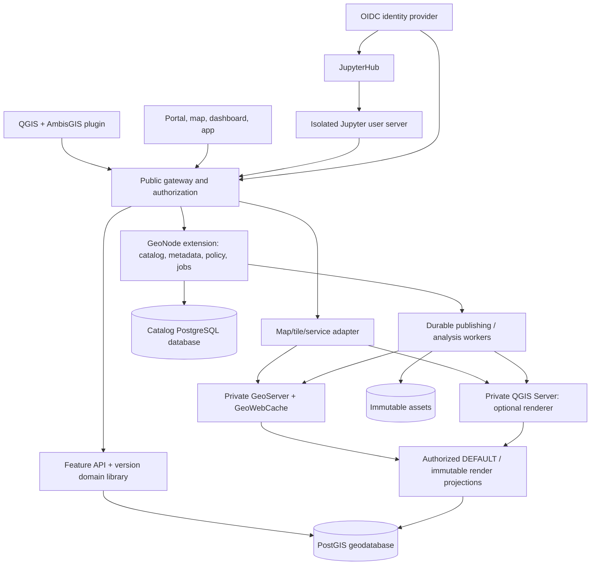

# 00 — Product architecture and scope

## 1. Executive decision

Build **an independently maintained GIS product from source-owned forks and consolidated product modules**. Existing projects are source donors, not continuing architecture or release authorities. AmbisGIS controls the selected code, build inputs, data models, internal contracts, user experience, security fixes and release cadence. It must be possible to build, modify, test, install and repair a supported release without upstream repositories, package servers, release decisions or maintainer approval. This does not require rewriting mature algorithms or putting all code into one language/process. See `11-independent-product-and-source-ownership.md` for the governing requirements.

A branded collection of unmodified upstream services connected only by configuration, adapters and single sign-on does **not** satisfy the product requirement. Internal integration remains necessary engineering work; independent source stewardship and deliberate removal of redundant product responsibilities are required outcomes.

The working product name is **AmbisGIS**. This is the user-proposed working name, **not a trademark-cleared brand**. Branding is configurable; public binary branding remains subject to clearance. The initial hosting model is a self-hosted deployment for one organization, with users, groups, public resources, and private resources. Strong shared-database SaaS tenancy is not an initial promise.

The main differentiation is operational and semantic cohesion: **one install, one identity, one content model, one authorization model, one publishing workflow, and explicit versioned-edit behavior**. Installation must not require an administrator to independently understand GeoNode, GeoServer, GeoFence, pycsw, an identity provider, and JupyterHub configuration before publishing a layer.

The technical rationale is not a legal finding about Esri's market position. The comparison uses the user's ArcGIS Enterprise experience to define target workflows and acceptance tests rather than assuming every open-source tool is less capable in every dimension.

## 2. Scope contract

**Required for the first complete scoped release:** administer a GIS deployment; register/copy datasets; expose map/query/edit/raster-tile/vector-tile services; edit metadata; create maps, dashboards, and responsive applications; manage users/groups/sharing; create isolated named edit branches; reconcile and post with conflicts; run integrated spatial Python notebooks; publish from QGIS through a single wizard.

**Not required for the first release:** ArcGIS Online multi-tenant SaaS, Hub, Knowledge graphs, Utility Network/Trace Network semantics, Parcel Fabric, full topology-controller parity, ArcGIS Image Server distributed analytics/orthomapping, 3D scene services, full geoprocessing service catalog, offline replica/sync protocol, ArcGIS enterprise geodatabase wire-format compatibility, arbitrary ArcPy execution, complete Arcade emulation, native `.aprx`/`.sd` ingestion, or universal ArcGIS SDK/Pro compatibility. Relevant extension interfaces are reserved; these exclusions must appear in release notes rather than disappear behind a blanket “ArcGIS replacement” claim.

ArcGIS Enterprise 11.5 and Pro 3.5.x are the **reference environment**, not declarations of the latest Esri versions. Contract tests must name exact client builds.

## 3. Selected components

| Product capability | Initial implementation decision | Reason / boundary |
|---|---|---|
| General map/coverage/OGC serving | GeoServer with selected, pinned extensions; embedded GeoWebCache | Reuse rendering/standards. Inherited admin UI is a restricted diagnostic tool during migration; the owned service model is authoritative and no inherited UI may create competing product state. [S01–S05] |
| Desktop cartographic rendering | Optional QGIS Server engine selected per publication | Preserve QGIS project rendering when style conversion is insufficient; same product service/capability model. [S11–S12] |
| Portal and catalog | Extended GeoNode backend | Reuse content, metadata, and permission structures rather than establish a competing item database. [S06–S08] |
| Web user experience | New React/TypeScript shell with MapStore integration | Reuse map/dashboard foundations while delivering modern navigation, workflows, and a constrained app composer. [S09–S10] |
| Spatial storage | PostgreSQL + PostGIS | Fork both engines, preserve tested storage semantics initially, and produce AmbisGIS-controlled builds. Add branch/domain semantics in the owned geodatabase module; core changes are allowed when justified. [S13–S14] |
| Feature and version APIs | New typed Python service, initially FastAPI, sharing an `ambisgis-geodb` domain library | Own service-oriented edit semantics and protocol contracts; do not misuse GeoServer's configuration REST API. |
| Publishing/long jobs | Durable PostgreSQL job records + GeoNode-compatible worker stack | Existing queue infrastructure is reused, but the database is authoritative for job state and retries. |
| Identity | Bundled Keycloak or a supported external OIDC provider | One SSO identity; resource permissions remain in the catalog. [S34] |
| Notebooks | JupyterHub + JupyterLab + pinned custom spatial images | Multi-user execution, quotas, storage, and application integration need more than notebook files. [S18–S19] |
| Files/attachments/raster assets | Content-addressed local blob adapter initially; S3-compatible adapter later | Avoid a mandatory additional storage server for a small installation. |
| Standards metadata | Catalog forms/core metadata + pycsw adapter as needed | No separate GeoNetwork installation for normal layer metadata. GeoNetwork remains an advanced option. [S02, S25–S26] |
| Desktop authoring | QGIS + AmbisGIS publishing/version-edit plugin | Maintain an owned QGIS source fork and tested desktop/server distribution. Implement publishing as a bundled plugin where appropriate; plugin modularity is not dependence on future upstream QGIS releases. |

P0 must validate this composition against G3W-SUITE and Lizmap end-to-end examples. If either eliminates a substantial amount of code while satisfying the catalog/security/versioning boundaries, record an ADR before implementation. Do not silently swap architectural foundations halfway through a milestone. [S39–S40]

## 4. Logical architecture

This is a logical diagram, not a requirement to create one microservice per box. Start with a modular GeoNode extension for the control plane, one feature/gateway application, a worker deployment, and AmbisGIS-owned builds of the inherited engines. The branch library is imported by the feature application; it is not an additional network service by default. The map adapter may be a module in the gateway.

## 5. Authoritative ownership and transaction boundaries

| Information | Authoritative owner | Other copies |
|---|---|---|
| Identity subject and authentication | OIDC provider | Opaque subject references in catalog; never duplicate passwords. |
| Items, metadata, groups, role assignments, sharing rules | GeoNode-backed catalog extension | Search index, GeoServer labels, ACL projections are rebuildable views. |
| Feature schema, domains, relationships, feature states, branch heads, audit | `ambisgis-geodb` database | GeoNode stores references, not competing feature state. |
| Stable service/layer IDs and active publication revision | Catalog service registry | Gateway caches are revisioned and revocable. |
| QGIS projects, styles, attachments, rasters, notebook files | Blob/storage adapters with database manifests | Workers use staged read-only mounts; content hashes detect corruption. |
| Publication job and per-step progress | Catalog job tables | Queue messages are wake-up signals, never sole job state. |
| Tile content and render projections | Derived cache | Disposable; never the source of data or permissions. |
| Notebook kernels and scratch files | Isolated user runtime | Not trusted administrative components. |

Use separate PostgreSQL databases/roles for the control plane and each managed geodatabase even if the first installation uses one physical PostgreSQL instance. A branch-version group spans layers **inside one geodatabase** so edits/post can be atomic. Publishing across catalog, geodatabase, assets, and render engines is explicitly a **saga with private staging and compensating actions**, not a fictitious distributed ACID transaction.

Authorization policy changes must be committed to the catalog and enforced at the gateway immediately for new requests. Async engine ACL synchronization cannot be the only barrier. Strict revocation invalidates cached decisions; private access fails closed when policy cannot be established. An already authorized response cannot be retroactively removed from a client, so revocation guarantees apply to new requests, not historical downloads.

## 6. Public product surface

The initial navigation is **Home, Content, Maps, Apps, Notebooks, Services, Data, Jobs, Administration**. Ordinary publishers see one “Publish” action. Internally exposed terms such as workspaces, coverage stores, Django settings, GeoFence rules, and identity-provider clients are hidden behind templates and diagnostics. Advanced settings remain accessible through a deliberate expert panel, not as prerequisites.

A normal browser session uses the portal origin and API gateway. **Notebook code and arbitrary rendered outputs must not share the portal's security origin.** Provide SSO and coherent navigation while Jupyter user servers use isolated per-user domains, appropriately scoped cookies, and a separate registrable domain where practical. “One product” does not mean “one JavaScript trust boundary.” [S18]

The user can publish a public resource without authentication being required for every subsequent read. Anonymous read is an explicit policy choice; it is not intrinsically a vulnerability. Administrative calls, private reads, write operations, and version management require authorization.

## 7. Data and client compatibility posture

Native APIs are versioned and documented first. OGC endpoints are generated or proxied only through capability-aware, access-controlled adapters. An ArcGIS-shaped facade is a **separately tested compatibility profile**, initially focused on read-only service discovery, query, map export, and selected feature edits later. Similar URL shapes do not establish compatibility.

A native client uses `/api/v1`; OGC clients use `/ogc`; explicitly tested ArcGIS-style operations use `/arcgis/rest/services`. The gateway reports precisely supported capabilities. Do not populate optimistic flags to persuade clients to enable operations that do not work. In particular, native branch support does not justify advertising Esri `isDataBranchVersioned` or `VersionManagementServer` support. [S20–S24]

The first desktop publishing client is QGIS. Standard external clients, including ArcGIS Pro where supported, can consume standard services. Publishing ArcGIS service-definition files is not included.

## 8. Quality and release principles

Prefer correctness and measured interoperability over visual demo breadth. A publishing wizard is not complete until cancellation, retry, overwrite, permissions, and rollback work. A branch implementation is not complete until concurrent post, schema changes, deletions, and backup/restore preserve invariants. A notebook deployment is not complete until one user's arbitrary code cannot read another user's files or obtain an administrator token.

Use Python type checking, schema-generated API clients, database integration tests, Playwright user journeys, OGC/ArcGIS compatibility fixtures, security tests, and a pure reference versioning model. Upstream tests remain required for changed forks. Every release includes reproducible source commits, dependency/image locks, an SBOM, release notes, upgrade/recovery instructions, and a visible support matrix.

## 9. Initial hard decisions and unresolved gates

Accepted planning defaults: use GeoNode rather than write a new catalog; use GeoServer rather than write a rendering engine; maintain a QGIS source fork with a bundled publishing plugin; expose native branch behavior before claiming Esri protocol compatibility; keep one organization per deployment; keep GeoNetwork optional; keep deployment composable but initially single-node.

Evidence gates: verified donor baselines followed by owned component builds and catalog/map contract tests; actual fork/file licensing; identity and GeoFence propagation without bypass; QGIS project parity; branch storage/merge performance; exact native/ArcGIS operation boundaries; safe notebook hosting; upgrade/restore behavior. `DECISIONS.md` tracks them. A failed spike changes an ADR and the backlog, not the definition of success.
