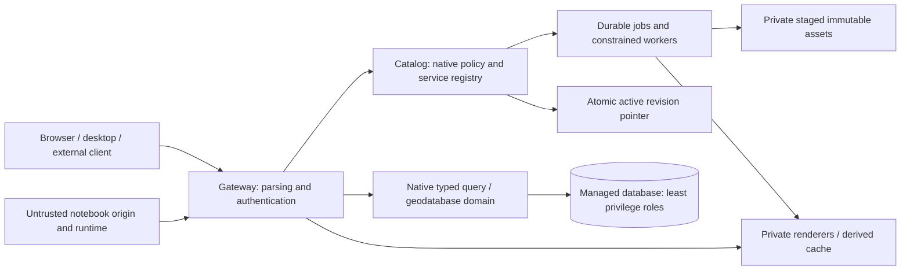

# FND-06 threat model and abuse-test obligations

Scope: initial single-organization Linux profile, the bounded FND-06 query
experiment, and the complete required product paths. This is a design plus
an evidence index, not security certification or deployment approval. FND-03/05
and FND-04 evidence covers only their accepted prototypes. New FND-06 real
runtime results will be linked separately; planned rows are not passing tests.

## Assets and trust boundaries

Protect identity credentials, private item/schema/data/branch existence, user
files and notebook outputs, sharing/metadata integrity, committed version heads,
publication activation, retained source/dependencies and backup/recovery material.
Attackers include anonymous internet callers, a malicious authenticated reader,
publisher or notebook user, malformed external content, compromised dependencies
and accidental operator actions. Authorized administrators are privileged; the
system does not claim to defeat a host/database administrator without separately
secured controls.

Public entry points never trust forwarded identity/role/internal-service headers.
Edge routes are finite; internal endpoints require both private reachability and
scoped service authentication. The catalog is the only policy authority. Derived
engine ACLs supplement immediate gateway checks. Notebook code/HTML has a
separate origin and runtime/network/filesystem boundary; product navigation
does not collapse those boundaries.

## Mandatory threats from chapter 07

| ID / threat | Required control and actual test boundary | Current evidence and remaining acceptance |
|---|---|---|
| TM01 Private ID guessing | Authenticate and authorize discovery, metadata, schema, data, branches, jobs, staging and download paths; uniform unauthorized/nonexistent result and no count/extent leak. | FND-03/05 bounded object/map denials exist. FND-06 must execute private/public/group query/count/extent, two-user and direct-route negatives. Remaining product surfaces: T-AUTH-ALL/T-SEC-ABUSE. |
| TM02 Backend bypass | Private network, scoped service credential, finite projection binding, strip caller identity headers; direct renderer/database/admin attempts fail. | FND-03/05 real backend negatives exist. New Koop discovery/metadata/query/backend routes must all fail without boundary authorization. Installer network topology remains PLT/SEC acceptance. |
| TM03 Cross-user cache/revocation | No private cache without policy/revision/principal scope; fresh authorization on new requests, including cache hits. | FND-05 tested bounded revoke/restart. Koop default key omits authorization context; disable cache in the experiment and test user alternation, grant/revoke, outage, pages and metadata. Full tile/app/search caches remain open. |
| TM04 SQL/expression injection | Typed bounded AST, trusted field/table mapping, bound values, revision-keyset pagination; reject unknown parameters rather than strip. | Contract unit negatives cover shape/types/bounds. Real PostGIS parameterization, EXPLAIN/pushdown, malicious strings/identifiers, nonfinite values, limits and concurrent revision pages are FND-06 tests; API-02 extends them. |
| TM05 Upload/parser exploit or bomb | Private staging, archive traversal/symlink/type/ratio/size limits, constrained parser without secrets/sensitive mounts/network, timeouts and output budgets. | FND-05 has bounded bundle/analyzer negatives, not a general sandbox. PUB/QGIS/SEC must run malformed geometry/raster/archive, SSRF redirect/DNS/internal-address and remote font/style tests. |
| TM06 Notebook privilege escalation | Per-user isolated origin, files, credentials, process/network/resources; no runtime socket or admin/writer credential; scoped SDK through gateway. | No accepted multi-user isolation. NB-01/NB-05 and T-NB-ISOLATION must execute two-user HTML/cookie/file/network/token probes, resource exhaustion, restart and revocation. |
| TM07 Duplicate/replayed edits/publications | Durable idempotency bound to identity, operation, target and payload digest; matching retries return original result; changed payload fails. | FND-04 has real bounded transactional retry tests. Full API/publication crash-at-step, retry/cancel and duplicate side-effect tests remain T-EDIT-RETRY/T-PUBLISH-CRASH. |
| TM08 Stale post/malicious resolution | Captured heads/schema/rules, explicit resolved acceptance, current permission and atomic constraint revalidation under locks. | FND-04 accepted real stale/race/termination/NULL-resolution negatives. Full permissions, schema migrations and restored branch post remain DB/API/OPS acceptance. |
| TM09 Secrets/private data in source or logs | Synthetic corpus only, private runtime secrets, sanitized errors/logs/support bundles, source/archive scans before push. | Prior runtime scans/cleanup exist. FND-06 must scan new source/evidence and runtime output; never publish credential-bearing configs, tokens or private payloads. All later artifacts retain the gate. |
| TM10 Dependency/generated-code supply chain | Exact owned sources, complete retained closure, integrity checks, reviewed lock reconciliation and lifecycle scripts; offline replay and independent review before execution. | FND-07/08 bounded custody/builds accepted. Koop candidate001 was rejected before execution for missing archive identities; replacement needs complete closure. SBOM, rights, repair/signing/release remain OWN/SEC/REL gates. |
| TM11 Deleting live blobs/snapshots | Reference-aware retention, dry-run ownership checks, grace period, coordinated backup and tested restore. | No complete product retention/restore acceptance. DB-07/OPS-02 must prove referenced snapshots/assets survive collection and restored branch/notebook/publication journeys work. |

## All-output authorization matrix

| Output family | Policy before execution/output | Required failure/revocation tests |
|---|---|---|
| Discovery, metadata, schema, thumbnails, search facets | Separate discover/metadata permission and safe aggregates | Guessed ID, anonymous/private, two users, group revoke, outage, count/existence error parity. |
| Features, counts, extent, statistics and exports | Item/data/branch plus row/field policy before selection and aggregation | Direct read versus aggregate equivalence, cross-user pages/cache, injection, limits, denied fields and unsupported secure projections. |
| Map, legend, identify, print, raster/vector tiles | Same policy as source with an equivalent secure render projection | Raw engine URL, forged headers, private cache hit, revocation/restart, unsupported row-filter rendering denied. |
| Source/raster/attachments/blob downloads | Explicit download permission and current referenced immutable asset binding | Guessed staging/hash/filename, path traversal, shared link scope/revoke, range requests and cache behavior. |
| Apps/dashboards and embedded outputs | App visibility plus independent current permission for every data dependency | Public app with private dependency, aggregation leak, restored app revision, revoked reader and malicious widget payload. |
| Notebook files, outputs and job logs | Run/item identity and output scope; isolated HTML origin | Cross-user file/token/cookie/HTML access, secret-bearing failure, revoked ongoing runtime, schedules and publication sharing. |
| Reconcile plans, branch history, publication staging and jobs | Operation/item/branch policy, no guessed private stage access | Stale/malicious plan, owner loses permission before commit, staged URL leakage, cancelled/failed job logs and retries. |

Unsupported row/field-secure rendering, C1 operation/encoding, transform or parser
mode returns an explicit unsupported result. Never fall back to a broader query,
approximate CRS, public cache or direct engine route. All requirements remain
in the [contract package](../contracts/contract-package.json) and
[complete matrix](delivery-requirements-matrix.md).

## Experiment containment and residual risk

The Koop experiment uses entirely synthetic data, a disposable job-owned database
and existing owned catalog build. Its read role cannot mutate snapshots or managed
branches. The loader is separate. Bind listeners explicitly, authenticate private
provider traffic and exercise direct bypasses. Use generated short-lived private
credentials, resource/time/response limits and verified shutdown/invalidation.
Do not execute dependency lifecycle scripts or package imports until the complete
retained closure has independent review. Preserve failed acquisition/runtime
attempts with accurate status and exact-byte evidence.

The experiment cannot prove product installation, general row/field policy,
complete C1/native APIs, named proprietary-client compatibility, production key
rotation, multi-user notebooks, coordinated restore or independent full repair.
Those are release-blocking acceptance obligations on their tasks, not waived
risks. Human-only accessibility and user pilots also remain unperformed.
